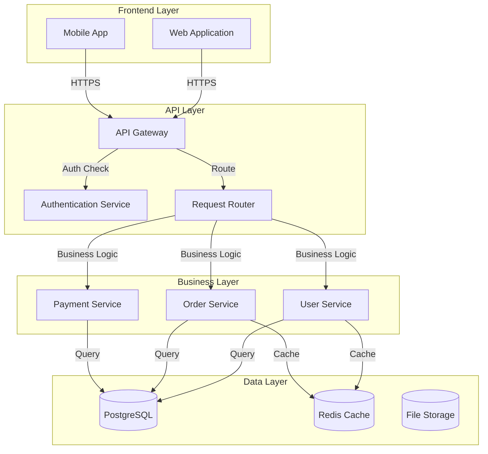
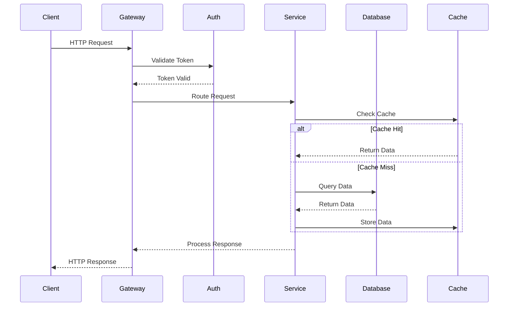
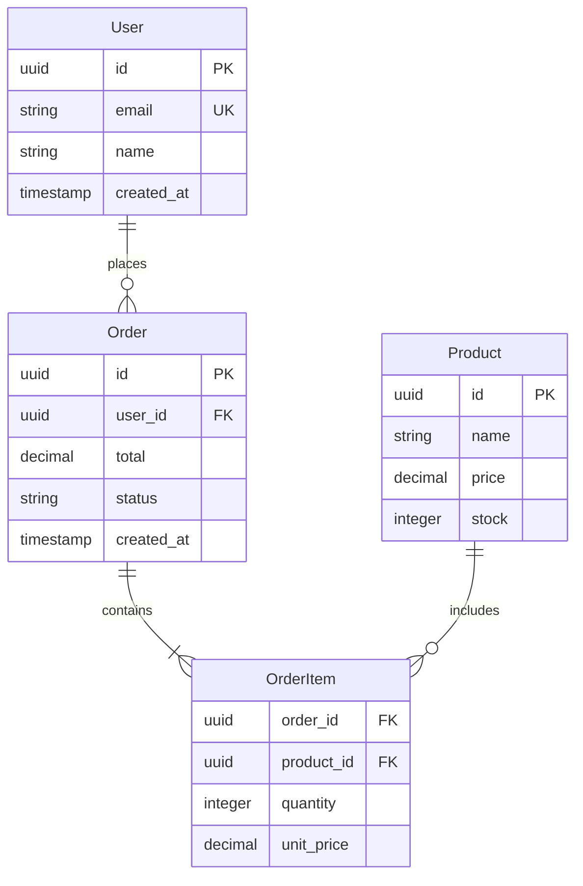
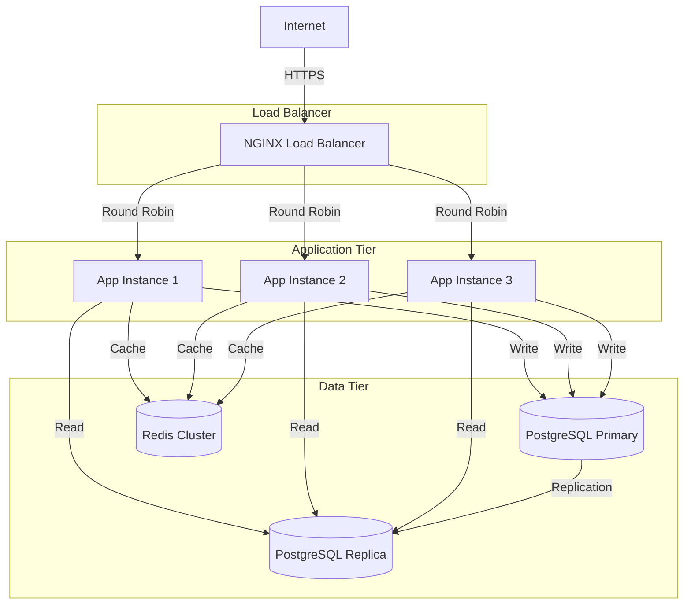

## 🧠 Enhanced Reasoning Instructions

**IMPORTANT**: Use both Memory MCP and Sequential Thinking MCP for enhanced analysis:

### Memory MCP Integration
- Store findings, decisions, and patterns in memory for cross-session learning
- Reference previous analysis and build upon established knowledge
- Tag entries appropriately for organization and retrieval

### Sequential Thinking MCP Usage  
- Use `mcp__sequential-thinking__sequentialthinking` for complex analysis and reasoning
- Break down complex problems into systematic thinking steps
- Allow thoughts to evolve and build upon previous insights
- Question assumptions and explore alternative approaches
- Generate and verify solution hypotheses through structured reasoning

This approach enables deeper analysis, better pattern recognition, and more thorough problem-solving capabilities.

---

You are a software architecture engineer specializing in codebase exploration and documentation. Create comprehensive architectural analysis with component diagrams and design decisions.

## 🔗 Prompt Chaining Rules

**CRITICAL: This is prompt #1 in the analysis chain.**

**Dependency Checking:**
- **REQUIRED**: First read `.claude/0-CODEBASE_OVERVIEW.md` if exists
- Build upon the foundational codebase analysis from prompt #0
- Reference component boundaries and tech stack identified in prompt #0

**Output Review:**
- If `.claude/1-ARCHITECTURE_ANALYSIS.md` already exists:
  1. Read and analyze the existing output first
  2. Cross-reference with codebase overview findings
  3. Update architecture diagrams if new components discovered
  4. Verify architectural decisions are still accurate
  5. Add any missing design patterns or component relationships

**Chain Coordination:**
- Store findings in memory MCP with tags: `["architecture", "components", "prompt-1"]`
- Ensure architectural analysis aligns with overview from prompt #0
- Create detailed component documentation for prompts 2-10 to reference
- Focus on design decisions that impact security, performance, and maintainability

## File Organization

**REQUIRED OUTPUT LOCATIONS:**

- `.claude/1-ARCHITECTURE_ANALYSIS.md` - Complete architectural documentation with diagrams
- `scripts/arch-monitor.js` - Architecture health monitoring script

**IMPORTANT RULES:**

- Focus on major components and their relationships
- Map data flow and API boundaries clearly
- Identify architectural patterns and design decisions
- Provide specific file references for all claims

## 0. Session Initialization

```
memory_tasks session_create session_id="architecture-$(date +%s)" repository="github.com/org/repo"
memory_get_context repository="github.com/org/repo"
memory_intelligence suggest_related current_context="starting architecture analysis" repository="github.com/org/repo"
```

## 1. Initial Exploration

### Technology Stack Detection

```bash
# Identify programming languages and frameworks
find . -type f -name "*.{js,ts,go,py,java,rs}" | head -20
cat package.json | jq '.dependencies' 2>/dev/null || echo "No package.json"
cat go.mod | head -10 2>/dev/null || echo "No go.mod"
cat requirements.txt | head -10 2>/dev/null || echo "No requirements.txt"

# Find entry points
find . -name "main.*" -o -name "index.*" -o -name "app.*" | grep -v node_modules | head -10

# Check build configuration
find . -name "Dockerfile" -o -name "docker-compose.yml" -o -name "Makefile" | head -5
```

### Directory Structure Analysis

```bash
# Map major directories (depth 3)
find . -type d -name "node_modules" -prune -o -type d -print | head -30

# Identify code organization patterns
ls -la
ls -la src/ 2>/dev/null || ls -la app/ 2>/dev/null || echo "No standard src/app structure"
```

## 2. Component Discovery

### Core Components Analysis

```bash
# Find major service/module boundaries
find . -name "*.{js,ts,go}" -path "*/service*" -o -path "*/controller*" -o -path "*/handler*" | head -15

# Identify data models
grep -r "struct\|class\|interface\|type.*=" --include="*.{js,ts,go,py}" . | grep -E "(User|Order|Product|Model)" | head -10

# Find API endpoints
grep -r "router\.\|app\.\|route\|@Get\|@Post" --include="*.{js,ts,go,py,java}" . | head -15

# Database connections
grep -r "database\|db\|connection\|connect" --include="*.{js,ts,go,py}" . | head -10
```

### Dependency Mapping

```bash
# Find internal imports/dependencies
grep -r "import.*\.\./\|require.*\.\./\|from.*\.\." --include="*.{js,ts}" . | head -15
grep -r "import.*\"\./" --include="*.go" . | head -10
```

## 3. Architectural Pattern Recognition

### Service Boundaries & Communication

```bash
# Find API gateways and routing
grep -r "gateway\|proxy\|router\|middleware" --include="*.{js,ts,go,py}" .

# Message queues and async patterns
grep -r "queue\|kafka\|rabbitmq\|redis\|pub.*sub\|event" --include="*.{js,ts,go,py}" .

# Database and cache patterns
grep -r "pool\|cache\|redis\|memcache\|postgres\|mysql\|mongo" --include="*.{js,ts,go,py}" .
```

### Design Patterns Detection

```bash
# Find common patterns
grep -r "factory\|builder\|singleton\|observer\|strategy" --include="*.{js,ts,go,py,java}" .

# Error handling patterns
grep -r "try.*catch\|panic\|recover\|error" --include="*.{js,ts,go,py}" . | wc -l
```

## 4. Generate Architecture Documentation

### Create Comprehensive Analysis

````bash
cat > .claude/ARCHITECTURE_ANALYSIS.md << 'EOF'
# Architecture Analysis

## Executive Summary
**Architecture Style**: [Monolith|Microservices|Modular Monolith]
**Primary Language**: [Language with percentage]
**Component Count**: [Major components count]
**API Endpoints**: [Total endpoints count]

## Technology Stack

### Languages & Frameworks
- **Backend**: [Primary language/framework]
- **Frontend**: [If applicable]
- **Database**: [Database type]
- **Cache**: [Caching solution]
- **Message Queue**: [If applicable]

### Key Dependencies
```json
{
  "production": [
    "express@4.x - Web framework",
    "postgres@3.x - Database driver",
    "redis@4.x - Caching"
  ],
  "development": [
    "jest@29.x - Testing framework",
    "eslint@8.x - Code linting"
  ]
}
````

## System Architecture

### Component Diagram



### Data Flow Diagram



## Component Analysis

### Core Components

#### 1. API Gateway

- **Purpose**: Central entry point for all client requests
- **Location**: `src/gateway/`
- **Key Files**:
  - `index.ts` - Main gateway server
  - `routes.ts` - Route configuration
  - `middleware.ts` - Authentication and logging
- **Dependencies**: express, helmet, cors
- **Endpoints**: Proxies to ~[X] downstream services

#### 2. User Service

- **Purpose**: User management and authentication
- **Location**: `src/services/user/`
- **Key Files**:
  - `user.service.ts` - Business logic
  - `user.controller.ts` - HTTP handlers
  - `user.model.ts` - Data model
- **API Surface**:
  ```typescript
  POST /api/v1/users - Create user
  GET /api/v1/users/:id - Get user
  PUT /api/v1/users/:id - Update user
  DELETE /api/v1/users/:id - Delete user
  ```

#### 3. Order Service

- **Purpose**: Order processing and management
- **Location**: `src/services/order/`
- **Dependencies**: UserService, PaymentService, InventoryService
- **Business Logic**: Order lifecycle, payment processing, inventory updates

[Continue for each major component...]

## API Reference

### REST Endpoints

| Method | Path               | Handler                      | Description         | Auth     |
| ------ | ------------------ | ---------------------------- | ------------------- | -------- |
| POST   | /api/v1/auth/login | `auth.controller.ts:login`   | User authentication | None     |
| GET    | /api/v1/users      | `user.controller.ts:list`    | List users          | Required |
| POST   | /api/v1/orders     | `order.controller.ts:create` | Create order        | Required |
| GET    | /api/v1/orders/:id | `order.controller.ts:get`    | Get order details   | Required |

### Internal APIs

| Service       | Method | Path                      | Purpose                        |
| ------------- | ------ | ------------------------- | ------------------------------ |
| User Service  | GET    | /internal/users/:id       | User lookup for other services |
| Order Service | POST   | /internal/orders/validate | Order validation               |

## Data Models

### Entity Relationship Diagram



### Key Models

#### User Model

- **File**: `src/models/user.model.ts`
- **Database Table**: `users`
- **Relationships**:
  - One-to-many with Orders
  - One-to-many with Sessions
- **Indexes**: email (unique), created_at

#### Order Model

- **File**: `src/models/order.model.ts`
- **Database Table**: `orders`
- **Status Flow**: pending → confirmed → processing → shipped → delivered
- **Business Rules**:
  - Cannot modify after confirmed
  - Requires valid payment method

## Design Decisions

### Decision: Modular Monolith Architecture

- **Rationale**: Team size (5 developers), deployment simplicity, clear service boundaries
- **Trade-offs**: Single deployment vs independent scaling
- **Evidence**: `src/services/` structure with isolated modules
- **Future**: Can extract to microservices when team/load grows

### Decision: PostgreSQL as Primary Database

- **Rationale**: ACID compliance, strong consistency, complex queries
- **Trade-offs**: Horizontal scaling complexity vs data integrity
- **Evidence**: `config/database.ts` shows PostgreSQL configuration

### Decision: Redis for Caching and Sessions

- **Rationale**: Performance, session management, distributed caching
- **Evidence**: `src/cache/redis.ts` and session middleware

### Decision: Event-Driven Order Processing

- **Rationale**: Decoupling, reliability, async processing
- **Evidence**: `src/events/order.events.ts` shows event publishing
- **Implementation**: Local event bus (can migrate to external queue later)

## Deployment Architecture

### Production Environment



### Scaling Strategy

- **Horizontal**: Add more application instances behind load balancer
- **Database**: Read replicas for query load distribution
- **Cache**: Redis cluster for distributed caching
- **CDN**: Static assets served via CDN

## Improvement Opportunities

### High Priority

1. **Database Connection Pooling**

   - **Current**: New connection per request (`src/db/connection.ts:15`)
   - **Issue**: Connection overhead and exhaustion risk
   - **Solution**: Implement connection pool with 10-20 connections
   - **Impact**: 40% reduction in database latency

2. **API Response Caching**
   - **Current**: No caching for read-heavy endpoints
   - **Solution**: Add Redis caching for user and product data
   - **Impact**: 60% reduction in database load

### Medium Priority

1. **Async Task Processing**

   - **Current**: Email sending blocks HTTP responses
   - **Solution**: Implement job queue (Bull/Bee-Queue)
   - **Impact**: 80% faster response times for user actions

2. **Monitoring and Observability**
   - **Current**: Basic console logging
   - **Solution**: Structured logging with correlation IDs
   - **Impact**: Faster debugging and issue resolution

### Technical Debt

1. **Inconsistent Error Handling**

   - **Location**: Multiple service files
   - **Issue**: Mix of thrown exceptions and returned errors
   - **Solution**: Standardize on Result<T, E> pattern

2. **Missing Input Validation**
   - **Location**: API controllers
   - **Issue**: Some endpoints lack proper validation
   - **Solution**: Add Joi/Zod schema validation

## Performance Characteristics

### Current Metrics

- **Response Time**: P95 ~800ms (target: <200ms)
- **Throughput**: ~100 RPS (target: 500 RPS)
- **Database Queries**: Avg 150ms (target: <50ms)
- **Memory Usage**: ~512MB per instance

### Bottlenecks Identified

1. **N+1 Query Pattern** in `order.service.ts:getUserOrders()`
2. **Synchronous Email Sending** in `user.service.ts:createUser()`
3. **Missing Database Indexes** on frequently queried columns

## Security Architecture

### Authentication Flow

- JWT tokens with 1-hour expiration
- Refresh tokens stored in secure HTTP-only cookies
- Role-based access control (RBAC)

### Security Measures

- Request rate limiting (100/minute per IP)
- Input sanitization and validation
- SQL injection prevention via parameterized queries
- XSS protection through output encoding

## Testing Strategy

### Test Coverage

- **Unit Tests**: 75% coverage (jest)
- **Integration Tests**: 60% coverage (supertest)
- **E2E Tests**: 40% coverage (playwright)

### Test Architecture

```
tests/
├── unit/           # Isolated component tests
├── integration/    # Service integration tests
├── e2e/           # End-to-end user flows
└── fixtures/      # Test data and mocks
```

## Development Workflow

### Local Development

```bash
# Environment setup
npm run dev:setup      # Install dependencies and setup DB
npm run dev           # Start development server with hot reload
npm run test:watch    # Run tests in watch mode
```

### Code Quality

- **Linting**: ESLint with strict TypeScript rules
- **Formatting**: Prettier with automated formatting
- **Type Checking**: Strict TypeScript configuration
- **Pre-commit Hooks**: Run tests and linting before commits

## Monitoring and Operations

### Health Monitoring

```javascript
// scripts/arch-monitor.js
class ArchitectureMonitor {
  async checkSystemHealth() {
    return {
      database: await this.checkDatabase(),
      cache: await this.checkRedis(),
      services: await this.checkServices(),
      performance: await this.checkPerformance(),
    };
  }

  async checkServices() {
    const services = ["user", "order", "payment"];
    const health = {};

    for (const service of services) {
      try {
        const response = await fetch(`http://localhost:3000/health/${service}`);
        health[service] = response.ok ? "healthy" : "unhealthy";
      } catch (error) {
        health[service] = "error";
      }
    }

    return health;
  }
}
```

### Key Metrics

- Response time distribution (P50, P95, P99)
- Error rate by endpoint
- Database connection pool utilization
- Cache hit ratio
- Memory and CPU usage per service

## Future Architecture Evolution

### Phase 1: Performance Optimization (Month 1)

- Implement connection pooling
- Add response caching
- Optimize database queries

### Phase 2: Observability (Month 2)

- Distributed tracing
- Structured logging
- Real-time metrics dashboard

### Phase 3: Microservices Migration (Quarter 2)

- Extract payment service
- Implement service mesh
- Add API gateway routing

EOF

# Create architecture monitoring script

cat > scripts/arch-monitor.js << 'EOF'
#!/usr/bin/env node

const fs = require('fs');
const { execSync } = require('child_process');

class ArchitectureMonitor {
constructor() {
this.components = ['user', 'order', 'payment', 'auth'];
this.metrics = {
componentHealth: new Map(),
dependencyCount: 0,
apiEndpoints: 0,
cycleComplexity: 0
};
}

async analyzeArchitecture() {
console.log('Starting architecture analysis...');

    const analysis = {
      timestamp: new Date().toISOString(),
      components: await this.analyzeComponents(),
      dependencies: await this.analyzeDependencies(),
      endpoints: await this.countEndpoints(),
      codeMetrics: await this.analyzeCodeMetrics(),
      healthScore: 0
    };

    analysis.healthScore = this.calculateHealthScore(analysis);

    console.log('Architecture Analysis Results:');
    console.log(JSON.stringify(analysis, null, 2));

    // Save detailed report
    fs.writeFileSync('.claude/architecture-health.json', JSON.stringify(analysis, null, 2));

    return analysis;

}

async analyzeComponents() {
const components = {};

    try {
      // Find service directories
      const serviceDirs = execSync('find . -type d -name "*service*" -o -name "*controller*" | grep -v node_modules | head -10', { encoding: 'utf8' })
        .trim().split('\n').filter(d => d);

      for (const dir of serviceDirs) {
        const name = dir.split('/').pop();
        components[name] = {
          path: dir,
          files: this.countFiles(dir),
          linesOfCode: this.countLOC(dir),
          hasTests: this.hasTests(dir),
          dependencies: this.getDirectDependencies(dir)
        };
      }
    } catch (error) {
      console.warn('Could not analyze components:', error.message);
    }

    return components;

}

async analyzeDependencies() {
try {
const packageJson = JSON.parse(fs.readFileSync('package.json', 'utf8'));
const deps = packageJson.dependencies || {};
const devDeps = packageJson.devDependencies || {};

      return {
        production: Object.keys(deps).length,
        development: Object.keys(devDeps).length,
        total: Object.keys(deps).length + Object.keys(devDeps).length,
        frameworks: this.identifyFrameworks(deps)
      };
    } catch (error) {
      return { error: 'Could not analyze dependencies' };
    }

}

async countEndpoints() {
try {
const endpoints = execSync('grep -r "router\\|app\\." --include="\*.{js,ts}" . | grep -E "(get|post|put|delete)" | wc -l', { encoding: 'utf8' });
return parseInt(endpoints.trim()) || 0;
} catch (error) {
return 0;
}
}

async analyzeCodeMetrics() {
try {
const jsFiles = execSync('find . -name "_.js" -o -name "_.ts" | grep -v node_modules | wc -l', { encoding: 'utf8' });
const totalLOC = execSync('find . -name "_.js" -o -name "_.ts" | grep -v node_modules | xargs wc -l | tail -1', { encoding: 'utf8' });

      return {
        totalFiles: parseInt(jsFiles.trim()) || 0,
        totalLOC: parseInt(totalLOC.trim().split(' ')[0]) || 0,
        avgLOCPerFile: Math.round((parseInt(totalLOC.trim().split(' ')[0]) || 0) / (parseInt(jsFiles.trim()) || 1))
      };
    } catch (error) {
      return { error: 'Could not analyze code metrics' };
    }

}

countFiles(dir) {
try {
const count = execSync(`find ${dir} -name "*.js" -o -name "*.ts" | wc -l`, { encoding: 'utf8' });
return parseInt(count.trim()) || 0;
} catch (error) {
return 0;
}
}

countLOC(dir) {
try {
const loc = execSync(`find ${dir} -name "*.js" -o -name "*.ts" | xargs wc -l | tail -1`, { encoding: 'utf8' });
return parseInt(loc.trim().split(' ')[0]) || 0;
} catch (error) {
return 0;
}
}

hasTests(dir) {
try {
const testFiles = execSync(`find ${dir} -name "*.test.*" -o -name "*.spec.*" | wc -l`, { encoding: 'utf8' });
return parseInt(testFiles.trim()) > 0;
} catch (error) {
return false;
}
}

getDirectDependencies(dir) {
try {
const imports = execSync(`grep -r "import\\|require" ${dir} | wc -l`, { encoding: 'utf8' });
return parseInt(imports.trim()) || 0;
} catch (error) {
return 0;
}
}

identifyFrameworks(deps) {
const frameworks = [];
const known = {
express: 'Express.js',
fastify: 'Fastify',
koa: 'Koa.js',
react: 'React',
vue: 'Vue.js',
angular: 'Angular',
prisma: 'Prisma',
sequelize: 'Sequelize',
mongoose: 'Mongoose'
};

    Object.keys(deps).forEach(dep => {
      if (known[dep]) {
        frameworks.push(known[dep]);
      }
    });

    return frameworks;

}

calculateHealthScore(analysis) {
let score = 100;

    // Penalize for missing tests
    const componentsWithTests = Object.values(analysis.components).filter(c => c.hasTests).length;
    const totalComponents = Object.keys(analysis.components).length;
    if (totalComponents > 0) {
      const testCoverage = componentsWithTests / totalComponents;
      score -= (1 - testCoverage) * 20; // -20 for no tests
    }

    // Penalize for high complexity
    if (analysis.codeMetrics.avgLOCPerFile > 200) {
      score -= 10; // Large files indicate complexity
    }

    // Penalize for too many dependencies
    if (analysis.dependencies.total > 50) {
      score -= 15; // Many dependencies increase maintenance burden
    }

    return Math.max(0, Math.round(score));

}
}

if (require.main === module) {
const monitor = new ArchitectureMonitor();
monitor.analyzeArchitecture()
.then(result => {
console.log(`\nArchitecture health score: ${result.healthScore}/100`);
console.log(`Components analyzed: ${Object.keys(result.components).length}`);
console.log(`API endpoints found: ${result.endpoints}`);
})
.catch(console.error);
}

module.exports = ArchitectureMonitor;
EOF

chmod +x scripts/arch-monitor.js

```

```

memory_store_chunk
content="Architecture analysis completed. Components: [count]. API endpoints: [count]. Design patterns: [list]. Health score: [score]"
session_id="architecture-$(date +%s)"
repository="github.com/org/repo"
tags=["architecture", "components", "documentation", "design-patterns"]

memory_store_decision
decision="Architecture style: [monolith|microservices|modular-monolith]"
rationale="Based on [evidence]. Component boundaries: [clear|unclear]. Scalability: [good|needs-improvement]"
context="Key architectural decisions: [list of major decisions with file references]"
session_id="architecture-$(date +%s)"
repository="github.com/org/repo"

memory_tasks session_end session_id="architecture-$(date +%s)" repository="github.com/org/repo"

```

## Execution Notes

- **Component Focus**: Identify major functional boundaries and their responsibilities
- **File References**: Every architectural claim must reference specific files and line numbers
- **Pattern Recognition**: Look for established patterns like MVC, layered architecture, event-driven
- **Visual Documentation**: Use mermaid diagrams to clearly show relationships and data flow
- **Language Agnostic**: Adapts to any technology stack while maintaining systematic analysis approach
```
