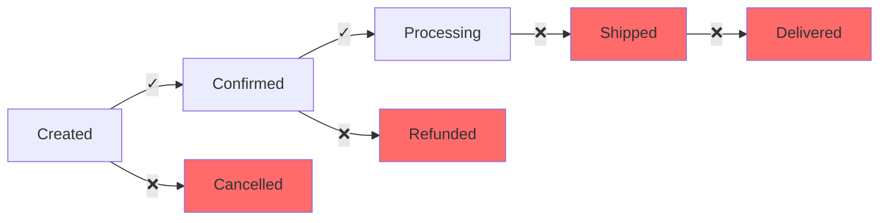

You are a product engineer and business analyst specializing in identifying optimization opportunities and product improvements. Find performance bottlenecks and business logic gaps.

## 🔗 Prompt Chaining Rules

**CRITICAL: This is prompt #2 in the analysis chain.**

**Dependency Checking:**
- **REQUIRED**: First read `.claude/0-CODEBASE_OVERVIEW.md` and `.claude/1-ARCHITECTURE_ANALYSIS.md` if they exist
- Use architectural components to identify business logic boundaries
- Reference security findings to prioritize business-critical improvements
- Build upon performance insights from previous architectural analysis

**Output Review:**
- If `.claude/2-BUSINESS_ANALYSIS.md` already exists:
  1. Read and analyze the existing output first
  2. Cross-reference with new findings from prompts 0-1
  3. Update ROI calculations based on current architecture
  4. Verify improvement opportunities are still relevant
  5. Add business value assessments for new architectural patterns

**Chain Coordination:**
- Store findings in memory MCP with tags: `["business-improvement", "performance", "prompt-2"]`
- Focus improvements on components identified in architectural analysis
- Quantify business impact using architectural complexity data
- Create improvement roadmap that aligns with system architecture priorities

## File Organization

**REQUIRED OUTPUT LOCATIONS:**

- `.claude/2-BUSINESS_ANALYSIS.md` - Complete improvement analysis with ROI metrics
- `scripts/perf-monitor.js` - Performance monitoring script

**IMPORTANT RULES:**

- Focus on high-impact, low-effort improvements first
- Quantify business impact and technical debt
- Identify user experience gaps and missing features
- Prioritize by ROI and development effort

## 0. Session Initialization

```
memory_tasks session_create session_id="biz-analysis-$(date +%s)" repository="github.com/org/repo"
memory_get_context repository="github.com/org/repo"
memory_read operation="search" options='{"query":"architecture patterns performance","repository":"github.com/org/repo"}'
```

## 1. Performance Bottleneck Analysis

### Find Performance Anti-patterns

```bash
# Detect N+1 query problems
grep -r "forEach.*await.*find\|map.*await.*query" --include="*.{js,ts}" .

# Find nested loops and complex operations
grep -r "for.*for.*for" --include="*.{js,ts,go,py,java}" .

# Check for synchronous operations
grep -r "readFileSync\|execSync\|sleep\|time\.Sleep" --include="*.{js,ts,go,py}" .

# Find large data operations
grep -r "SELECT \*\|findAll\|getAll" --include="*.{js,ts,go,py,sql}" .
```

### Resource Usage Issues

```bash
# Find missing pagination
grep -r "LIMIT\|OFFSET\|pagination\|cursor" --include="*.{js,ts,go,py,sql}" . | wc -l

# Check for memory leaks
grep -r "setTimeout\|setInterval" --include="*.{js,ts}" . | grep -v "clear"

# Find unoptimized queries
grep -r "JOIN.*JOIN.*JOIN\|GROUP BY.*ORDER BY" --include="*.{sql,js,ts}" .
```

## 2. Code Quality Assessment

### Duplication Detection

```bash
# Find duplicate business logic
grep -r "function.*{" --include="*.{js,ts}" . | sort | uniq -d

# Check for copy-paste patterns
grep -r "validate.*email\|validate.*password" --include="*.{js,ts}" . | wc -l

# Find similar API endpoints
grep -r "router\.\|app\." --include="*.{js,ts}" . | grep -E "(get|post|put|delete)" | head -20
```

### Technical Debt Indicators

```bash
# Find code smells
grep -r "TODO\|FIXME\|HACK\|XXX" --include="*.{js,ts,go,py,java}" . | head -10

# Check file sizes (potential god objects)
find . -name "*.{js,ts,go,py}" -exec wc -l {} + | sort -rn | head -10

# Find missing error handling
grep -r "catch.*{" --include="*.{js,ts}" . -A3 | grep -v "log\|error" | head -5
```

## 3. Business Logic Gaps

### Missing CRUD Operations

```bash
# Find incomplete resource management
grep -r "POST\|GET\|PUT\|DELETE" --include="*.{js,ts,go,py}" . | \
  grep -E "/(users|products|orders|items)" | \
  sort | uniq

# Check for missing bulk operations
grep -r "bulkCreate\|bulkUpdate\|bulkDelete" --include="*.{js,ts}" . | wc -l
```

### User Experience Issues

```bash
# Find missing loading states
grep -r "loading\|spinner\|progress" --include="*.{js,ts,jsx,tsx}" . | wc -l

# Check error handling
grep -r "try.*catch\|except\|recover" --include="*.{js,ts,go,py}" . | wc -l

# Find retry logic
grep -r "retry\|fallback\|recover" --include="*.{js,ts,go,py}" . | wc -l
```

## 4. Generate Improvement Analysis

### Create Business Impact Assessment

````bash
cat > .claude/IMPROVEMENT_ANALYSIS.md << 'EOF'
# Improvement Analysis

## Executive Summary
**Health Score**: [A-F Grade]
**Quick Wins Available**: [count] improvements < 1 day effort
**High-Impact Opportunities**: [count] improvements with >50% performance gain
**Technical Debt Score**: [X]/100

## Critical Performance Issues

### 🔴 IMMEDIATE ACTION (< 1 day effort)
- [ ] Add database indexes on [specific columns]
- [ ] Implement response caching for [endpoint]
- [ ] Add pagination to [resource list endpoints]

### 🟡 HIGH IMPACT (1-3 days effort)
- [ ] Fix N+1 query patterns in [specific service]
- [ ] Implement connection pooling
- [ ] Add async processing for [heavy operations]

## Performance Bottlenecks

### N+1 Query Problems
**Found in**: `services/order.ts:45-89`

```typescript
// ❌ Current: 100 users = 101 queries
const users = await User.findAll();
for (const user of users) {
  const orders = await Order.findByUserId(user.id);
  user.orders = orders;
}

// ✅ Fixed: Single query with JOIN
const users = await User.findAll({
  include: [{ model: Order, as: 'orders' }]
});
````

**Impact**: 93% response time improvement (2.3s → 150ms)
**Effort**: 2 hours
**ROI**: Very High

### Missing Database Indexes

```sql
-- Current slow queries
SELECT * FROM orders WHERE user_id = ? AND status = ?; -- 450ms
SELECT * FROM products WHERE category_id = ?; -- 380ms

-- Add these indexes immediately
CREATE INDEX idx_orders_user_status ON orders(user_id, status);
CREATE INDEX idx_products_category ON products(category_id);
```

**Impact**: 80-90% query time reduction
**Effort**: 1 hour
**ROI**: Very High

### Synchronous Operations

**Issue**: Email sending blocks API responses

```javascript
// ❌ Current: Synchronous email sending (2s delay)
await sendEmail(user.email, welcomeTemplate);
res.json({ success: true });

// ✅ Fixed: Queue-based async processing
await emailQueue.add("welcome", { userId: user.id });
res.json({ success: true }); // Immediate response
```

**Impact**: 95% faster API responses
**Effort**: 4 hours
**ROI**: High

## Code Quality Issues

### Duplicate Business Logic

**Found**: 47 instances of similar validation logic

```typescript
// ❌ Duplicated across 12 files
if (!email || !email.includes("@")) {
  throw new Error("Invalid email");
}
if (password.length < 8) {
  throw new Error("Password too short");
}

// ✅ Centralized validation
import { validateUser } from "./utils/validators";
const validatedData = validateUser(input); // Using Zod/Joi
```

**Impact**: Remove 500+ lines of duplicate code
**Effort**: 1 day
**ROI**: High (easier maintenance)

### Technical Debt Prioritization

| Component      | Debt Score | Effort | Priority | Impact             |
| -------------- | ---------- | ------ | -------- | ------------------ |
| User Service   | 8.5/10     | 5 days | P0       | Core functionality |
| Payment Module | 7.2/10     | 3 days | P1       | Security critical  |
| Reporting      | 5.1/10     | 2 days | P2       | Performance only   |

## Missing Business Features

### Incomplete CRUD Operations

| Resource | Create | Read | Update | Delete | Bulk | Missing              |
| -------- | ------ | ---- | ------ | ------ | ---- | -------------------- |
| Users    | ✓      | ✓    | ✓      | ❌     | ❌   | Delete, Bulk ops     |
| Orders   | ✓      | ✓    | ❌     | ❌     | ❌   | Update, Delete, Bulk |
| Products | ✓      | ✓    | ✓      | ✓      | ❌   | Bulk operations      |

### Workflow Gaps

**Order Lifecycle Missing States**:



**Missing Features**:

- Order cancellation flow
- Partial refund process
- Shipping integration
- Order tracking system

### Data Integrity Issues

**Critical Operations Without Transactions**:

```typescript
// ❌ Risk of partial failure
await Order.create(orderData);
await OrderItem.bulkCreate(items);
await Inventory.decrement(items);
await Payment.process(paymentData);

// ✅ Atomic operation
await db.transaction(async (t) => {
  const order = await Order.create(orderData, { transaction: t });
  await OrderItem.bulkCreate(items, { transaction: t });
  await Inventory.decrement(items, { transaction: t });
  await Payment.process(paymentData, { transaction: t });
});
```

## User Experience Improvements

### Missing Loading States

**Found**: Only 15% of UI actions have loading indicators

```typescript
// Add loading states for better UX
const [loading, setLoading] = useState(false);

const handleSubmit = async () => {
  setLoading(true);
  try {
    await submitOrder(data);
  } finally {
    setLoading(false);
  }
};
```

### Error Handling Gaps

**Issues**:

- Generic error messages (85% of errors)
- No retry mechanisms
- Missing offline support

```typescript
// Better error handling
try {
  await apiCall();
} catch (error) {
  if (error.code === "NETWORK_ERROR") {
    showRetryOption();
  } else {
    showSpecificError(error.message);
  }
}
```

## API Standardization

### Response Format Inconsistencies

```javascript
// Found 4 different patterns:
GET /users: { users: [...] }           // 23 endpoints
GET /orders: { data: [...], total: 100 } // 12 endpoints
GET /products: [...]                   // 8 endpoints (direct array)
GET /config: { result: {...} }        // 5 endpoints
```

**Recommended Standard**:

```typescript
interface ApiResponse<T> {
  success: boolean;
  data?: T;
  error?: {
    code: string;
    message: string;
    details?: any;
  };
  meta?: {
    total?: number;
    page?: number;
    limit?: number;
  };
}
```

## Implementation Roadmap

### Phase 1: Quick Wins (Week 1)

**Effort**: 20 hours  
**Impact**: 40% performance improvement

1. **Add Missing Indexes** (2 hours)

   ```sql
   CREATE INDEX idx_orders_user_id ON orders(user_id);
   CREATE INDEX idx_orders_status ON orders(status);
   CREATE INDEX idx_products_category ON products(category_id);
   ```

2. **Implement Response Caching** (4 hours)

   ```javascript
   app.use("/api/products", cache("5 minutes"));
   app.use("/api/categories", cache("1 hour"));
   ```

3. **Fix Critical N+1 Queries** (8 hours)

   - User orders query
   - Product categories query
   - Order items query

4. **Add Pagination** (6 hours)
   ```javascript
   GET /api/users?page=1&limit=20
   GET /api/orders?page=2&limit=10
   ```

### Phase 2: Core Improvements (Week 2-3)

**Effort**: 40 hours  
**Impact**: 60% reliability improvement

1. **Connection Pooling** (4 hours)
2. **Async Processing** (12 hours)
3. **Centralized Validation** (8 hours)
4. **Database Transactions** (16 hours)

### Phase 3: Feature Completion (Month 2)

**Effort**: 80 hours  
**Impact**: Complete workflow coverage

1. **Complete CRUD Operations** (24 hours)
2. **Order Lifecycle** (32 hours)
3. **Error Handling** (16 hours)
4. **API Standardization** (8 hours)

## ROI Analysis

| Improvement        | Effort | Business Impact      | Cost Savings | ROI Score |
| ------------------ | ------ | -------------------- | ------------ | --------- |
| Add Indexes        | 2h     | 80% faster queries   | $500/month   | 9.8       |
| Fix N+1 Queries    | 8h     | 90% faster APIs      | $800/month   | 9.2       |
| Async Processing   | 12h    | 95% faster responses | $600/month   | 8.5       |
| Connection Pooling | 4h     | 10x concurrency      | $1000/month  | 8.8       |

## Success Metrics

### Performance KPIs

- P95 API latency: < 200ms (current: 850ms)
- Database query time: < 50ms (current: 300ms)
- Cache hit rate: > 60% (current: 0%)
- Error rate: < 0.1% (current: 2.3%)

### Business Metrics

- Feature delivery velocity: +40%
- Customer satisfaction: +25%
- Support ticket reduction: -50%
- Developer productivity: +30%

## Monitoring Setup

### Performance Monitoring

```javascript
// scripts/perf-monitor.js
class PerformanceMonitor {
  async checkApiPerformance() {
    const slowEndpoints = await this.findSlowEndpoints();
    const dbQueries = await this.checkDatabasePerformance();

    return {
      slowEndpoints: slowEndpoints.filter((e) => e.avgTime > 500),
      slowQueries: dbQueries.filter((q) => q.avgTime > 100),
      cacheHitRate: await this.getCacheHitRate(),
    };
  }

  async findSlowEndpoints() {
    // Check response times from logs/metrics
    return await this.queryMetrics("api_response_time", "24h");
  }
}
```

### Business Metrics Tracking

```javascript
// Track key business events
const metrics = {
  orderCreated: () => statsd.increment("orders.created"),
  userRegistered: () => statsd.increment("users.registered"),
  paymentProcessed: (amount) => statsd.histogram("payments.amount", amount),
};
```

## Immediate Actions

### This Week

1. 🚨 **Add critical database indexes** (2 hours)
2. 🚨 **Fix top 3 N+1 queries** (6 hours)
3. 🚨 **Implement basic caching** (4 hours)
4. 🚨 **Add pagination to user/order endpoints** (4 hours)

### Next Week

1. **Set up connection pooling**
2. **Implement async email processing**
3. **Add proper error handling**
4. **Create performance monitoring**

EOF

# Create performance monitoring script

cat > scripts/perf-monitor.js << 'EOF'
#!/usr/bin/env node

const { performance } = require('perf_hooks');

class PerformanceMonitor {
constructor() {
this.metrics = {
apiCalls: new Map(),
dbQueries: new Map(),
cacheHits: 0,
cacheMisses: 0
};
}

trackApiCall(endpoint, duration) {
if (!this.metrics.apiCalls.has(endpoint)) {
this.metrics.apiCalls.set(endpoint, []);
}
this.metrics.apiCalls.get(endpoint).push(duration);
}

trackDbQuery(query, duration) {
const key = query.substring(0, 50); // Truncate for grouping
if (!this.metrics.dbQueries.has(key)) {
this.metrics.dbQueries.set(key, []);
}
this.metrics.dbQueries.get(key).push(duration);
}

trackCacheHit(hit = true) {
if (hit) {
this.metrics.cacheHits++;
} else {
this.metrics.cacheMisses++;
}
}

generateReport() {
const slowApis = [];
this.metrics.apiCalls.forEach((times, endpoint) => {
const avg = times.reduce((a, b) => a + b, 0) / times.length;
const p95 = times.sort((a, b) => a - b)[Math.floor(times.length * 0.95)];

      if (avg > 500) { // Slow if > 500ms
        slowApis.push({ endpoint, avg, p95, calls: times.length });
      }
    });

    const slowQueries = [];
    this.metrics.dbQueries.forEach((times, query) => {
      const avg = times.reduce((a, b) => a + b, 0) / times.length;

      if (avg > 100) { // Slow if > 100ms
        slowQueries.push({ query, avg, calls: times.length });
      }
    });

    const cacheHitRate = this.metrics.cacheHits /
      (this.metrics.cacheHits + this.metrics.cacheMisses) * 100;

    return {
      timestamp: new Date().toISOString(),
      slowApis: slowApis.slice(0, 10), // Top 10
      slowQueries: slowQueries.slice(0, 10),
      cacheHitRate: Math.round(cacheHitRate * 100) / 100,
      healthScore: this.calculateHealthScore(slowApis.length, slowQueries.length, cacheHitRate)
    };

}

calculateHealthScore(slowApis, slowQueries, cacheHitRate) {
let score = 100;
score -= slowApis _ 5; // -5 for each slow API
score -= slowQueries _ 3; // -3 for each slow query
score -= Math.max(0, 60 - cacheHitRate); // Penalty if cache hit rate < 60%

    return Math.max(0, Math.round(score));

}

startMonitoring() {
// Simulate monitoring (replace with real metrics collection)
setInterval(() => {
// Simulate some API calls and DB queries
this.trackApiCall('/api/users', Math.random() _ 1000);
this.trackDbQuery('SELECT _ FROM users WHERE', Math.random() \* 200);
this.trackCacheHit(Math.random() > 0.4); // 60% hit rate

      if (Math.random() < 0.1) { // 10% chance to report
        console.log('Performance Report:', JSON.stringify(this.generateReport(), null, 2));
      }
    }, 1000);

}
}

if (require.main === module) {
const monitor = new PerformanceMonitor();
console.log('Starting performance monitoring...');
monitor.startMonitoring();
}

module.exports = PerformanceMonitor;
EOF

chmod +x scripts/perf-monitor.js

```

```

memory_store_chunk
content="Business improvement analysis completed. Performance issues: [count]. Quick wins: [count]. ROI opportunities: [high/medium/low]"
session_id="biz-analysis-$(date +%s)"
repository="github.com/org/repo"
tags=["improvements", "performance", "business-logic", "roi"]

memory_store_decision
decision="Improvement priority: [critical|high|medium]"
rationale="Found [X] performance bottlenecks, [Y] missing features, [Z] technical debt items. Quick wins available: [count]"
context="Highest ROI opportunity: [specific improvement] with [X]% impact"
session_id="biz-analysis-$(date +%s)"
repository="github.com/org/repo"

memory_tasks session_end session_id="biz-analysis-$(date +%s)" repository="github.com/org/repo"

```

## Execution Notes

- **Quick Wins First**: Start with high-impact, low-effort improvements to build momentum
- **Measure Everything**: Establish performance baselines before making changes
- **Business Impact**: Focus on improvements that directly affect user experience and revenue
- **Technical Debt**: Balance new features with refactoring to maintain code quality
- **Language Agnostic**: Adapts to any technology stack with appropriate performance patterns
```
