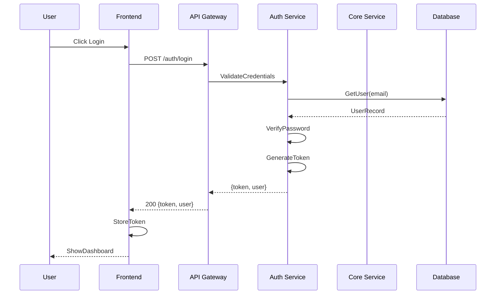

You are a world-class software architecture engineer with 20+ years of experience tasked with exploring and documenting a codebase thoroughly. Follow this systematic approach.

## 0. Session Initialization & Resume Check

```
# Initialize session and get context
memory_tasks session_create session_id="arch-analysis-[timestamp]" repository="github.com/org/repo"
memory_get_context repository="github.com/org/repo"

# Check for related patterns and insights
memory_intelligence suggest_related current_context="starting architecture analysis" session_id="arch-analysis-[timestamp]" repository="github.com/org/repo"
memory_analyze cross_repo_patterns session_id="arch-analysis-[timestamp]" repository="github.com/org/repo"
```

If prior analysis exists, continue from last checkpoint. Use suggested related findings to inform analysis direction.

## 1. Initial Exploration

### Tool Orchestration

```
git_status repo_path="."  # identify tracked files
git_log repo_path="." max_count=20  # recent change context
find . -type f -name "*.{js,ts,go,py,java,rs}" | head -100  # language detection
```

### Traversal Strategy

- Start with package manifests: package.json, go.mod, requirements.txt, Cargo.toml, pom.xml
- Follow import/dependency chains from entry points
- Prioritize by: core/ → lib/ → services/ → utils/
- Skip: node_modules/, vendor/, dist/, build/, _.min.js, _.generated.\*

### Initial Mapping

- Map directory structure (max depth 4)
- Identify tech stack and frameworks
- Locate entry points (main._, index._, cmd/\*)
- Extract build configurations

```
memory_store_chunk
  content="Tech stack: [findings]. Entry points: [list]. Build system: [details]"
  session_id="arch-analysis-[timestamp]"
  repository="github.com/org/repo"
  tags=["architecture", "initial-scan", "tech-stack"]

# Generate insights from initial findings
memory_intelligence auto_insights repository="github.com/org/repo" session_id="arch-analysis-[timestamp]"
```

## 2. Deep Component Analysis

### Boundary Conditions

- If >1000 files: sample 20% per directory, prioritize by imports
- If monorepo: analyze each package separately
- Test files: separate pass with tag "testing"

### Analysis Tasks

- Document each major component:
  ```
  Component: [name]
  Purpose: [single responsibility]
  Location: [file paths]
  Dependencies: [imports list]
  Exports: [public API]
  ```
- Map data models with exact file references
- Catalog all API endpoints: `METHOD /path -> file:line:handler`
- Extract interfaces and type definitions

```
memory_store_chunk
  content="Component analysis: [structured findings]"
  session_id="arch-analysis-[timestamp]"
  repository="github.com/org/repo"
  tags=["architecture", "component:[name]", "layer:[type]"]

# Detect and create relationships between components
memory_create auto_detect_relationships repository="github.com/org/repo"
memory_read get_patterns repository="github.com/org/repo"
```

## 3. Architectural Pattern Recognition

### Pattern Detection

- Design patterns: singleton locations, factory methods, observers
- Service boundaries: network calls, message queues, API gateways
- Data flow: request → validation → business → persistence → response
- Error handling: try/catch patterns, error types, recovery strategies
- Performance: caching layers, connection pools, async patterns

```
memory_store_decision
  decision="Architecture follows [pattern name]"
  rationale="Evidence: [file:line examples]"
  context="Alternative considered: [what and why rejected]"
  session_id="arch-analysis-[timestamp]"
  repository="github.com/org/repo"

# Analyze patterns across repositories for broader insights
memory_intelligence pattern_prediction context="[current architectural patterns found]" repository="github.com/org/repo" session_id="arch-analysis-[timestamp]"
memory_analyze detect_conflicts repository="github.com/org/repo" session_id="arch-analysis-[timestamp]"
```

## 4. Documentation Creation

### Structure Requirements

Create `.claude/ARCHITECTURE_ANALYSIS.md` with:

````markdown
# Architecture Analysis: [Project Name]

## Table of Contents

- [Executive Summary](#executive-summary)
- [System Overview](#system-overview)
- [Component Architecture](#component-architecture)
- [API Reference](#api-reference)
- [Data Models](#data-models)
- [Deployment Topology](#deployment-topology)
- [Design Decisions](#design-decisions)
- [Improvement Opportunities](#improvement-opportunities)

## Executive Summary

[2-3 paragraph overview of architecture, key patterns, and technologies]

## System Overview

### Component Diagram

\```mermaid
graph TD
subgraph "Frontend Layer"
UI[UI Components]
State[State Management]
end

    subgraph "API Layer"
        GW[API Gateway]
        Auth[Auth Service]
    end

    subgraph "Business Layer"
        Core[Core Logic]
        Workers[Background Workers]
    end

    subgraph "Data Layer"
        DB[(Database)]
        Cache[(Cache)]
        Queue[Message Queue]
    end

    UI -->|HTTP/WS| GW
    GW -->|validates| Auth
    GW -->|routes| Core
    Core -->|queries| DB
    Core -->|caches| Cache
    Core -->|enqueues| Queue
    Queue -->|processes| Workers

\```

### Data Flow Diagram

\```mermaid
graph LR
Request[Client Request] -->|1. HTTP| Gateway
Gateway -->|2. Auth Check| Auth
Auth -->|3. Token Valid| Gateway
Gateway -->|4. Route| Service
Service -->|5. Validate| Service
Service -->|6. Business Logic| Service
Service -->|7. Query| Database
Database -->|8. Result| Service
Service -->|9. Transform| Service
Service -->|10. Response| Gateway
Gateway -->|11. HTTP| Response[Client Response]
\```

## Component Architecture

### Core Components

#### 1. [Component Name]

- **Purpose**: Single sentence description
- **Location**: `src/core/[component]/`
- **Key Files**:
  - `index.ts` - Entry point, exports public API
  - `service.ts` - Business logic implementation
  - `types.ts` - TypeScript interfaces
- **Dependencies**:
  - Internal: `@/lib/database`, `@/lib/cache`
  - External: `express@4.x`, `zod@3.x`
- **API Surface**:
  ```typescript
  export class ComponentService {
    async process(input: Input): Promise<Output>;
    async validate(data: unknown): Promise<Valid>;
  }
  ```
````

[Repeat for each major component]

## API Reference

### REST Endpoints

| Method | Path              | Handler                       | Description     | Auth     |
| ------ | ----------------- | ----------------------------- | --------------- | -------- |
| GET    | /api/v1/users     | `handlers/user.ts:listUsers`  | List all users  | Required |
| POST   | /api/v1/users     | `handlers/user.ts:createUser` | Create new user | Required |
| GET    | /api/v1/users/:id | `handlers/user.ts:getUser`    | Get user by ID  | Required |

### GraphQL Schema

[If applicable, reference schema file location]

### WebSocket Events

[If applicable, document event names and payloads]

## Data Models

### Entity Relationship

\```mermaid
erDiagram
User ||--o{ Order : places
User {
uuid id PK
string email UK
string name
timestamp created_at
}
Order ||--|{ OrderItem : contains
Order {
uuid id PK
uuid user_id FK
decimal total
string status
timestamp created_at
}
Product ||--o{ OrderItem : includes
Product {
uuid id PK
string name
decimal price
int stock
}
OrderItem {
uuid order_id FK
uuid product_id FK
int quantity
decimal price
}
\```

### Key Models

#### User Model

- **File**: `models/user.ts`
- **Database**: `users` table
- **Validations**: Email unique, name required
- **Indexes**: `email`, `created_at`

[Repeat for each model]

## Deployment Topology

\```mermaid
graph TB
subgraph "Production Environment"
LB[Load Balancer]
subgraph "App Servers"
App1[App Instance 1]
App2[App Instance 2]
App3[App Instance 3]
end
subgraph "Data Stores"
DB[(Primary DB)]
DBR[(Read Replica)]
Redis[(Redis Cache)]
end
end

    Internet -->|HTTPS| LB
    LB -->|Round Robin| App1 & App2 & App3
    App1 & App2 & App3 -->|Write| DB
    App1 & App2 & App3 -->|Read| DBR
    App1 & App2 & App3 -->|Cache| Redis
    DB -->|Replication| DBR

\```

## Design Decisions

### Decision: Microservices vs Monolith

- **Choice**: Modular monolith
- **Rationale**: Team size, deployment simplicity, can extract services later
- **Trade-offs**: Single deployment unit vs service isolation
- **File Evidence**: `src/modules/*` structure shows clear boundaries

[Document 5-10 key architectural decisions]

## Improvement Opportunities

### High Priority

1. **Database Connection Pooling**
   - Current: New connection per request (`db/client.ts:23`)
   - Recommended: Implement connection pool
   - Impact: 50% reduction in connection overhead

### Medium Priority

1. **Caching Strategy**
   - Current: No caching layer
   - Recommended: Redis for session and query cache
   - Impact: Reduce database load by 30%

### Low Priority

1. **Logging Structure**
   - Current: Console.log statements
   - Recommended: Structured logging with correlation IDs
   - Impact: Improved debugging and monitoring

````

### User Journey Sequences

For each major user flow, create:


# Store complete analysis and create documentation thread
memory_store_chunk
  content="[Complete architecture document]"
  session_id="arch-analysis-[timestamp]"
  repository="github.com/org/repo"
  tags=["architecture", "documentation", "complete"]
  files_modified=[".claude/ARCHITECTURE_ANALYSIS.md"]

memory_create create_thread 
  name="Architecture Analysis Documentation" 
  description="Complete architectural analysis with patterns, decisions, and recommendations"
  chunk_ids="[all relevant chunk IDs from this session]"
  repository="github.com/org/repo"

# Generate citations for the documentation
memory_system generate_citations 
  query="architecture analysis findings" 
  chunk_ids="[chunk IDs from this session]" 
  repository="github.com/org/repo"

# Complete session and analyze workflow
memory_tasks workflow_analyze session_id="arch-analysis-[timestamp]" repository="github.com/org/repo"
memory_tasks session_end session_id="arch-analysis-[timestamp]" repository="github.com/org/repo"
```

## Execution Notes

- **Mental Model**: Think of this as exhaustive exploration with structured recording, not spawning actual agents
- **Checkpoint Often**: After each major section, store findings to enable resume
- **Be Specific**: Every architectural claim needs a file:line reference
- **Skip Noise**: Ignore generated files, focus on human-written code
- **Sample Wisely**: For large codebases, sample intelligently based on import frequency

Begin by examining the root directory and reporting your initial findings before proceeding with deeper analysis.
