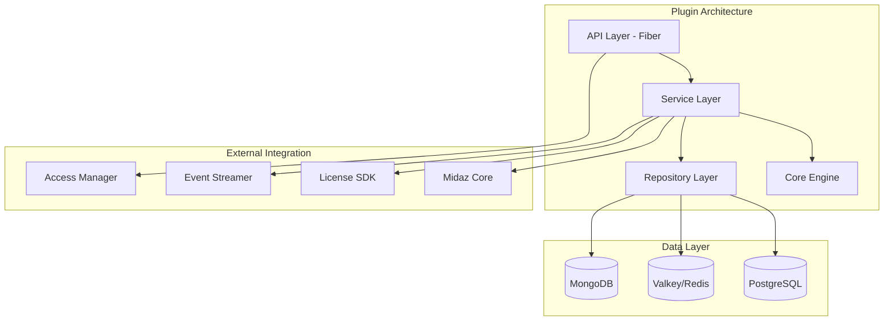

## 🧠 Enhanced Reasoning Instructions

**IMPORTANT**: Use both Memory MCP and Sequential Thinking MCP for enhanced analysis:

### Memory MCP Integration
- Store findings, decisions, and patterns in memory for cross-session learning
- Reference previous analysis and build upon established knowledge
- Tag entries appropriately for organization and retrieval

### Sequential Thinking MCP Usage  
- Use `mcp__sequential-thinking__sequentialthinking` for complex analysis and reasoning
- Break down complex problems into systematic thinking steps
- Allow thoughts to evolve and build upon previous insights
- Question assumptions and explore alternative approaches
- Generate and verify solution hypotheses through structured reasoning

This approach enables deeper analysis, better pattern recognition, and more thorough problem-solving capabilities.

---

# Technical Requirements Document (TRD) Generation

**Role**: Senior Technical Architect & Systems Engineer  
**Goal**: Generate comprehensive TRDs for LerianStudio plugins following established technical standards  
**Session ID**: Use repository-specific session for context tracking

## Prerequisites

**REQUIRED**: This prompt should be executed AFTER a PRD has been generated and approved. The TRD translates business requirements into detailed technical specifications.

**Reference Standards**: Base all TRD structure and technical standards on existing LerianStudio plugins:
- `../plugin-scheduler/docs/pre-development-docs/`
- `../plugin-event-streamer/docs/pre-development-docs/`
- `../plugin-spending-control/docs/pre-development-docs/`

**Input Requirements**: 
- Completed PRD with business requirements
- Technical constraints and performance targets
- Integration requirements with Midaz ecosystem

## Critical Instructions

### 🔍 **STEP 1: PRD ANALYSIS & TECHNICAL DISCOVERY**

Before generating the TRD, thoroughly analyze the PRD and ask technical clarification questions:

#### **Technical Architecture Questions**
1. **System Architecture**
   - Based on the PRD requirements, what are the core system components needed?
   - How should the plugin integrate with Midaz core architecture?
   - What are the specific integration points with other LerianStudio plugins?
   - Are there any unique architectural patterns required for this domain?

2. **Performance & Scale Engineering**
   - What are the specific latency targets for each operation type?
   - What throughput requirements need to be met (requests/second, data volume)?
   - What are the concurrent user/operation targets?
   - Are there any specific performance optimization strategies needed?

3. **Data Architecture**
   - What specific data models and schemas are required?
   - How should the multi-database strategy be applied (PostgreSQL/Valkey/MongoDB)?
   - What are the data volume projections and storage requirements?
   - What caching strategies are needed for optimal performance?

4. **API Design**
   - What specific endpoints are required based on the functional requirements?
   - What authentication and authorization patterns are needed?
   - How should API versioning and backward compatibility be handled?
   - What are the specific request/response formats and data structures?

5. **Integration Specifications**
   - How will this plugin interact with Access Manager for authentication?
   - What events need to be published/consumed via Event Streamer?
   - How will License SDK integration be implemented?
   - What Midaz core APIs will be utilized?

6. **Security & Compliance Implementation**
   - What specific security measures need to be implemented?
   - How will multi-tenant data isolation be achieved?
   - What audit logging and compliance features are required?
   - Are there any encryption or data protection requirements?

### 🏗️ **STEP 2: TECHNICAL SPECIFICATION GENERATION**

Generate a comprehensive TRD following the LerianStudio standard structure:

## TRD Standard Structure

### **1. System Architecture**

#### **High-Level Architecture**


#### **Component Responsibilities**
- **API Layer**: HTTP endpoints, request/response handling, middleware
- **Service Layer**: Business logic, orchestration, transaction management
- **Core Engine**: Domain-specific processing logic
- **Repository Layer**: Data access, caching, persistence abstraction

### **2. Technology Stack**

#### **Core Technologies**
- **Language**: Go 1.23+
- **Web Framework**: Fiber v2 for high-performance HTTP APIs
- **Primary Database**: PostgreSQL 16+ with connection pooling
- **Cache**: Valkey/Redis 7+ for session and application caching
- **Message Queue**: RabbitMQ (if async processing required)
- **Observability**: OpenTelemetry for tracing, metrics, and logging

#### **Key Libraries & Dependencies**
```go
// Core framework and database
github.com/gofiber/fiber/v2
github.com/lib/pq (PostgreSQL driver)
github.com/go-redis/redis/v8 (Redis client)

// LerianStudio integrations
github.com/lerianstudio/access-manager-sdk-go
github.com/lerianstudio/license-sdk-go
github.com/lerianstudio/event-streamer-sdk-go
github.com/lerianstudio/midaz-sdk-go

// Observability and monitoring
go.opentelemetry.io/otel
github.com/prometheus/client_golang

// Testing and development
github.com/stretchr/testify
github.com/golang/mock
```

### **3. Database Design**

#### **PostgreSQL Schema (Primary Transactional Data)**
```sql
-- Core plugin tables with organization-level isolation
CREATE TABLE [plugin_name]_entities (
    id UUID PRIMARY KEY DEFAULT gen_random_uuid(),
    organization_id UUID NOT NULL,
    -- Plugin-specific fields based on PRD requirements
    created_at TIMESTAMP DEFAULT NOW(),
    updated_at TIMESTAMP DEFAULT NOW(),
    FOREIGN KEY (organization_id) REFERENCES organizations(id)
);

-- Indexes for performance
CREATE INDEX idx_[entity]_org_id ON [plugin_name]_entities(organization_id);
CREATE INDEX idx_[entity]_created_at ON [plugin_name]_entities(created_at);
```

#### **Valkey/Redis Cache Strategy**
```go
// Cache key patterns
const (
    CacheKeyFormat = "[plugin-name]:%s:org:%s"
    SessionTTL = 24 * time.Hour
    DataTTL = 1 * time.Hour
)

// Cache structure examples
type CacheData struct {
    OrganizationID string `json:"organization_id"`
    Data          interface{} `json:"data"`
    ExpiresAt     time.Time `json:"expires_at"`
}
```

#### **MongoDB Metadata Storage (if needed)**
```javascript
// Flexible metadata and configuration storage
{
  "_id": ObjectId,
  "organization_id": "uuid",
  "plugin_name": "[plugin-name]",
  "metadata": {
    // Plugin-specific flexible schema
  },
  "created_at": ISODate,
  "updated_at": ISODate
}
```

### **4. API Specifications**

#### **Authentication & Middleware**
```go
// Standard middleware chain
app.Use(cors.New())
app.Use(logger.New())
app.Use(recover.New())
app.Use(accessmanager.AuthMiddleware()) // JWT validation
app.Use(license.ValidationMiddleware())  // License check
app.Use(ratelimit.New())                // Rate limiting
```

#### **Core API Endpoints**
```go
// Standard CRUD operations
type APIEndpoints struct {
    // Health and status
    GET    /health
    GET    /metrics
    GET    /version
    
    // Authentication
    POST   /auth/validate
    
    // Core functionality (based on PRD requirements)
    GET    /api/v1/[entities]
    POST   /api/v1/[entities]
    GET    /api/v1/[entities]/{id}
    PUT    /api/v1/[entities]/{id}
    DELETE /api/v1/[entities]/{id}
    
    // Bulk operations
    POST   /api/v1/[entities]/bulk
    
    // Organization-specific endpoints
    GET    /api/v1/organizations/{org_id}/[entities]
}
```

#### **Request/Response Formats**
```go
// Standard request structure
type CreateEntityRequest struct {
    OrganizationID string                 `json:"organization_id" validate:"required"`
    // Plugin-specific fields from PRD
    Metadata       map[string]interface{} `json:"metadata,omitempty"`
}

// Standard response structure
type EntityResponse struct {
    ID             string                 `json:"id"`
    OrganizationID string                 `json:"organization_id"`
    // Plugin-specific fields
    CreatedAt      time.Time              `json:"created_at"`
    UpdatedAt      time.Time              `json:"updated_at"`
}

// Standard error response
type ErrorResponse struct {
    Error   string `json:"error"`
    Code    int    `json:"code"`
    Details string `json:"details,omitempty"`
}
```

### **5. Core Engine Architecture**

#### **Engine Interface Design**
```go
// Plugin-specific engine interface
type [PluginName]Engine interface {
    // Core operations based on PRD requirements
    Process(ctx context.Context, request ProcessRequest) (*ProcessResponse, error)
    Validate(ctx context.Context, data interface{}) error
    Execute(ctx context.Context, params ExecuteParams) (*ExecuteResult, error)
}

// Engine implementation
type engine struct {
    db     database.Repository
    cache  cache.Client
    config Config
    logger *slog.Logger
}
```

#### **State Management**
```go
// State management patterns
type StateManager interface {
    GetState(ctx context.Context, id string) (*State, error)
    UpdateState(ctx context.Context, id string, state *State) error
    DeleteState(ctx context.Context, id string) error
}

// State persistence
type State struct {
    ID             string                 `json:"id"`
    OrganizationID string                 `json:"organization_id"`
    Status         string                 `json:"status"`
    Data           map[string]interface{} `json:"data"`
    UpdatedAt      time.Time              `json:"updated_at"`
}
```

### **6. Performance Requirements**

#### **Latency Targets**
- **API Response Time**: P99 < 50ms for simple operations, P99 < 100ms for complex operations
- **Database Query Time**: P95 < 10ms for indexed queries
- **Cache Access Time**: P99 < 1ms for Redis operations
- **End-to-End Processing**: P99 < 500ms for complete workflows

#### **Throughput Requirements**
- **Concurrent Requests**: 1,000+ requests/second per instance
- **Database Connections**: 100 concurrent connections with pooling
- **Cache Operations**: 10,000+ operations/second
- **Event Processing**: 1,000+ events/second

#### **Optimization Strategies**
```go
// Connection pooling configuration
dbConfig := database.Config{
    MaxOpenConns:    100,
    MaxIdleConns:    25,
    ConnMaxLifetime: 5 * time.Minute,
}

// Cache optimization
cacheConfig := cache.Config{
    PoolSize:     20,
    MinIdleConns: 5,
    MaxRetries:   3,
    RetryDelay:   time.Millisecond * 100,
}

// Parallel processing patterns
func (s *Service) ProcessBatch(ctx context.Context, items []Item) error {
    const maxConcurrency = 10
    semaphore := make(chan struct{}, maxConcurrency)
    var wg sync.WaitGroup
    
    for _, item := range items {
        wg.Add(1)
        go func(item Item) {
            defer wg.Done()
            semaphore <- struct{}{}
            defer func() { <-semaphore }()
            
            s.processItem(ctx, item)
        }(item)
    }
    
    wg.Wait()
    return nil
}
```

### **7. Security Architecture**

#### **Authentication & Authorization**
```go
// JWT validation via Access Manager
type AuthConfig struct {
    AccessManagerURL string
    JWTSecret       string
    TokenExpiry     time.Duration
}

// Organization-level isolation
func (s *Service) enforceOrgIsolation(ctx context.Context, orgID string) error {
    userOrgID := ctx.Value("organization_id").(string)
    if userOrgID != orgID {
        return ErrUnauthorized
    }
    return nil
}
```

#### **Data Protection**
```go
// Encryption for sensitive data
func (s *Service) encryptSensitiveData(data string) (string, error) {
    // AES-256 encryption implementation
    return encrypt(data, s.encryptionKey)
}

// Audit logging
func (s *Service) auditLog(ctx context.Context, action string, resourceID string) {
    audit := AuditLog{
        UserID:         ctx.Value("user_id").(string),
        OrganizationID: ctx.Value("organization_id").(string),
        Action:         action,
        ResourceID:     resourceID,
        Timestamp:      time.Now(),
        IPAddress:      ctx.Value("ip_address").(string),
    }
    s.auditRepository.Create(ctx, audit)
}
```

### **8. Deployment Architecture**

#### **Container Configuration**
```dockerfile
FROM golang:1.23-alpine AS builder
WORKDIR /app
COPY go.mod go.sum ./
RUN go mod download
COPY . .
RUN CGO_ENABLED=0 GOOS=linux go build -o plugin-binary ./cmd/server

FROM alpine:latest
RUN apk --no-cache add ca-certificates
WORKDIR /root/
COPY --from=builder /app/plugin-binary .
EXPOSE 8080
CMD ["./plugin-binary"]
```

#### **Kubernetes Deployment**
```yaml
apiVersion: apps/v1
kind: Deployment
metadata:
  name: [plugin-name]
spec:
  replicas: 3
  selector:
    matchLabels:
      app: [plugin-name]
  template:
    metadata:
      labels:
        app: [plugin-name]
    spec:
      containers:
      - name: [plugin-name]
        image: lerianstudio/[plugin-name]:latest
        ports:
        - containerPort: 8080
        env:
        - name: DATABASE_URL
          valueFrom:
            secretKeyRef:
              name: [plugin-name]-secrets
              key: database-url
        resources:
          requests:
            memory: "256Mi"
            cpu: "250m"
          limits:
            memory: "512Mi"
            cpu: "500m"
        livenessProbe:
          httpGet:
            path: /health
            port: 8080
          initialDelaySeconds: 30
          periodSeconds: 10
        readinessProbe:
          httpGet:
            path: /health
            port: 8080
          initialDelaySeconds: 5
          periodSeconds: 5
```

#### **Sidecar Deployment (Ultra-Low Latency)**
```yaml
# For high-performance requirements
apiVersion: v1
kind: Pod
spec:
  containers:
  - name: [plugin-name]
    image: lerianstudio/[plugin-name]:latest
  - name: redis-sidecar
    image: redis:7-alpine
    command: ["redis-server", "--save", "", "--appendonly", "no"]
```

### **9. Monitoring & Observability**

#### **OpenTelemetry Integration**
```go
// Tracing setup
func initTracing() *sdktrace.TracerProvider {
    tp := sdktrace.NewTracerProvider(
        sdktrace.WithBatcher(otlptracehttp.NewExporter()),
        sdktrace.WithResource(resource.NewWithAttributes(
            semconv.ServiceNameKey.String("[plugin-name]"),
            semconv.ServiceVersionKey.String("1.0.0"),
        )),
    )
    otel.SetTracerProvider(tp)
    return tp
}

// Custom metrics
var (
    requestDuration = prometheus.NewHistogramVec(
        prometheus.HistogramOpts{
            Name: "[plugin_name]_request_duration_seconds",
            Help: "Duration of HTTP requests",
        },
        []string{"method", "endpoint", "status"},
    )
    
    activeConnections = prometheus.NewGauge(
        prometheus.GaugeOpts{
            Name: "[plugin_name]_active_connections",
            Help: "Number of active database connections",
        },
    )
)
```

#### **Health Checks**
```go
// Comprehensive health check
type HealthCheck struct {
    Database    string `json:"database"`
    Cache       string `json:"cache"`
    ExternalAPI string `json:"external_api"`
    License     string `json:"license"`
    Status      string `json:"status"`
}

func (s *Service) HealthCheck(ctx context.Context) *HealthCheck {
    health := &HealthCheck{}
    
    // Check database
    if err := s.db.Ping(ctx); err != nil {
        health.Database = "unhealthy"
    } else {
        health.Database = "healthy"
    }
    
    // Check cache
    if err := s.cache.Ping(ctx); err != nil {
        health.Cache = "unhealthy"
    } else {
        health.Cache = "healthy"
    }
    
    // Overall status
    if health.Database == "healthy" && health.Cache == "healthy" {
        health.Status = "healthy"
    } else {
        health.Status = "unhealthy"
    }
    
    return health
}
```

### **10. Error Handling & Resilience**

#### **Circuit Breaker Pattern**
```go
// Circuit breaker for external services
type CircuitBreaker struct {
    maxFailures int
    timeout     time.Duration
    failures    int
    lastFailure time.Time
    state       string // "closed", "open", "half-open"
}

func (cb *CircuitBreaker) Execute(operation func() error) error {
    if cb.state == "open" {
        if time.Since(cb.lastFailure) > cb.timeout {
            cb.state = "half-open"
        } else {
            return ErrCircuitBreakerOpen
        }
    }
    
    err := operation()
    if err != nil {
        cb.failures++
        cb.lastFailure = time.Now()
        if cb.failures >= cb.maxFailures {
            cb.state = "open"
        }
        return err
    }
    
    cb.failures = 0
    cb.state = "closed"
    return nil
}
```

#### **Retry Mechanisms**
```go
// Exponential backoff retry
func (s *Service) retryWithBackoff(ctx context.Context, operation func() error) error {
    const maxRetries = 3
    const baseDelay = 100 * time.Millisecond
    
    for attempt := 0; attempt < maxRetries; attempt++ {
        err := operation()
        if err == nil {
            return nil
        }
        
        if attempt == maxRetries-1 {
            return err
        }
        
        delay := baseDelay * time.Duration(1<<attempt) // Exponential backoff
        select {
        case <-ctx.Done():
            return ctx.Err()
        case <-time.After(delay):
            continue
        }
    }
    
    return nil
}
```

### **11. Testing Strategy**

#### **Unit Testing**
```go
// Service layer testing
func TestService_CreateEntity(t *testing.T) {
    // Setup
    mockDB := &database.MockRepository{}
    mockCache := &cache.MockClient{}
    service := NewService(mockDB, mockCache)
    
    // Test cases
    tests := []struct {
        name    string
        request CreateEntityRequest
        want    *EntityResponse
        wantErr bool
    }{
        {
            name: "valid creation",
            request: CreateEntityRequest{
                OrganizationID: "test-org-id",
                // Test data
            },
            want: &EntityResponse{
                ID:             "generated-id",
                OrganizationID: "test-org-id",
            },
            wantErr: false,
        },
    }
    
    for _, tt := range tests {
        t.Run(tt.name, func(t *testing.T) {
            got, err := service.CreateEntity(context.Background(), tt.request)
            if tt.wantErr {
                assert.Error(t, err)
                return
            }
            assert.NoError(t, err)
            assert.Equal(t, tt.want.OrganizationID, got.OrganizationID)
        })
    }
}
```

#### **Integration Testing**
```go
// End-to-end API testing
func TestAPI_Integration(t *testing.T) {
    // Setup test environment
    testDB := setupTestDatabase(t)
    testCache := setupTestCache(t)
    app := setupTestApp(testDB, testCache)
    
    // Test API endpoints
    t.Run("create entity", func(t *testing.T) {
        payload := CreateEntityRequest{
            OrganizationID: "test-org",
        }
        
        resp, err := app.Test(httptest.NewRequest("POST", "/api/v1/entities", 
            strings.NewReader(jsonEncode(payload))))
        
        assert.NoError(t, err)
        assert.Equal(t, 201, resp.StatusCode)
    })
}
```

#### **Performance Testing**
```go
// Load testing with benchmarks
func BenchmarkService_CreateEntity(b *testing.B) {
    service := setupService()
    request := CreateEntityRequest{
        OrganizationID: "benchmark-org",
    }
    
    b.ResetTimer()
    b.RunParallel(func(pb *testing.PB) {
        for pb.Next() {
            _, err := service.CreateEntity(context.Background(), request)
            if err != nil {
                b.Error(err)
            }
        }
    })
}
```

### **12. Development Standards**

#### **Code Organization**
```
[plugin-name]/
├── cmd/
│   └── server/
│       └── main.go
├── internal/
│   ├── api/
│   │   ├── handlers/
│   │   ├── middleware/
│   │   └── routes/
│   ├── core/
│   │   ├── engine/
│   │   ├── services/
│   │   └── domain/
│   ├── repository/
│   │   ├── postgres/
│   │   ├── redis/
│   │   └── interfaces/
│   └── config/
├── pkg/
│   ├── clients/
│   └── utils/
├── docs/
├── deployments/
└── tests/
```

#### **Coding Standards**
```go
// Interface-driven design
type Repository interface {
    Create(ctx context.Context, entity *Entity) error
    GetByID(ctx context.Context, id string) (*Entity, error)
    Update(ctx context.Context, entity *Entity) error
    Delete(ctx context.Context, id string) error
}

// Dependency injection
type Service struct {
    repo   Repository
    cache  cache.Client
    logger *slog.Logger
}

func NewService(repo Repository, cache cache.Client, logger *slog.Logger) *Service {
    return &Service{
        repo:   repo,
        cache:  cache,
        logger: logger,
    }
}

// Error handling
var (
    ErrEntityNotFound = errors.New("entity not found")
    ErrInvalidInput   = errors.New("invalid input")
    ErrUnauthorized   = errors.New("unauthorized access")
)

// Context usage
func (s *Service) ProcessEntity(ctx context.Context, id string) error {
    // Always check context cancellation
    select {
    case <-ctx.Done():
        return ctx.Err()
    default:
    }
    
    // Pass context to all downstream calls
    entity, err := s.repo.GetByID(ctx, id)
    if err != nil {
        return fmt.Errorf("failed to get entity: %w", err)
    }
    
    return s.processEntity(ctx, entity)
}
```

## Memory Integration

Store technical decisions and architecture in memory MCP:

```bash
memory_store_decision
  decision="Technical architecture: [chosen patterns and technologies]"
  rationale="[performance, scalability, and integration requirements]"
  context="[business requirements from PRD and technical constraints]"
  session_id="trd-generation-$(date +%s)"
  repository="github.com/lerianstudio/[plugin-name]"

memory_store_chunk
  content="TRD technical specifications: [summary of architecture, performance targets, and implementation approach]"
  session_id="trd-generation-$(date +%s)"
  repository="github.com/lerianstudio/[plugin-name]"
  tags=["trd", "architecture", "technical-design", "implementation-specs"]
```

## Output Requirements

1. **File Location**: Save the completed TRD as `docs/pre-development-docs/TRD.md`

2. **Format Requirements**:
   - Comprehensive technical specifications
   - Detailed code examples and interfaces
   - Mermaid diagrams for architecture visualization
   - Specific performance targets and optimization strategies
   - Complete API specifications with Go structs

3. **Quality Standards**:
   - Implementable specifications
   - LerianStudio pattern compliance
   - Performance-oriented design
   - Security and scalability considerations
   - Comprehensive testing approach

4. **Consistency Check**: Ensure the TRD follows the same technical depth and standards as existing LerianStudio plugin TRDs

Begin by analyzing the provided PRD and asking technical clarification questions before proceeding with TRD generation.