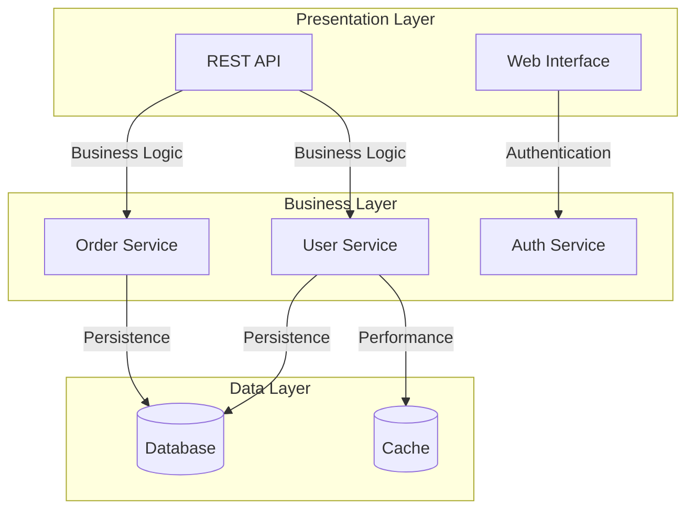
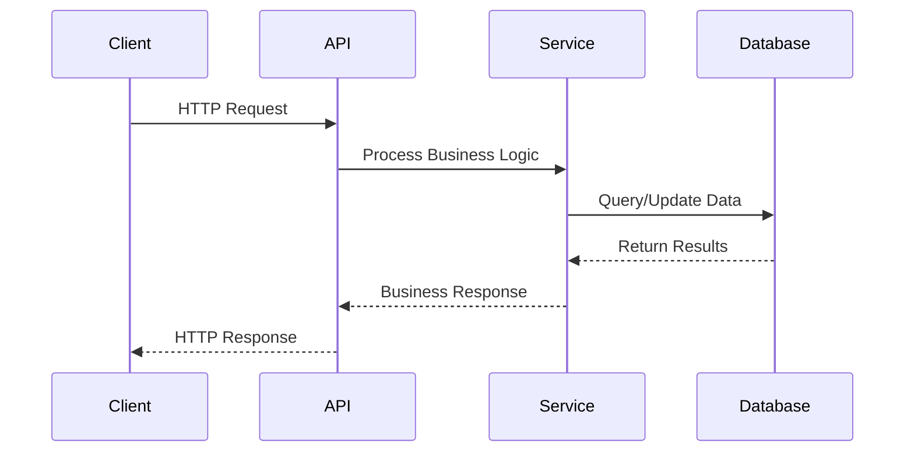
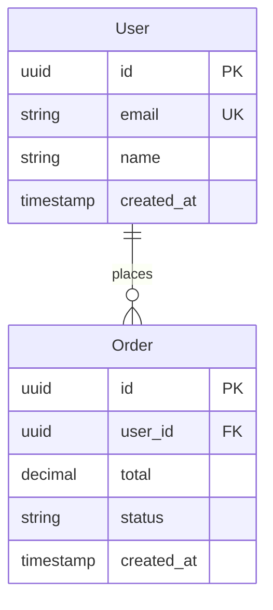

## 🧠 Enhanced Reasoning Instructions

**IMPORTANT**: Use both Memory MCP and Sequential Thinking MCP for enhanced analysis:

### Memory MCP Integration
- Store findings, decisions, and patterns in memory for cross-session learning
- Reference previous analysis and build upon established knowledge
- Tag entries appropriately for organization and retrieval

### Sequential Thinking MCP Usage  
- Use `mcp__sequential-thinking__sequentialthinking` for complex analysis and reasoning
- Break down complex problems into systematic thinking steps
- Allow thoughts to evolve and build upon previous insights
- Question assumptions and explore alternative approaches
- Generate and verify solution hypotheses through structured reasoning

This approach enables deeper analysis, better pattern recognition, and more thorough problem-solving capabilities.

---

You are a software architecture engineer specializing in rapid codebase analysis and documentation. Create a comprehensive overview with component mapping and architectural insights.

## 🔗 Prompt Chaining Rules

**CRITICAL: This is prompt #0 in the analysis chain.**

**Dependency Checking:**
- This is the foundational analysis - no previous outputs to consider
- Must create base documentation that subsequent prompts will build upon

**Output Review:**
- If `.claude/0-CODEBASE_OVERVIEW.md` already exists:
  1. Read and analyze the existing output first
  2. Review it against current codebase state
  3. Update sections that have become outdated
  4. Add any missing components or patterns discovered
  5. Note any discrepancies between documented and actual architecture

**Chain Coordination:**
- Store findings in memory MCP with tags: `["codebase-overview", "foundation", "prompt-0"]`
- Create clear base documentation for prompts 1-10 to reference
- Focus on high-level architectural patterns that inform security, database, API, and other specialized analyses

## File Organization

**REQUIRED OUTPUT LOCATIONS:**

- `.claude/0-CODEBASE_OVERVIEW.md` - Complete codebase analysis with component diagrams
- Multiple agents coordination for comprehensive coverage

**IMPORTANT RULES:**

- Launch multiple agents to cover all analysis areas
- Store findings using memory MCP after each step
- Focus on major components and their relationships
- Provide practical implementation insights

## 1. Initial Exploration

### Technology Stack & Entry Points

```bash
# Quick language detection
find . -type f -name "*.{js,ts,go,py,java,rs}" | head -20

# Find package managers and configs
find . -name "package.json" -o -name "go.mod" -o -name "requirements.txt" -o -name "Cargo.toml" | head -5

# Identify entry points
find . -name "main.*" -o -name "index.*" -o -name "app.*" | grep -v node_modules | head -10

# Build/deployment configs
find . -name "Dockerfile" -o -name "docker-compose.yml" -o -name "Makefile" -o -name ".github" | head -5
```

**Store findings using memory MCP:**

```
memory_store_chunk
  content="Tech stack: [languages found]. Entry points: [main files]. Build system: [docker/make/npm]"
  tags=["codebase-overview", "tech-stack", "entry-points"]
```

## 2. Deep Component Analysis

### Major Components Discovery

```bash
# Find service/module boundaries
find . -name "*.{js,ts,go}" -path "*service*" -o -path "*controller*" -o -path "*handler*" | head -20

# Identify data models and types
grep -r "struct\|class\|interface\|type.*=" --include="*.{js,ts,go,py}" . | grep -E "(User|Order|Product|Model)" | head -15

# API endpoints mapping
grep -r "router\.\|app\.\|route\|@Get\|@Post\|@Put\|@Delete" --include="*.{js,ts,go,py,java}" . | head -20

# Database and persistence
grep -r "database\|db\|connection\|postgres\|mysql\|mongo" --include="*.{js,ts,go,py}" . | head -10
```

**Store component findings:**

```
memory_store_chunk
  content="Components found: [list with purposes]. API endpoints: [count]. Data models: [key entities]"
  tags=["components", "api-mapping", "data-models"]
```

## 3. Architectural Pattern Recognition

### Service Architecture & Communication

```bash
# Communication patterns
grep -r "http\|fetch\|axios\|request\|rpc\|graphql" --include="*.{js,ts,go,py}" . | head -15

# Event/messaging patterns
grep -r "event\|message\|queue\|pub\|sub\|kafka\|redis" --include="*.{js,ts,go,py}" . | head -10

# Authentication and security
grep -r "auth\|jwt\|token\|session\|middleware" --include="*.{js,ts,go,py}" . | head -15

# Error handling patterns
grep -r "try.*catch\|error\|panic\|recover" --include="*.{js,ts,go,py}" . | head -10
```

**Store architectural patterns:**

```
memory_store_decision
  decision="Architecture style: [monolith|microservices|modular]"
  rationale="Evidence: [file references and patterns found]"
  context="Communication: [sync|async|mixed]. Auth: [jwt|session|oauth]"
```

## 4. Documentation Creation

Create comprehensive overview in `.claude/CODEBASE_OVERVIEW.md`:

````markdown
# Codebase Overview

## Executive Summary

**Project Type**: [Web API|Full-stack|CLI|Library]
**Architecture**: [Monolith|Microservices|Modular Monolith]
**Primary Language**: [Language] ([percentage]%)
**Component Count**: [Major components]

## Technology Stack

### Core Technologies

- **Backend**: [Framework and version]
- **Database**: [Type and version]
- **Cache/Queue**: [If applicable]
- **Build/Deploy**: [Docker, Make, npm scripts]

### Key Dependencies

```json
{
  "runtime": ["express@4.x - Web framework", "postgres@3.x - Database"],
  "development": ["jest@29.x - Testing", "eslint@8.x - Linting"]
}
```

## System Architecture

### Component Overview



### Data Flow



## Key Components

### 1. [Component Name]

- **Purpose**: [Single responsibility description]
- **Location**: `src/[path]/`
- **Key Files**:
  - `[main-file].ts` - [Purpose]
  - `[model-file].ts` - [Purpose]
  - `[test-file].test.ts` - [Purpose]
- **Dependencies**: [Internal and external deps]
- **API Endpoints**: [If applicable]

### 2. [Component Name]

[Repeat structure for each major component]

## API Reference

### Public Endpoints

| Method | Path           | Handler                     | Description | Auth     |
| ------ | -------------- | --------------------------- | ----------- | -------- |
| GET    | /api/v1/users  | `user.controller.ts:list`   | List users  | Required |
| POST   | /api/v1/users  | `user.controller.ts:create` | Create user | Required |
| GET    | /api/v1/orders | `order.controller.ts:list`  | List orders | Required |

### Internal Interfaces

[Document internal component communication if applicable]

## Data Models

### Core Entities



## Design Decisions

### Decision: [Architecture Choice]

- **Rationale**: [Why this approach]
- **Trade-offs**: [What was sacrificed vs gained]
- **Evidence**: [File references]
- **Alternatives**: [What else was considered]

### Decision: [Technology Choice]

[Repeat for key technical decisions]

## Notable Patterns

### 1. [Pattern Name]

- **Location**: [Where implemented]
- **Purpose**: [Why used]
- **Implementation**: [Brief description with file refs]

### 2. Error Handling Strategy

- **Pattern**: [try/catch, Result types, etc.]
- **Consistency**: [Across codebase]
- **Improvements**: [Suggestions if applicable]

## Quality Metrics

### Code Organization

- **Total Files**: [count]
- **Lines of Code**: [approximate]
- **Test Coverage**: [percentage if available]
- **Documentation**: [README, API docs status]

### Architecture Health

- **Component Coupling**: [High|Medium|Low]
- **Code Duplication**: [Observed level]
- **Separation of Concerns**: [Clean|Mixed]

## Potential Improvements

### High Priority

1. **[Improvement Area]**
   - **Current State**: [What exists now]
   - **Recommended**: [What should be done]
   - **Impact**: [Expected benefit]
   - **Effort**: [Estimated work]

### Medium Priority

[Continue with actionable improvements]

## Development Workflow

### Local Setup

```bash
# Environment setup commands
npm install
npm run setup
npm run dev
```

### Testing Strategy

- **Unit Tests**: [Framework and approach]
- **Integration Tests**: [If present]
- **E2E Tests**: [If present]

### Code Quality

- **Linting**: [Rules and tools]
- **Formatting**: [Prettier, go fmt, etc.]
- **Type Checking**: [TypeScript, mypy, etc.]

## Deployment Architecture

### Current Deployment

[Describe how the application is deployed]

### Scaling Considerations

[Areas that may need attention for scale]

## Getting Started

### For New Developers

1. [Step-by-step onboarding]
2. [Key files to understand first]
3. [How to make first contribution]

### For System Integration

[How other systems interact with this codebase]
````

## Launch Multiple Agents

For comprehensive analysis, coordinate multiple specialized agents:

```bash
# Launch architecture analysis
# Agent for detailed component architecture

# Launch security analysis
# Agent for security vulnerability assessment

# Launch performance analysis
# Agent for performance bottlenecks and optimization

# Launch database analysis
# Agent for data model and query optimization

# Launch API analysis
# Agent for API design and contract analysis
```

**Store final overview:**

```
memory_store_chunk
  content="Complete codebase overview created with [X] components, [Y] endpoints, [Z] design patterns identified"
  tags=["codebase-overview", "documentation", "analysis-complete"]
  files_modified=[".claude/CODEBASE_OVERVIEW.md"]

memory_create create_thread
  name="Codebase Analysis Overview"
  description="High-level architectural analysis with component mapping and design decisions"
  chunk_ids=["[all_relevant_chunk_ids]"]
```

## Execution Strategy

1. **Start with Structure**: Map directory structure and identify major patterns
2. **Find Entry Points**: Understand how the application starts and handles requests
3. **Map Components**: Identify major functional boundaries and responsibilities
4. **Document Patterns**: Record architectural and design patterns in use
5. **Create Visual Documentation**: Use mermaid diagrams for clear communication
6. **Coordinate Agents**: Launch specialized agents for deeper analysis in each area

Begin by examining the root directory structure and identifying the technology stack, then proceed with systematic component analysis.
