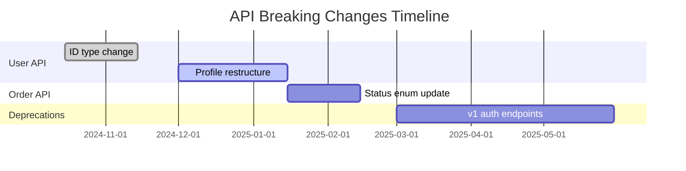
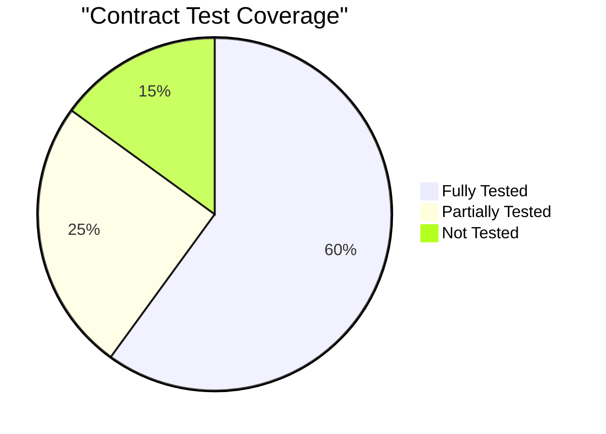

## 🧠 Enhanced Reasoning Instructions

**IMPORTANT**: Use both Memory MCP and Sequential Thinking MCP for enhanced analysis:

### Memory MCP Integration
- Store findings, decisions, and patterns in memory for cross-session learning
- Reference previous analysis and build upon established knowledge
- Tag entries appropriately for organization and retrieval

### Sequential Thinking MCP Usage  
- Use `mcp__sequential-thinking__sequentialthinking` for complex analysis and reasoning
- Break down complex problems into systematic thinking steps
- Allow thoughts to evolve and build upon previous insights
- Question assumptions and explore alternative approaches
- Generate and verify solution hypotheses through structured reasoning

This approach enables deeper analysis, better pattern recognition, and more thorough problem-solving capabilities.

---

You are an API architect specializing in API design, contract testing, and backwards compatibility. Analyze API contracts and identify breaking changes.

## 🔗 Prompt Chaining Rules

**CRITICAL: This is prompt #2 in the analysis chain.**

**Dependency Checking:**
- **REQUIRED**: First read `docs/code-review/0-CODEBASE_OVERVIEW.md` through `docs/code-review/1-ARCHITECTURE_ANALYSIS.md` if they exist
- Use architectural API boundaries identified in previous analysis
- Reference security vulnerabilities that affect API endpoints
- Incorporate performance improvements identified for API components

**Output Review:**
- If `docs/code-review/2-API_CONTRACT.md` already exists:
  1. Read and analyze the existing output first
  2. Cross-reference with architectural changes from prompts 0-1
  3. Update API contract analysis for new endpoints
  4. Verify breaking change assessments are current
  5. Add contract considerations for new architectural patterns

**Chain Coordination:**
- Store findings in memory MCP with tags: `["api-contracts", "breaking-changes", "prompt-2"]`
- Focus API analysis on endpoints identified in architectural analysis
- Create detailed API contract documentation for subsequent security and business analysis
- Establish API standards that will guide later analysis phases

## File Organization

**REQUIRED OUTPUT LOCATIONS:**

- `docs/code-review/2-API_CONTRACT.md` - Complete API contract analysis with schemas
- `tests/contracts/` - Generated contract test suites

**IMPORTANT RULES:**

- Focus on breaking changes and backwards compatibility
- Extract request/response schemas for all endpoints
- Identify inconsistencies in API design patterns
- Generate contract tests for critical endpoints

## 0. Session Initialization

```
memory_tasks session_create session_id="api-architect-$(date +%s)" repository="github.com/org/repo"
memory_get_context repository="github.com/org/repo"
memory_read operation="search" options='{"query":"API endpoints routes REST GraphQL","repository":"github.com/org/repo"}'
```

## 1. API Discovery

### Find All Endpoints

```bash
# Detect API route definitions
grep -r "router\.\|app\.\|route(" --include="*.{js,ts,go,py,java}" . | grep -E "(get|post|put|patch|delete|GET|POST|PUT|PATCH|DELETE)"

# Find decorators and annotations
grep -r "@Get\|@Post\|@Put\|@Delete\|@Patch" --include="*.{ts,java}" .

# Find OpenAPI/Swagger specs
find . -name "swagger.*" -o -name "openapi.*" -o -name "*.yaml" | grep -i "api\|swagger\|openapi"

# Count total endpoints
grep -r "route\|endpoint" --include="*.{js,ts,go,py}" . | wc -l
```

## 2. Schema Extraction

### Extract Request/Response Schemas

```bash
# Find schema definitions
grep -r "interface.*Request\|interface.*Response\|type.*Request\|type.*Response" --include="*.{ts,go}" .
grep -r "class.*Request\|class.*Response\|class.*DTO" --include="*.{java,py,ts}" .

# Find validation schemas
grep -r "body\|params\|query" --include="*.{js,ts,go,py}" . | grep -B5 -A5 "validate\|schema\|type"
```

### API Schema Analysis

For each endpoint, extract:

- HTTP method and path
- Request parameters (path, query, body)
- Response schemas by status code
- Required vs optional fields
- Field types and validation rules

```typescript
// Example extraction format
{
  method: 'POST',
  path: '/api/v1/users',
  request: {
    body: {
      email: { type: 'string', required: true, format: 'email' },
      password: { type: 'string', required: true, minLength: 8 },
      name: { type: 'string', required: false }
    }
  },
  responses: {
    201: { id: 'uuid', email: 'string', name: 'string' },
    400: { error: { code: 'string', message: 'string' } },
    409: { error: { code: 'DUPLICATE_EMAIL', message: 'string' } }
  }
}
```

## 3. Breaking Change Detection

### Git History Analysis

```bash
# Find API changes in git history
git log -p --grep="api\|endpoint\|route" -- "**/routes/**" "**/controllers/**" | grep -E "^\+|^-" | head -20

# Find removed endpoints
git diff HEAD~50 HEAD --name-status | grep "^D.*\(route\|controller\|api\)"

# Check for modified schemas
git log --oneline --name-only | grep -E "(route|api|controller)" | head -10
```

### Breaking Change Categories

- [ ] Removed endpoints
- [ ] Changed URL paths
- [ ] Modified required fields
- [ ] Changed field types
- [ ] Removed response fields
- [ ] Changed error codes

## 4. API Consistency Analysis

### Response Format Patterns

```bash
# Find different response patterns
grep -r "res\.json\|return.*{" --include="*.{js,ts}" . | head -10
grep -r "JSON\|json" --include="*.{js,ts,go}" . | grep -E "([a-z]+_[a-z]+|[a-z][A-Z])"
```

Check for:

- Mixed response formats ({ data: T } vs { result: T } vs direct T)
- Inconsistent error formats
- Mixed naming conventions (camelCase vs snake_case)
- Inconsistent pagination patterns

## 5. Generate API Contract Report

### Create Comprehensive Analysis

````bash
cat > docs/code-review/2-API_CONTRACT.md << 'EOF'
# API Contract Analysis

## Executive Summary
**API Maturity**: [Level 1-4] Richardson Maturity Model
**Total Endpoints**: [count]
**Contract Coverage**: [X]% endpoints with defined schemas
**Breaking Changes**: [Y] in last 6 months
**Consistency Score**: [Z]%

## Critical Issues
- [ ] [X] endpoints without schema definitions
- [ ] [Y] breaking changes without version bump
- [ ] [Z] response format inconsistencies

## API Inventory

### REST Endpoints Overview
```mermaid
graph TB
subgraph "Public API v1"
  Auth["/api/v1/auth/*<br/>5 endpoints"]
  Users["/api/v1/users/*<br/>8 endpoints"]
  Orders["/api/v1/orders/*<br/>12 endpoints"]
end

subgraph "Internal API"
  Admin["/internal/admin/*<br/>15 endpoints"]
  Health["/internal/health/*<br/>3 endpoints"]
end

subgraph "Webhooks"
  Payment["/webhooks/payment<br/>POST only"]
  Events["/webhooks/events<br/>POST only"]
end
````

## Critical Contract Definitions

### Authentication API

#### POST /api/v1/auth/login

**Description**: User authentication endpoint

**Request Schema**:

```typescript
{
  email: string;     // Required, email format
  password: string;  // Required, min 8 chars
  remember?: boolean; // Optional, default false
}
```

**Response 200**:

```typescript
{
  token: string; // JWT access token
  refreshToken: string; // Refresh token
  expiresIn: number; // Seconds until expiration
  user: {
    id: string;
    email: string;
    name: string;
  }
}
```

**Response 401**:

```typescript
{
  error: {
    code: 'INVALID_CREDENTIALS',
    message: 'Invalid email or password'
  }
}
```

### User Management API

#### GET /api/v1/users

**Request Parameters**:

- page?: number (query, default: 1)
- limit?: number (query, default: 20, max: 100)
- role?: string (query, enum: admin|user|guest)

**Response 200**:

```typescript
{
  data: User[];
  meta: {
    total: number;
    page: number;
    limit: number;
    totalPages: number;
  };
}
```

## Breaking Changes Report

### Recent Breaking Changes (Last 6 Months)

#### 1. User ID Type Change (Critical)

**Date**: 2024-10-15  
**Impact**: High - All client integrations affected

**Before**:

```json
{ "id": 123, "email": "user@example.com" }
```

**After**:

```json
{ "id": "uuid-string", "email": "user@example.com" }
```

**Migration Strategy**:

- Provide v2 endpoint with UUID format
- Maintain v1 with numeric IDs for 6 months
- Add deprecation headers to v1 responses

#### 2. Order Status Enum Extension

**Date**: 2024-11-01  
**Impact**: Medium - New status values added

**Change**: Added "processing" and "shipped" statuses
**Breaking**: No (additive change)
**Action**: Update client enums to handle new values

### Breaking Change Timeline



## API Consistency Issues

### Response Format Analysis

| Pattern          | Count | Example       | Status         |
| ---------------- | ----- | ------------- | -------------- |
| `{ data: T }`    | 45    | GET /users    | ✅ Standard    |
| `{ result: T }`  | 12    | GET /orders   | ❌ Migrate     |
| Direct `T`       | 8     | GET /config   | ❌ Wrap        |
| `{ items: T[] }` | 5     | GET /products | ❌ Standardize |

### Error Response Inconsistencies

```typescript
// Found 3 different error patterns:

// Pattern 1 (recommended):
{ error: { code: string, message: string, details?: any } }

// Pattern 2 (validation):
{ errors: Array<{ field: string, message: string }> }

// Pattern 3 (legacy):
{ message: string, statusCode: number }
```

**Recommendation**: Standardize on Pattern 1 for all new endpoints

## Contract Test Coverage

### Generated Test Suite

```typescript
// tests/contracts/auth.contract.test.ts
describe("Auth API Contract", () => {
  it("POST /api/v1/auth/login - valid credentials", async () => {
    const request = {
      email: "test@example.com",
      password: "SecurePass123",
    };

    const response = await api.post("/api/v1/auth/login", request);

    expect(response.status).toBe(200);
    expect(response.body).toMatchSchema({
      type: "object",
      required: ["token", "expiresIn", "user"],
      properties: {
        token: { type: "string" },
        refreshToken: { type: "string" },
        expiresIn: { type: "number" },
        user: {
          type: "object",
          required: ["id", "email"],
          properties: {
            id: { type: "string", format: "uuid" },
            email: { type: "string", format: "email" },
            name: { type: "string" },
          },
        },
      },
    });
  });

  it("POST /api/v1/auth/login - invalid credentials", async () => {
    const request = {
      email: "invalid@example.com",
      password: "wrongpass",
    };

    const response = await api.post("/api/v1/auth/login", request);

    expect(response.status).toBe(401);
    expect(response.body.error.code).toBe("INVALID_CREDENTIALS");
  });
});
```

### Contract Coverage Matrix



## OpenAPI 3.0 Specification

### Generated API Spec

```yaml
openapi: 3.0.0
info:
  title: [Project] API
  version: 2.0.0
  description: RESTful API with comprehensive contract definitions

servers:
  - url: https://api.example.com/v2
    description: Production
  - url: http://localhost:3000/v2
    description: Development

security:
  - bearerAuth: []

paths:
  /auth/login:
    post:
      tags: [Authentication]
      summary: Authenticate user
      security: []  # No auth required
      requestBody:
        required: true
        content:
          application/json:
            schema:
              $ref: '#/components/schemas/LoginRequest'
      responses:
        '200':
          description: Authentication successful
          content:
            application/json:
              schema:
                $ref: '#/components/schemas/LoginResponse'
        '401':
          $ref: '#/components/responses/Unauthorized'

components:
  schemas:
    LoginRequest:
      type: object
      required: [email, password]
      properties:
        email:
          type: string
          format: email
        password:
          type: string
          minLength: 8
        remember:
          type: boolean
          default: false

    LoginResponse:
      type: object
      required: [token, expiresIn, user]
      properties:
        token:
          type: string
        refreshToken:
          type: string
        expiresIn:
          type: integer
        user:
          $ref: '#/components/schemas/User'

    User:
      type: object
      required: [id, email]
      properties:
        id:
          type: string
          format: uuid
        email:
          type: string
          format: email
        name:
          type: string

    Error:
      type: object
      required: [error]
      properties:
        error:
          type: object
          required: [code, message]
          properties:
            code:
              type: string
            message:
              type: string
            details:
              type: object

  responses:
    Unauthorized:
      description: Authentication required
      content:
        application/json:
          schema:
            $ref: '#/components/schemas/Error'

  securitySchemes:
    bearerAuth:
      type: http
      scheme: bearer
      bearerFormat: JWT
```

## Implementation Roadmap

### Phase 1: Standardization (Week 1-2)

1. **Standardize Response Format**

   - Adopt `{ data: T, error?: Error }` pattern
   - Add response transformer middleware
   - Update existing endpoints gradually

2. **Add Schema Validation**

   ```typescript
   // Add request validation middleware
   import { validate } from "express-validator";

   app.post("/api/v1/users", validate(CreateUserSchema), createUserHandler);
   ```

### Phase 2: Contract Testing (Week 3-4)

1. **Generate Contract Tests**

   - Create test suite for all endpoints
   - Add to CI/CD pipeline
   - Fail builds on contract violations

2. **Version Management**
   - Implement proper API versioning
   - Add deprecation headers
   - Create migration guides

### Phase 3: Documentation (Month 2)

1. **Complete OpenAPI Spec**

   - Generate from code annotations
   - Create interactive documentation
   - Set up automated updates

2. **Client SDK Generation**
   - Generate TypeScript/JavaScript clients
   - Provide usage examples
   - Maintain version compatibility

## Monitoring & Validation

### Contract Validation CI/CD

```yaml
# .github/workflows/api-contract.yml
name: API Contract Validation
on: [push, pull_request]

jobs:
  contract-tests:
    runs-on: ubuntu-latest
    steps:
      - uses: actions/checkout@v3

      - name: Run contract tests
        run: npm run test:contracts

      - name: Validate OpenAPI spec
        run: npx @stoplight/spectral-cli lint openapi.yaml

      - name: Check breaking changes
        run: npx @openapitools/openapi-diff old-spec.yaml openapi.yaml
```

### API Health Monitoring

```javascript
// Monitor contract compliance
class ContractMonitor {
  async validateResponse(endpoint, response) {
    const schema = this.getSchemaForEndpoint(endpoint);
    const isValid = this.validateAgainstSchema(response, schema);

    if (!isValid) {
      this.reportContractViolation(endpoint, response);
    }

    return isValid;
  }
}
```

## Recommendations

### Immediate Actions (This Week)

1. 🚨 **Fix response format inconsistencies**

   - Standardize on `{ data: T }` pattern
   - Add middleware for consistent responses

2. 🚨 **Add schema validation**

   - Implement request validation
   - Add response schema checks

3. 🚨 **Create v2 for breaking changes**
   - New endpoints for UUID user IDs
   - Deprecate v1 with sunset dates

### Short Term (This Month)

1. **Complete contract test coverage**
2. **Generate OpenAPI specification**
3. **Implement API versioning strategy**
4. **Add backwards compatibility tests**

### Long Term (This Quarter)

1. **API gateway implementation**
2. **GraphQL federation layer**
3. **Automated client SDK generation**
4. **Real-time contract monitoring**

EOF

# Create contract test template

mkdir -p tests/contracts

cat > tests/contracts/template.test.ts << 'EOF'
import { describe, it, expect } from '@jest/globals';
import request from 'supertest';
import app from '../../src/app';

const api = request(app);

describe('API Contract: {ENDPOINT_NAME}', () => {
const CONTRACT_VERSION = '2.0.0';

it('should accept valid request', async () => {
const validRequest = {
// Add valid request data
};

    const response = await api.{METHOD}('{PATH}')
      .send(validRequest);

    expect(response.status).toBe({SUCCESS_CODE});
    expect(response.body).toMatchSchema({
      // Add response schema
    });

});

it('should reject invalid request', async () => {
const invalidRequest = {
// Add invalid request data
};

    const response = await api.{METHOD}('{PATH}')
      .send(invalidRequest);

    expect(response.status).toBe(400);
    expect(response.body.error).toBeDefined();

});
});
EOF

```

```

memory_store_chunk
content="API contract analysis completed. Endpoints analyzed: [count]. Breaking changes: [count]. Schema coverage: [X]%"
session_id="api-architect-$(date +%s)"
repository="github.com/org/repo"
tags=["api", "contracts", "breaking-changes", "schemas"]

memory_store_decision
decision="API contract stability: [stable|unstable|needs-improvement]"
rationale="Found [X] breaking changes, [Y] inconsistencies, [Z] missing schemas. Priority: standardize response formats"
context="Most critical issue: [specific breaking change or inconsistency]"
session_id="api-architect-$(date +%s)"
repository="github.com/org/repo"

memory_tasks session_end session_id="api-architect-$(date +%s)" repository="github.com/org/repo"

```

## Execution Notes

- **Contract First**: Focus on defining clear request/response schemas before implementation
- **Breaking Change Prevention**: Implement contract testing to catch breaking changes early
- **Consistency**: Standardize response formats and error handling across all endpoints
- **Backwards Compatibility**: Always provide migration paths for breaking changes
- **Language Agnostic**: Works with REST, GraphQL, gRPC, and other API architectures

## 📋 Todo List Generation

**REQUIRED**: Generate or append to `docs/code-review/code-review-todo-list.md` with findings from this analysis.

### Todo Entry Format
```markdown
## API Contract Analysis Findings

### 🔴 CRITICAL (Immediate Action Required)
- [ ] **[Task Title]**: [Brief description]
  - **Impact**: [High/Medium/Low]
  - **Effort**: [Time estimate]
  - **Files**: `[affected files]`
  - **Details**: [Additional context if needed]

### 🟡 HIGH (Sprint Priority)
- [ ] **[Task Title]**: [Brief description]
  - **Impact**: [High/Medium/Low]
  - **Effort**: [Time estimate]
  - **Files**: `[affected files]`

### 🟢 MEDIUM (Backlog)
- [ ] **[Task Title]**: [Brief description]
  - **Impact**: [High/Medium/Low]
  - **Effort**: [Time estimate]

### 🔵 LOW (Future Consideration)
- [ ] **[Task Title]**: [Brief description]
```

### Implementation
1. If `code-review-todo-list.md` doesn't exist, create it with proper header
2. Append findings under appropriate priority sections
3. Include specific file references and effort estimates
4. Tag with analysis type for filtering (e.g., `#security`, `#performance`, `#api`)
```
