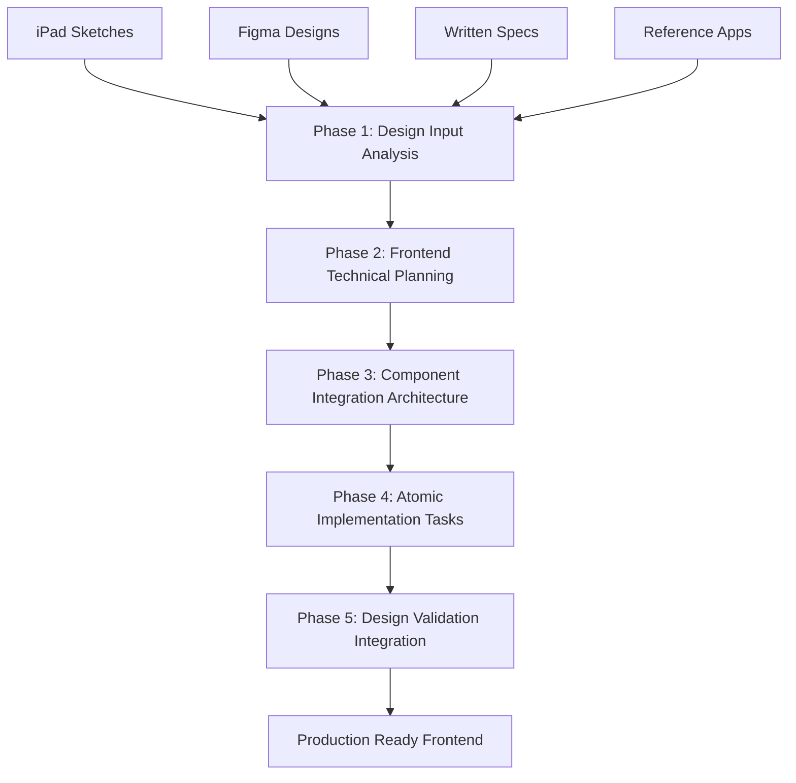

# 3-frontend: Complete Frontend Development Workflow

## Overview

The **3-frontend** workflow is a comprehensive system for frontend development that handles flexible design inputs (from iPad sketches to Figma designs) and creates atomic, human-reviewable implementation tasks optimized for **human-AI pair programming**.

## When to Use This Workflow

### ✅ Perfect for:
- **Frontend features** with any level of design input (sketches, Figma, wireframes, references)
- **UI components** that need systematic breakdown into implementable tasks
- **Integration with existing BFF/backend** systems and APIs
- **Human-AI pair programming** scenarios requiring clear task boundaries
- **Atomic commit workflows** for easy code review and validation
- **Design-to-code projects** requiring high design fidelity
- **Component library development** with systematic architecture

### ❌ Use other workflows for:
- **Complete product development** → Use `1-pre-dev-product`
- **Quick feature additions to existing systems** → Use `2-pre-dev-feature`
- **Backend-only development** → Use `1-pre-dev-product`
- **Code review and analysis** → Use `3-code-review`

## Key Workflow Advantages

### 🎨 Design Flexibility
- **Handles any design input:** iPad sketches, Figma designs, written specs, reference apps
- **Fills design gaps systematically:** AI suggests missing specifications based on design systems
- **Iterative design refinement:** Built-in user feedback loops for design iteration
- **Design system integration:** Automatic alignment with existing component libraries

### ⚡ Human-AI Pair Programming Optimization
- **2-4 hour atomic tasks:** Perfect for focused development sessions
- **Single commit per task:** Easy human review and validation
- **Clear acceptance criteria:** Human knows exactly what to validate
- **Complete feature slices:** Each task delivers working, testable functionality

### 🔗 Integration First
- **BFF integration planning:** Backend API contracts planned from architecture phase
- **Existing system alignment:** Respects current frontend architecture patterns
- **Performance consideration:** Performance optimization built into architecture
- **Component reusability:** Maximizes component reuse across features

## Workflow Phases

The workflow consists of **5 progressive phases** with strategic user interaction:



### 🎨 Phase 1: Design Input Analysis (DIA)
**File:** `1-design-input-analysis.mdc`  
**Duration:** 1-3 hours  
**User Interaction:** **REQUIRED** - Design iteration and clarification  

**Purpose:** Transform any design input into clear, implementable frontend specifications

**Supported Inputs:**
- 📱 **iPad sketches/drawings** - Extract intent and suggest detailed specifications
- 🎨 **Figma designs** - Analyze comprehensive specs and extract implementation details
- 📝 **Written descriptions** - Transform functional requirements into visual specs
- 🖼️ **Reference screenshots/apps** - Analyze existing implementations and adapt
- 🔗 **Mixed/multiple inputs** - Synthesize multiple sources into cohesive specifications

**Key Outputs:**
- Complete design requirement specifications
- User experience and interaction definitions
- Responsive behavior and breakpoint strategies
- Design system alignment and extension needs
- Missing design gap identification and recommendations

---

### 🔧 Phase 2: Frontend Technical Planning (FTP)
**File:** `2-frontend-tech-planning.mdc`  
**Duration:** 2-4 hours  
**User Interaction:** **REQUIRED** - Technical decision validation  

**Purpose:** Convert design understanding into comprehensive technical implementation strategy

**Key Outputs:**
- Component architecture strategy and hierarchy
- State management approach (local, context, global)
- BFF/API integration patterns and data flow
- Performance optimization strategy and benchmarks
- Technology stack decisions within existing constraints
- Testing strategy (unit, integration, e2e, visual regression)
- Styling and responsive design implementation approach

---

### 🏗️ Phase 3: Component Integration Architecture (CIA)
**File:** `3-component-integration-arch.mdc`  
**Duration:** 2-3 hours  
**User Interaction:** **OPTIONAL** - Architecture review  

**Purpose:** Design detailed component structure and backend integration patterns

**Key Outputs:**
- Detailed component hierarchy and responsibility matrix
- Complete component interfaces and TypeScript definitions
- BFF integration architecture with API service layers
- State management implementation with data flow patterns
- Styling architecture and design system integration
- Accessibility implementation patterns
- Performance optimization built into component design

---

### ⚡ Phase 4: Atomic Implementation Tasks (AIT)
**File:** `4-atomic-implementation-tasks.mdc`  
**Duration:** 1-2 hours (planning) + 2-4 hours per task (implementation)  
**User Interaction:** **OPTIONAL** - Task breakdown review  

**Purpose:** Break down component architecture into atomic, human-reviewable implementation tasks

**Key Outputs:**
- **Atomic tasks** completable in 2-4 hour sessions
- **Complete git workflow** for each task with detailed commit messages
- **Human review guidelines** with clear acceptance criteria
- **Integration specifications** for each component and API endpoint
- **Testing requirements** with comprehensive test coverage
- **Performance and accessibility** built into every task

**Task Structure:**
- **Single component focus** - One component or integration point per task
- **Complete feature slice** - UI + logic + tests + documentation
- **Rollback safety** - Tasks can be removed without breaking functionality
- **Human validation path** - Clear way for human to test and approve

---

### ✅ Phase 5: Design Validation Integration (DVI)
**File:** `5-design-validation-integration.mdc`  
**Duration:** 1-2 hours  
**User Interaction:** **OPTIONAL** - Quality validation review  

**Purpose:** Ensure design fidelity, integration quality, and production readiness

**Key Outputs:**
- **Design fidelity validation** against original specifications
- **BFF integration testing** and quality assurance
- **Cross-browser compatibility** verification
- **Accessibility compliance** (WCAG 2.1 AA) validation
- **Performance benchmarking** and optimization verification
- **Production readiness checklist** and deployment preparation

## Quick Start Options

### Option 1: Complete Orchestrated Workflow (Recommended for First-Time Users)
```bash
# Start with full guidance and workflow management
claude 3-frontend/0-frontend-orchestrator.mdc
```

### Option 2: Phase-by-Phase Execution (For Experienced Users)
```bash
# Phase 1: Analyze your design input (any format)
claude 3-frontend/1-design-input-analysis.mdc

# Phase 2: Plan technical implementation strategy
claude 3-frontend/2-frontend-tech-planning.mdc

# Phase 3: Design component architecture
claude 3-frontend/3-component-integration-arch.mdc

# Phase 4: Create atomic implementation tasks
claude 3-frontend/4-atomic-implementation-tasks.mdc

# Phase 5: Validate design fidelity and integration
claude 3-frontend/5-design-validation-integration.mdc
```

### Option 3: Express Mode (Skip Orchestrator)
```bash
# Jump directly to specific phases based on your needs
claude 3-frontend/1-design-input-analysis.mdc  # Start with design analysis
# ... continue with subsequent phases as needed
```

## Output Organization

The workflow creates a comprehensive documentation structure:

```
docs/frontend-development/
├── design-analysis-[feature].md          # Phase 1: Design specifications
├── frontend-tech-plan-[feature].md       # Phase 2: Technical strategy
├── component-integration-[feature].md     # Phase 3: Component architecture
├── validation-checklist-[feature].md     # Phase 5: Quality validation
└── tasks/
    └── frontend-[feature]/               # Phase 4: Implementation tasks
        ├── overview.md                   # Task overview and sequencing
        ├── FE-[XX]-[task-name].md        # Individual atomic tasks
        └── implementation-sequence.md     # Dependency management
```

## Human-AI Pair Programming Excellence

### Atomic Task Principles
Each implementation task follows strict principles for optimal human-AI collaboration:

- **2-4 Hour Sessions:** Tasks sized for focused development without fatigue
- **Single Commit Scope:** Complete, testable functionality in one git commit
- **Clear Acceptance Criteria:** Human knows exactly what to validate in 10-15 minutes
- **Rollback Safety:** Tasks can be removed without breaking existing functionality
- **Self-Contained:** Includes setup, implementation, testing, and cleanup

### Git Workflow Integration
Every task includes complete git workflow:

```bash
# Before starting each task
git checkout main && git pull origin main
git checkout -b feature/FE-[feature-id]-[num]-[short-desc]

# During development - continuous validation
npm test -- --watch    # Tests in watch mode
npm run lint           # Code quality checks
npm run typecheck      # TypeScript validation

# After completion - comprehensive validation
npm run build          # Production build verification
npm test              # Full test suite
npm run lint          # Final code quality check
npm run a11y-test     # Accessibility validation

# Detailed commit with human review focus
git commit -m "feat(FE-[feature-id]-[num]): [description]
Component: [what was built]
Integration: [how it connects]
Testing: [coverage achieved]
Human Review Focus: [what to validate]"
```

### Human Review Optimization
- **Clear Visual Validation:** What the human should see and test
- **Interaction Testing:** Specific user interactions to verify
- **Integration Verification:** How to confirm proper system integration
- **Performance Validation:** Observable performance characteristics
- **Accessibility Testing:** How to verify accessibility compliance

## Integration with Existing Systems

### BFF/Backend Integration
- **API Contract Planning:** Backend integration designed from architecture phase
- **Data Flow Optimization:** Efficient data fetching and caching strategies
- **Error Handling:** Comprehensive error scenarios and user feedback
- **Authentication Integration:** Seamless integration with existing auth systems
- **Real-time Features:** WebSocket and real-time data handling

### Design System Integration
- **Component Library Usage:** Maximize reuse of existing components
- **Design Token Integration:** Consistent use of colors, typography, spacing
- **Pattern Documentation:** New patterns documented for future reuse
- **Theme Support:** Integration with existing theming systems

### Performance Integration
- **Bundle Optimization:** Code splitting and lazy loading strategies
- **Caching Strategies:** Intelligent caching for API responses and assets
- **Performance Monitoring:** Built-in performance tracking and alerting
- **Core Web Vitals:** Optimization for Google's Core Web Vitals

## Memory MCP Integration

Every phase includes comprehensive Memory MCP integration:

### Context Management
- **Design Context Retrieval:** Access existing design systems and UI patterns
- **Technical Context:** Reference existing frontend architecture and patterns
- **Implementation Patterns:** Learn from successful component implementations
- **Decision History:** Maintain context of all design and technical decisions

### Knowledge Building
- **Pattern Storage:** Store successful component and integration patterns
- **Decision Rationale:** Capture reasoning behind architectural choices
- **Quality Standards:** Build knowledge base of quality benchmarks
- **Reusable Solutions:** Create library of reusable frontend solutions

### Cross-Session Continuity
- **Session Management:** Maintain context across development sessions
- **Progress Tracking:** Track implementation progress and completion
- **Knowledge Transfer:** Share learnings across team members and projects
- **Pattern Evolution:** Evolve patterns based on implementation experience

## File Size Guidelines

All generated code follows LLM-optimized guidelines:
- **Target:** <300 lines per file for optimal AI processing
- **Maximum:** 500 lines per file (hard limit)
- **Strategy:** Component-based splitting for maintainability and reusability
- **Organization:** Logical file structure for easy navigation and maintenance

## Success Metrics

### Speed Metrics
- **Design Analysis:** <3 hours from any input to clear specifications
- **Technical Planning:** <4 hours for comprehensive implementation strategy
- **Component Architecture:** <3 hours for detailed component design
- **Task Breakdown:** <2 hours for complete atomic task planning
- **Validation Planning:** <2 hours for comprehensive quality assurance
- **Total Planning:** <2 days from design input to implementation-ready

### Quality Metrics
- **Design Fidelity:** Implementation matches design intent and specifications
- **Integration Quality:** Seamless BFF and system integration
- **Performance Standards:** Meets or exceeds established performance benchmarks
- **Accessibility Compliance:** Full WCAG 2.1 AA compliance
- **Code Quality:** Maintainable, testable, and reusable code
- **Human Review Efficiency:** Human can validate each task in <15 minutes

### Development Efficiency
- **Task Atomicity:** All tasks completable in single development sessions
- **Human-AI Collaboration:** Optimal balance of AI automation and human validation
- **Code Review Speed:** Clear task boundaries enable rapid code review
- **Integration Velocity:** Seamless integration with existing systems
- **Reusability Factor:** Components and patterns reusable across features

## Integration with Other Workflows

### Backend Development Chain
```bash
# If backend needs development first
claude 1-pre-dev-product/0-pre-dev-orchestrator.mdc
# Then proceed with frontend development
claude 3-frontend/0-frontend-orchestrator.mdc
```

### Code Review Integration
```bash
# After implementation, validate with systematic review
claude 3-code-review/00-code-review-orchestrator.mdc
```

### Memory Management Integration
```bash
# Maintain context and learn from implementation
claude 0-memory-system/m0-memory-orchestrator.mdc
```

### Feature Development Integration
```bash
# For quick additions to existing frontend
claude 2-pre-dev-feature/0-feature-orchestrator.mdc
```

## Best Practices

### For Development Teams
1. **Systematic Approach:** Follow all phases for complex features, adapt for simpler ones
2. **Design Iteration:** Embrace design iteration in Phase 1 for better outcomes
3. **Architecture Investment:** Invest time in Phase 3 for long-term maintainability
4. **Human-AI Balance:** Use AI for systematic breakdown, human for creative validation
5. **Quality Gates:** Never skip validation phases for production deployments

### For Solo Developers
1. **Iterative Development:** Use phases iteratively for complex features
2. **Context Management:** Leverage Memory MCP for solo development continuity
3. **Quality Maintenance:** Use validation phases to maintain high code quality
4. **Pattern Building:** Build personal library of successful patterns and components

### For Design-Heavy Projects
1. **Design Input Flexibility:** Start with whatever design input is available
2. **Gap Filling Strategy:** Use AI to systematically fill design specification gaps
3. **Iteration Loops:** Plan for multiple design iteration cycles
4. **Fidelity Validation:** Use Phase 5 to ensure design intent is preserved

## Troubleshooting

### Common Issues and Solutions

**"Design input is too vague or incomplete"**
- Phase 1 is specifically designed for this - it systematically identifies gaps
- Use Sequential Thinking MCP for complex design interpretation
- Leverage existing design system patterns to fill gaps
- Iterate with user feedback to clarify design intent

**"Component architecture seems too complex"**
- Review component boundaries in Phase 3
- Consider breaking large components into smaller, focused components
- Use existing component patterns from design system
- Validate complexity against implementation team capacity

**"Tasks are too large for single sessions"**
- Revisit task boundaries in Phase 4
- Apply atomic task principles more strictly (2-4 hour maximum)
- Break integration points into separate tasks
- Consider file size limits when defining task scope

**"Integration with existing system is unclear"**
- Use Memory MCP to retrieve more architectural context in Phase 2
- Focus on integration points in Phase 3 component design
- Ask more specific technical questions about existing patterns
- Reference existing component implementations for consistency

**"Performance requirements not being met"**
- Review performance strategy in Phase 2
- Build performance optimization into Phase 3 component design
- Add specific performance tasks in Phase 4
- Use Phase 5 to validate performance against benchmarks

## Advanced Usage

### Complex Feature Development
For features requiring extensive design work or complex integration:
1. **Extended Design Phase:** Spend additional time in Phase 1 for design iteration
2. **Architecture Prototyping:** Create quick prototypes in Phase 3 for validation
3. **Incremental Implementation:** Break Phase 4 into multiple implementation cycles
4. **Continuous Validation:** Use Phase 5 iteratively throughout development

### Team Collaboration
For team-based development:
1. **Shared Context:** Use Memory MCP for team knowledge sharing
2. **Parallel Development:** Assign different atomic tasks to different team members
3. **Integration Coordination:** Use Phase 3 architecture as coordination foundation
4. **Quality Standards:** Use Phase 5 validation as team quality gate

### Legacy System Integration
For integration with existing systems:
1. **System Analysis:** Use Memory MCP to understand existing architecture
2. **Integration Strategy:** Focus Phase 2 on integration rather than new development
3. **Migration Planning:** Use Phase 4 to plan incremental migration tasks
4. **Compatibility Validation:** Extend Phase 5 for legacy system compatibility

---

🚀 **Ready to build exceptional frontend experiences with systematic precision and human-AI collaboration excellence!**

## Getting Started

Choose your entry point based on your situation:

1. **New to frontend systematic development?** → Start with the complete orchestrator
2. **Have specific design input ready?** → Jump to Phase 1 (Design Input Analysis)
3. **Need architectural guidance for complex feature?** → Begin with Phase 2 (Technical Planning)
4. **Ready to break down existing design into tasks?** → Skip to Phase 4 (Atomic Tasks)
5. **Validating completed implementation?** → Use Phase 5 (Design Validation)

The workflow adapts to your needs while maintaining systematic quality and human-AI collaboration excellence.