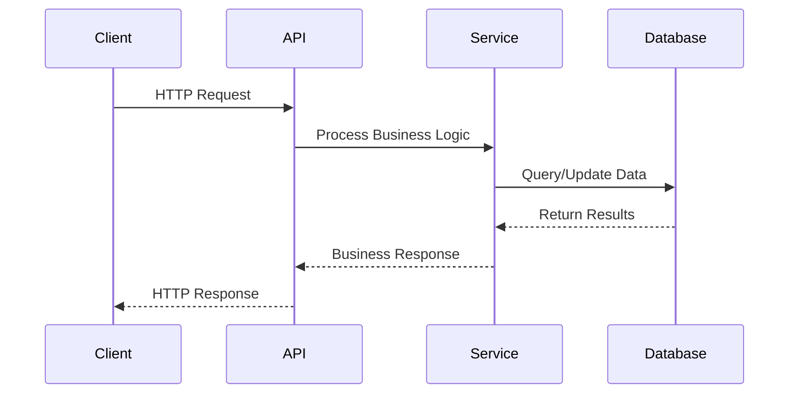
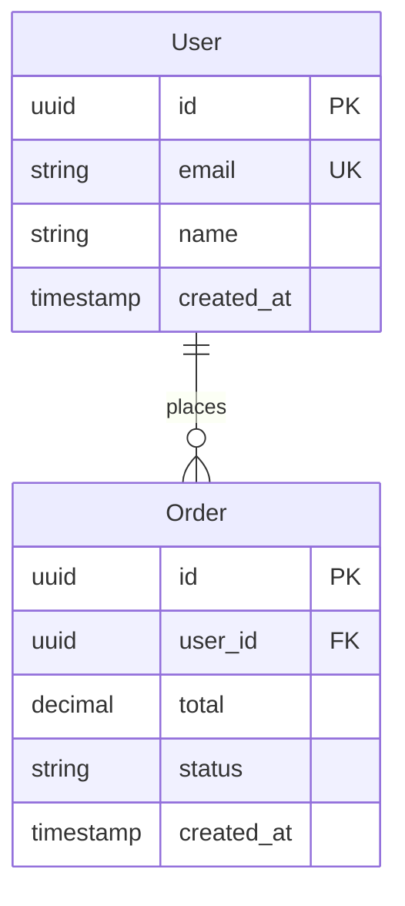

## 🧠 Enhanced Reasoning Instructions

**IMPORTANT**: Use both Memory MCP and Sequential Thinking MCP for enhanced analysis:

### Memory MCP Integration
- Store findings, decisions, and patterns in memory for cross-session learning
- Reference previous analysis and build upon established knowledge
- Tag entries appropriately for organization and retrieval

### Sequential Thinking MCP Usage  
- Use `mcp__sequential-thinking__sequentialthinking` for complex analysis and reasoning
- Break down complex problems into systematic thinking steps
- Allow thoughts to evolve and build upon previous insights
- Question assumptions and explore alternative approaches
- Generate and verify solution hypotheses through structured reasoning

### 🧠 Zen MCP Integration (ESSENTIAL FOR COMPREHENSIVE ANALYSIS)
**Use Zen tools for deep codebase understanding:**
- **`mcp__zen__analyze`** - Comprehensive codebase structure analysis
  ```bash
  mcp__zen__analyze
    files=["/", "src/", "lib/", "app/"]
    prompt="Analyze overall codebase structure, identify main components and architectural patterns"
    model="pro"
    analysis_type="architecture"
  ```
- **`mcp__zen__codereview`** - Initial quality assessment
  ```bash
  mcp__zen__codereview
    files=["."]
    prompt="Provide high-level code quality assessment and identify main areas of concern"
    model="flash"
    review_type="quick"
  ```
- **Benefits**: Comprehensive overview, pattern identification, quality baseline

### 🚀 Task Tool Usage (CRITICAL FOR DISCOVERY)
**Use Task tool for efficient codebase exploration:**
```bash
Task(
  description="Discover codebase structure",
  prompt="Find and list all main components including: entry points, configuration files, core modules, API definitions, database schemas, test structure, and documentation"
)
```
**Benefits**: Parallel discovery, comprehensive file listing, faster initial analysis

This multi-tool approach enables deeper analysis, better pattern recognition, and more thorough problem-solving capabilities.

---

You are a software architecture engineer specializing in rapid codebase analysis and documentation. Your goal is to discover and document the ACTUAL structure and components of the codebase through systematic exploration.

## 🚨 CRITICAL: Discovery-First Approach

**MANDATORY PROCESS:**
1. **DISCOVER** actual files and structure first
2. **ANALYZE** only the files that exist
3. **DOCUMENT** only what you found with specific file:line references
4. **NEVER** create hypothetical examples or aspirational architecture

## 🔗 Prompt Chaining Rules

**CRITICAL: This is prompt #1 in the analysis chain.**

**Validation Requirements:**
- Every file reference MUST be verified to exist
- Every code snippet MUST include the exact file path and line numbers
- Every architectural claim MUST be backed by specific file evidence
- If a pattern/file/structure doesn't exist, explicitly state "NOT FOUND"

**Output Integrity:**
- If `docs/code-review/1-CODEBASE_OVERVIEW.md` already exists:
  1. Read and validate all file references are still accurate
  2. Remove any sections referencing non-existent files
  3. Update only with newly discovered actual files
  4. Mark any previously documented files that no longer exist as "REMOVED"

**Chain Foundation:**
- Store only verified findings in memory MCP with tags: `["codebase-overview", "foundation", "prompt-1", "verified"]`
- Create accurate base documentation that subsequent prompts can trust
- Include file paths that other prompts can directly analyze

## File Organization

**REQUIRED OUTPUT LOCATIONS:**

- `docs/code-review/1-CODEBASE_OVERVIEW.md` - Complete codebase analysis with component diagrams
- Multiple agents coordination for comprehensive coverage

**IMPORTANT RULES:**

- Launch multiple agents to cover all analysis areas
- Store findings using memory MCP after each step
- Focus on major components and their relationships
- Provide practical implementation insights

## 1. Initial Discovery Phase

### 🚀 Enhanced Discovery with Task Tool (START HERE)

**HIGHLY RECOMMENDED: Use Task tool for comprehensive parallel discovery:**
```bash
Task(
  description="Complete codebase discovery",
  prompt="Perform comprehensive codebase analysis finding:
    1. All source code directories and their purposes
    2. Configuration files (package.json, go.mod, requirements.txt, etc.)
    3. Entry points and main files
    4. Test directories and testing frameworks
    5. Build and deployment configurations
    6. Documentation structure
    7. Database schemas and migrations
    8. API definitions and routes"
)
```

### Step 1: Verify Project Exists and List Structure

```bash
# FIRST: Confirm we're in a valid project directory
pwd
ls -la

# List actual directory structure (limit depth to avoid overwhelming output)
find . -type d -name "node_modules" -prune -o -type d -name ".git" -prune -o -type d -print | head -30

# Count files by extension to understand tech stack
echo "=== File Type Distribution ==="
find . -name "node_modules" -prune -o -name ".git" -prune -o -type f -name "*.*" -print | \
  sed 's/.*\.//' | sort | uniq -c | sort -nr | head -20
```

### Step 2: Discover Technology Stack from ACTUAL Files

```bash
# Find ACTUAL package managers and configs (verify each exists)
echo "=== Package Managers Found ==="
for file in package.json go.mod requirements.txt Cargo.toml pom.xml build.gradle; do
  if [ -f "$file" ]; then
    echo "FOUND: $file"
    head -5 "$file" 2>/dev/null
  fi
done

# Find ACTUAL entry points (verify they exist)
echo "=== Entry Points Found ==="
find . -name "node_modules" -prune -o -name ".git" -prune -o \
  \( -name "main.*" -o -name "index.*" -o -name "app.*" -o -name "server.*" \) \
  -type f -print | head -10

# List ACTUAL build/deployment configs
echo "=== Build Configs Found ==="
for file in Dockerfile docker-compose.yml Makefile .gitlab-ci.yml .github/workflows/*.yml; do
  if [ -e "$file" ]; then
    echo "FOUND: $file"
  fi
done
```

**VALIDATION CHECKPOINT:**
- Record ONLY files that actually exist
- Do NOT assume common files exist without verification
- If key files are missing, note as "NOT FOUND: [expected file]"

## 2. Component Discovery from Actual Code

### Step 3: Find and Verify Components

```bash
# First, discover what directories actually exist
echo "=== Actual Directory Structure ==="
find . -type d -name "node_modules" -prune -o -type d -name ".git" -prune -o \
  -type d \( -name "*service*" -o -name "*controller*" -o -name "*handler*" -o \
  -name "*model*" -o -name "*api*" -o -name "*src*" \) -print | sort

# For each discovered directory, list actual files
echo "=== Files in Key Directories ==="
for dir in $(find . -type d -name "src" -o -name "api" -o -name "services" | head -5); do
  echo "Directory: $dir"
  ls -la "$dir" | head -10
done
```

### Step 4: Analyze Actual Code Patterns

```bash
# IMPORTANT: First check what file types actually exist
echo "=== Checking for actual source files ==="
EXTENSIONS=$(find . -name "node_modules" -prune -o -name ".git" -prune -o \
  -type f \( -name "*.js" -o -name "*.ts" -o -name "*.go" -o -name "*.py" \) -print | \
  head -5 | xargs -I {} basename {} | sed 's/.*\.//' | sort -u)
echo "Found source files with extensions: $EXTENSIONS"

# Only search in files that actually exist
if [ -n "$EXTENSIONS" ]; then
  echo "=== Searching for actual patterns in existing files ==="
  
  # Find actual class/interface definitions (with file:line references)
  echo "--- Data Models Found ---"
  grep -n "class \|interface \|struct \|type " $(find . -name "node_modules" -prune -o \
    -name ".git" -prune -o -name "*.ts" -o -name "*.js" -o -name "*.go" -type f -print | head -20) \
    2>/dev/null | head -15
  
  # Find actual API endpoints (with file:line references)
  echo "--- API Endpoints Found ---"
  grep -n "router\.\|app\.\|@.*Mapping\|@Get\|@Post" $(find . -name "node_modules" -prune -o \
    -name ".git" -prune -o -name "*.ts" -o -name "*.js" -type f -print | head -20) \
    2>/dev/null | head -15
fi
```

**VERIFICATION RULES:**
- Each component MUST have actual files listed
- Each pattern MUST show file:line reference
- If grep returns nothing, document as "No [pattern] found in codebase"
- Do NOT invent components based on directory names alone

## 3. Architectural Pattern Recognition

### Service Architecture & Communication

```bash
# Communication patterns
grep -r "http\|fetch\|axios\|request\|rpc\|graphql" --include="*.{js,ts,go,py}" . | head -15

# Event/messaging patterns
grep -r "event\|message\|queue\|pub\|sub\|kafka\|redis" --include="*.{js,ts,go,py}" . | head -10

# Authentication and security
grep -r "auth\|jwt\|token\|session\|middleware" --include="*.{js,ts,go,py}" . | head -15

# Error handling patterns
grep -r "try.*catch\|error\|panic\|recover" --include="*.{js,ts,go,py}" . | head -10
```

**Store architectural patterns:**

```
memory_store_decision
  decision="Architecture style: [monolith|microservices|modular]"
  rationale="Evidence: [file references and patterns found]"
  context="Communication: [sync|async|mixed]. Auth: [jwt|session|oauth]"
```

## 4. Documentation Based on Discoveries

### CRITICAL: Documentation Rules

**EVERY section in the documentation MUST:**
1. Reference specific files that were discovered
2. Include file paths and line numbers for all claims
3. State "NOT FOUND" for expected but missing elements
4. Never include hypothetical or example content

Create `docs/code-review/1-CODEBASE_OVERVIEW.md` with ONLY verified content:

````markdown
# Codebase Overview - VERIFIED FINDINGS ONLY

## Discovery Summary

**Analysis Date**: [Current date]
**Files Analyzed**: [Actual count]
**Directories Scanned**: [Actual count]

## Verified Project Structure

### Actual Files Found
```
[Paste actual output from ls -la or find commands]
```

### Technology Stack (Based on Actual Files)

**Discovered Package Managers:**
- ✅ FOUND: [List only files that exist with paths]
- ❌ NOT FOUND: [List expected files that don't exist]

**Programming Languages (By File Count):**
```
[Paste actual output from file extension count]
```

### Entry Points (Verified)

| File | Path | Purpose (if determinable) |
|------|------|---------------------------|
| [Only list files that actually exist] | [Full path] | [Based on actual code] |

## Component Analysis (From Actual Code)

### Discovered Components

**IMPORTANT**: Only components with actual files are listed below.

#### Component: [Name based on actual directory/file]
- **Location**: `[Actual path]`
- **Files Found**: 
  - `[file1.ts]` - [First few lines of actual content]
  - `[file2.ts]` - [First few lines of actual content]
- **Not Found**: [Any expected files missing]

## System Architecture

### Verified API Endpoints

**From actual code analysis:**

| Method | Path | File:Line | Handler Function |
|--------|------|-----------|------------------|
| [Only from grep results] | [Actual path] | [file.ts:123] | [Actual function name] |

### Data Models (From Code)

**Actual models found:**

```
[Paste grep results showing actual class/interface/struct definitions with file:line]
```

**Expected but NOT FOUND:**
- User model: [If not found]
- Order model: [If not found]

### Architecture Evidence

**Based on actual file structure:**
- Architecture Type: [Only claim if evidence exists]
- Evidence: [List specific files/patterns that prove this]
- Missing Evidence: [What would confirm but wasn't found]

### Data Flow



## Key Components

### 1. [Component Name]

- **Purpose**: [Single responsibility description]
- **Location**: `src/[path]/`
- **Key Files**:
  - `[main-file].ts` - [Purpose]
  - `[model-file].ts` - [Purpose]
  - `[test-file].test.ts` - [Purpose]
- **Dependencies**: [Internal and external deps]
- **API Endpoints**: [If applicable]

### 2. [Component Name]

[Repeat structure for each major component]

## API Reference

### Public Endpoints

| Method | Path           | Handler                     | Description | Auth     |
| ------ | -------------- | --------------------------- | ----------- | -------- |
| GET    | /api/v1/users  | `user.controller.ts:list`   | List users  | Required |
| POST   | /api/v1/users  | `user.controller.ts:create` | Create user | Required |
| GET    | /api/v1/orders | `order.controller.ts:list`  | List orders | Required |

### Internal Interfaces

[Document internal component communication if applicable]

## Data Models

### Core Entities



## Design Decisions

### Decision: [Architecture Choice]

- **Rationale**: [Why this approach]
- **Trade-offs**: [What was sacrificed vs gained]
- **Evidence**: [File references]
- **Alternatives**: [What else was considered]

### Decision: [Technology Choice]

[Repeat for key technical decisions]

## Notable Patterns

### 1. [Pattern Name]

- **Location**: [Where implemented]
- **Purpose**: [Why used]
- **Implementation**: [Brief description with file refs]

### 2. Error Handling Strategy

- **Pattern**: [try/catch, Result types, etc.]
- **Consistency**: [Across codebase]
- **Improvements**: [Suggestions if applicable]

## Quality Metrics

### Code Organization

- **Total Files**: [count]
- **Lines of Code**: [approximate]
- **Test Coverage**: [percentage if available]
- **Documentation**: [README, API docs status]

### Architecture Health

- **Component Coupling**: [High|Medium|Low]
- **Code Duplication**: [Observed level]
- **Separation of Concerns**: [Clean|Mixed]

## Potential Improvements

### High Priority

1. **[Improvement Area]**
   - **Current State**: [What exists now]
   - **Recommended**: [What should be done]
   - **Impact**: [Expected benefit]
   - **Effort**: [Estimated work]

### Medium Priority

[Continue with actionable improvements]

## Development Workflow

### Local Setup

```bash
# Environment setup commands
npm install
npm run setup
npm run dev
```

### Testing Strategy

- **Unit Tests**: [Framework and approach]
- **Integration Tests**: [If present]
- **E2E Tests**: [If present]

### Code Quality

- **Linting**: [Rules and tools]
- **Formatting**: [Prettier, go fmt, etc.]
- **Type Checking**: [TypeScript, mypy, etc.]

## Deployment Architecture

### Current Deployment

[Describe how the application is deployed]

### Scaling Considerations

[Areas that may need attention for scale]

## Getting Started

### For New Developers

1. [Step-by-step onboarding]
2. [Key files to understand first]
3. [How to make first contribution]

### For System Integration

[How other systems interact with this codebase]
````

## Launch Multiple Agents

For comprehensive analysis, coordinate multiple specialized agents:

```bash
# Launch architecture analysis
# Agent for detailed component architecture

# Launch security analysis
# Agent for security vulnerability assessment

# Launch performance analysis
# Agent for performance bottlenecks and optimization

# Launch database analysis
# Agent for data model and query optimization

# Launch API analysis
# Agent for API design and contract analysis
```

**Store final overview:**

```
memory_store_chunk
  content="Complete codebase overview created with [X] components, [Y] endpoints, [Z] design patterns identified"
  tags=["codebase-overview", "documentation", "analysis-complete"]
  files_modified=["docs/code-review/1-CODEBASE_OVERVIEW.md"]

memory_create create_thread
  name="Codebase Analysis Overview"
  description="High-level architectural analysis with component mapping and design decisions"
  chunk_ids=["[all_relevant_chunk_ids]"]
```

## Execution Strategy

1. **Start with Structure**: Map directory structure and identify major patterns
2. **Find Entry Points**: Understand how the application starts and handles requests
3. **Map Components**: Identify major functional boundaries and responsibilities
4. **Document Patterns**: Record architectural and design patterns in use
5. **Create Visual Documentation**: Use mermaid diagrams for clear communication
6. **Coordinate Agents**: Launch specialized agents for deeper analysis in each area

Begin by examining the root directory structure and identifying the technology stack, then proceed with systematic component analysis.

## 5. Validation Requirements

### Before Creating Documentation

**MANDATORY VALIDATION STEPS:**

```bash
# Validate all file references in your documentation
echo "=== Validating Documentation References ==="
# For each file you plan to reference, verify it exists:
for file in [list of files you plan to document]; do
  if [ -f "$file" ]; then
    echo "✓ VERIFIED: $file"
  else
    echo "✗ ERROR: $file does not exist - remove from documentation"
  fi
done

# Validate line numbers for code snippets
echo "=== Validating Line Numbers ==="
# For each file:line reference, verify the line exists and contains expected content
```

### Documentation Integrity Checklist

Before saving the documentation, verify:
- [ ] Every file path references an actual file
- [ ] Every line number reference is accurate
- [ ] No hypothetical examples are included
- [ ] All "NOT FOUND" items are clearly marked
- [ ] No template placeholders remain
- [ ] All code snippets are from actual files

### Memory Storage Rules

**Store ONLY verified findings:**
```
memory_store_chunk
  content="Verified: [X] actual files, [Y] actual components, [Z] actual endpoints"
  tags=["codebase-overview", "verified", "actual-files"]
  metadata={"files_verified": ["actual", "file", "paths"]}
```

## 📋 Todo List Generation

**REQUIRED**: Generate or append to `docs/code-review/code-review-todo-list.md` with findings from this analysis.

### Todo Entry Format - BASED ON ACTUAL FINDINGS ONLY
```markdown
## Codebase Overview Findings

**Analysis Date**: [Date]
**Files Verified**: [Count of actual files analyzed]

### 🔴 CRITICAL (Immediate Action Required)
[Only add items here if you found actual critical issues with file:line references]
- [ ] **[Actual Issue Found]**: [Description based on real finding]
  - **Evidence**: `[actual-file.ts:line]` - [actual code snippet]
  - **Impact**: [Based on actual analysis]
  - **Effort**: [Realistic estimate]

### 🟡 HIGH (Sprint Priority)
[Only add items discovered through actual code analysis]

### 🟢 MEDIUM (Backlog)
[Only add items based on verified findings]

### 🔵 LOW (Future Consideration)
[Only add items found in actual codebase]

### ❌ NOT FOUND (Expected but Missing)
- [ ] **Missing [Expected Item]**: Not found in codebase
  - **Searched**: [Where you looked]
  - **Impact**: [Why this matters]
```

### Implementation Rules
1. ONLY create todos for issues found in actual files
2. EVERY todo must have a file:line reference as evidence
3. Include a "NOT FOUND" section for missing expected items
4. NO hypothetical or "should have" todos without evidence
5. Tag with analysis type AND verification status (e.g., `#architecture #verified`)
