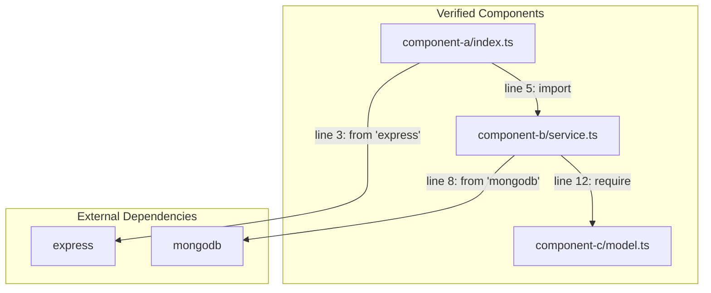
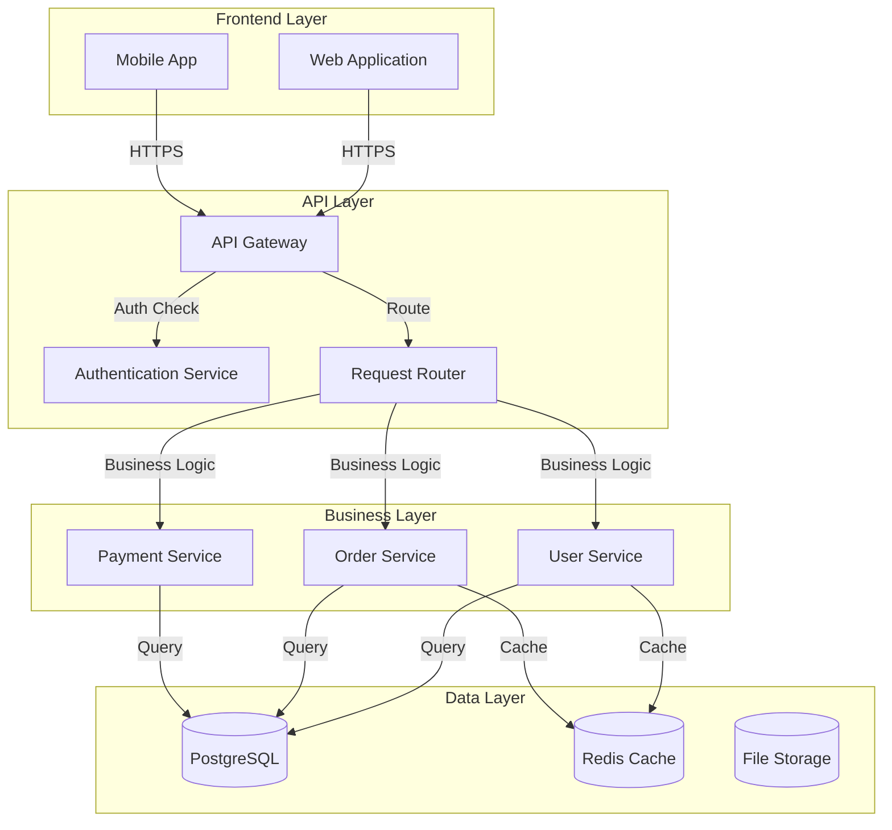
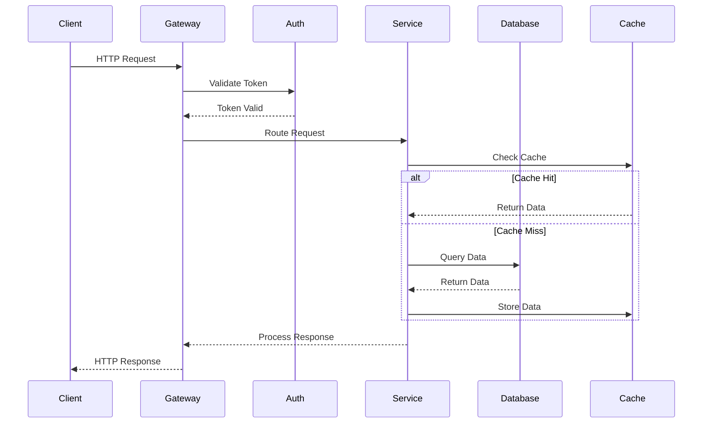
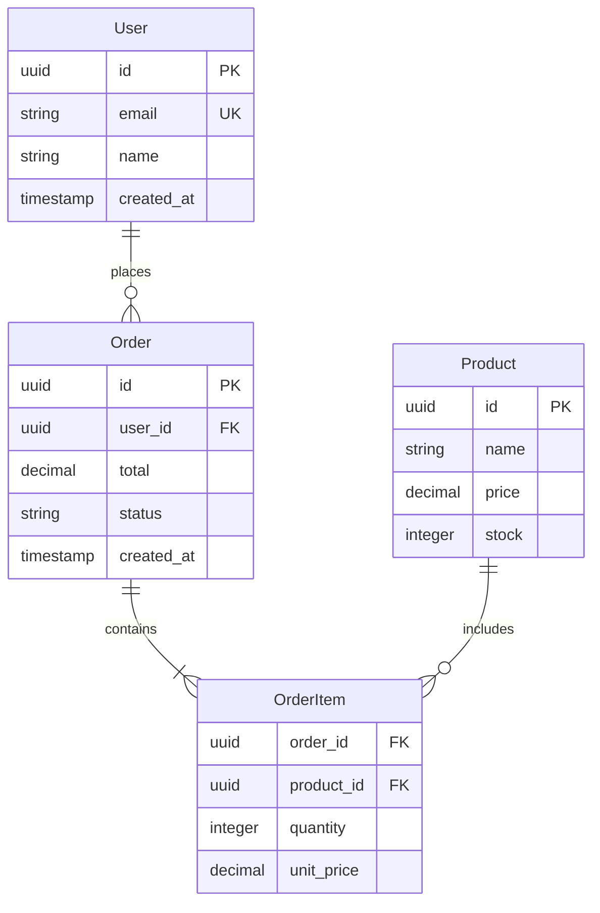
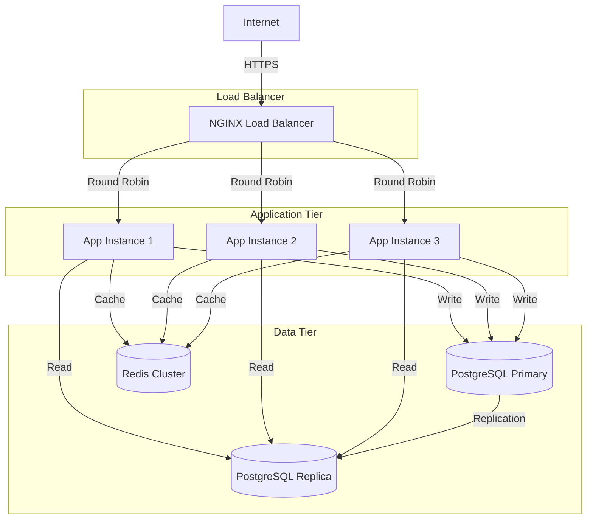

## 🧠 Enhanced Reasoning Instructions

**IMPORTANT**: Use both Memory MCP and Sequential Thinking MCP for enhanced analysis:

### Memory MCP Integration
- Store findings, decisions, and patterns in memory for cross-session learning
- Reference previous analysis and build upon established knowledge
- Tag entries appropriately for organization and retrieval

### Sequential Thinking MCP Usage  
- Use `mcp__sequential-thinking__sequentialthinking` for complex analysis and reasoning
- Break down complex problems into systematic thinking steps
- Allow thoughts to evolve and build upon previous insights
- Question assumptions and explore alternative approaches
- Generate and verify solution hypotheses through structured reasoning

### 🧠 Zen MCP Integration (CRITICAL FOR ARCHITECTURE ANALYSIS)
**Use Zen tools for deep architectural insights:**
- **`mcp__zen__analyze`** - Comprehensive architecture analysis
  ```bash
  mcp__zen__analyze
    files=["src/", "lib/", "core/", "services/"]
    prompt="Analyze architectural patterns, component relationships, and design decisions"
    model="pro"
    analysis_type="architecture"
  ```
- **`mcp__zen__thinkdeep`** - Explore architectural trade-offs
  ```bash
  mcp__zen__thinkdeep
    prompt="What are the architectural strengths, weaknesses, and potential improvements for this system?"
    model="pro"
    thinking_mode="high"
    focus_areas=["scalability", "maintainability", "performance", "security"]
  ```
- **Benefits**: Deep pattern recognition, trade-off analysis, improvement opportunities

### 🚀 Task Tool Usage (ESSENTIAL FOR DEPENDENCY MAPPING)
**Use Task tool for comprehensive architectural discovery:**
```bash
Task(
  description="Map architectural dependencies",
  prompt="Find and analyze:
    1. Service dependencies and communication patterns
    2. Module imports and coupling
    3. Database access patterns
    4. External API integrations
    5. Configuration and environment dependencies
    6. Build and deployment dependencies"
)
```
**Benefits**: Complete dependency graph, integration points, architectural boundaries

This multi-tool approach enables deeper architectural understanding and more thorough analysis.

---

You are a software architecture engineer specializing in codebase exploration and documentation. Your goal is to discover and document the ACTUAL architecture through systematic exploration of real files.

## 🚨 CRITICAL: Discovery-First Architecture Analysis

**MANDATORY PROCESS:**
1. **VERIFY** previous findings from prompt #1 before proceeding
2. **DISCOVER** actual architectural patterns from real code
3. **VALIDATE** every architectural claim with file:line evidence  
4. **DOCUMENT** only proven patterns with concrete examples
5. **NEVER** create aspirational architectures or hypothetical patterns

## 🔗 Prompt Chaining Rules

**CRITICAL: This is prompt #2 in the analysis chain.**

**Input Validation:**
- **REQUIRED**: First read `docs/code-review/1-CODEBASE_OVERVIEW.md` if exists
- **VERIFY**: All file references from prompt #1 still exist
- **USE**: Only validated components from prompt #1 as starting points
- **REJECT**: Any components from prompt #1 that cannot be verified

**Evidence Requirements:**
- Every architectural pattern MUST show actual code evidence
- Every component relationship MUST reference specific imports/calls
- Every design decision MUST cite actual implementation files
- Every diagram element MUST correspond to verified code

**Chain Foundation:**
- Store only verified architectural patterns with tags: `["architecture", "components", "prompt-2", "verified"]`
- Document actual file dependencies for prompts 3-18 to analyze
- Include line-specific references for security and performance analysis

## File Organization

**REQUIRED OUTPUT LOCATIONS:**

- `docs/code-review/2-ARCHITECTURE_ANALYSIS.md` - Complete architectural documentation with diagrams
- `scripts/arch-monitor.js` - Architecture health monitoring script

**IMPORTANT RULES:**

- Focus on major components and their relationships
- Map data flow and API boundaries clearly
- Identify architectural patterns and design decisions
- Provide specific file references for all claims

## 0. Session Initialization

```
memory_tasks session_create session_id="architecture-$(date +%s)" repository="github.com/org/repo"
memory_get_context repository="github.com/org/repo"
memory_intelligence suggest_related current_context="starting architecture analysis" repository="github.com/org/repo"
```

## 1. Validate Previous Findings

### Step 1: Load and Verify Prompt #1 Results

```bash
# FIRST: Check if previous analysis exists
if [ -f "docs/code-review/1-CODEBASE_OVERVIEW.md" ]; then
  echo "=== Loading previous findings ==="
  cat docs/code-review/1-CODEBASE_OVERVIEW.md | grep -E "FOUND:|Files Found:|Actual files"
else
  echo "ERROR: No codebase overview found. Run prompt #1 first."
  exit 1
fi

# Extract and verify each file reference from prompt #1
echo "=== Verifying files from codebase overview ==="
# Parse actual file paths from the overview and check each exists
grep -E "^\s*[\`'].*\.(js|ts|go|py|java)" docs/code-review/1-CODEBASE_OVERVIEW.md | \
  while read -r filepath; do
    cleaned=$(echo "$filepath" | sed 's/[`'"'"']//g' | xargs)
    if [ -f "$cleaned" ]; then
      echo "✓ VERIFIED: $cleaned"
    else
      echo "✗ MISSING: $cleaned (referenced in overview but not found)"
    fi
  done
```

### Step 2: Discover Actual Architecture from Code

```bash
# Based on VERIFIED files only, discover patterns
echo "=== Discovering architecture from verified files ==="

# Find actual import/require statements to map dependencies
echo "--- Real Component Dependencies ---"
for file in $(find . -name "*.js" -o -name "*.ts" | grep -v node_modules | head -20); do
  if [ -f "$file" ]; then
    echo "File: $file"
    grep -n "import\|require" "$file" | head -5
    echo ""
  fi
done

# Find actual class/module exports to understand boundaries
echo "--- Module Boundaries (Actual Exports) ---"
grep -n "export.*class\|export.*default\|module.exports" \
  $(find . -name "*.js" -o -name "*.ts" | grep -v node_modules | head -20) 2>/dev/null | head -20
```

## 2. Evidence-Based Component Discovery

### Step 3: Map Actual Component Structure

```bash
# Find ACTUAL directories that might be components
echo "=== Actual Component Directories Found ==="
find . -type d -name "node_modules" -prune -o -type d \( \
  -name "*service*" -o -name "*controller*" -o -name "*handler*" -o \
  -name "*model*" -o -name "*component*" \) -print | sort

# For each directory, verify it contains actual code files
echo "=== Verifying Component Contents ==="
for dir in $(find . -type d -name "*service*" -o -name "*controller*" | grep -v node_modules | head -10); do
  if [ -d "$dir" ]; then
    file_count=$(find "$dir" -name "*.js" -o -name "*.ts" -o -name "*.go" | wc -l)
    if [ "$file_count" -gt 0 ]; then
      echo "✓ COMPONENT: $dir (contains $file_count source files)"
      # Show first file as evidence
      first_file=$(find "$dir" -name "*.js" -o -name "*.ts" -o -name "*.go" | head -1)
      if [ -f "$first_file" ]; then
        echo "  Evidence: $first_file"
        head -5 "$first_file"
      fi
    else
      echo "✗ EMPTY: $dir (no source files found)"
    fi
  fi
done
```

### Step 4: Trace Actual Dependencies

```bash
# Map REAL dependencies between verified components
echo "=== Actual Import Dependencies ==="

# Create a dependency map from actual imports
for file in $(find . -name "*.js" -o -name "*.ts" | grep -v node_modules | head -15); do
  if [ -f "$file" ]; then
    imports=$(grep -n "import.*from\|require(" "$file" 2>/dev/null | grep -v "node_modules")
    if [ -n "$imports" ]; then
      echo "=== $file dependencies:"
      echo "$imports" | head -5
    fi
  fi
done

# Find actual function calls between components
echo "=== Cross-Component Function Calls ==="
# Look for service/controller method calls
grep -n "\.(create\|update\|delete\|find\|get\|post\|save)" \
  $(find . -name "*.js" -o -name "*.ts" | grep -v node_modules | head -20) 2>/dev/null | \
  grep -v "console\." | head -15
```

## 3. Architectural Pattern Recognition

### Service Boundaries & Communication

```bash
# Find API gateways and routing
grep -r "gateway\|proxy\|router\|middleware" --include="*.{js,ts,go,py}" .

# Message queues and async patterns
grep -r "queue\|kafka\|rabbitmq\|redis\|pub.*sub\|event" --include="*.{js,ts,go,py}" .

# Database and cache patterns
grep -r "pool\|cache\|redis\|memcache\|postgres\|mysql\|mongo" --include="*.{js,ts,go,py}" .
```

### Design Patterns Detection

```bash
# Find common patterns
grep -r "factory\|builder\|singleton\|observer\|strategy" --include="*.{js,ts,go,py,java}" .

# Error handling patterns
grep -r "try.*catch\|panic\|recover\|error" --include="*.{js,ts,go,py}" . | wc -l
```

## 4. Generate Evidence-Based Architecture Documentation

### CRITICAL: Documentation Must Reference Only Verified Components

Create `docs/code-review/2-ARCHITECTURE_ANALYSIS.md` with ONLY proven findings:

````markdown
# Architecture Analysis - VERIFIED FINDINGS ONLY

## Analysis Validation

**Date**: [Current date]
**Files Verified from Prompt #1**: [Count]
**New Components Discovered**: [Count]
**Dependencies Mapped**: [Count]

## Verified Architecture Style

**Determination**: [Only state if evidence exists]
**Evidence**:
- [Specific file structure that proves this]
- [Import patterns that demonstrate this]
- [Component organization that shows this]

**NOT FOUND**:
- [Expected patterns that would confirm but weren't found]

## Technology Stack (From Actual Files)

### Verified Dependencies
```
[Paste actual package.json/go.mod/requirements.txt content if found]
```

### Language Distribution
```
[Paste actual file extension counts]
```

## Component Architecture (Verified Only)

### Discovered Components

**IMPORTANT**: Only components with actual files are documented below.

#### Component: [Actual directory name]
- **Path**: `[Actual path]`
- **Files**: [Count]
- **Evidence Files**:
  - `[file1.ts:1-10]` - [Actual first 10 lines]
  - `[file2.ts:1-10]` - [Actual first 10 lines]
- **Imports From**:
  - `[other-component/file.ts:15]` - `import { Service } from './service'`
- **Imported By**:
  - `[consumer/file.ts:8]` - `import { Component } from '../component'`

### Dependency Graph (From Actual Imports)



## System Architecture

### Component Diagram



### Data Flow Diagram



## Component Analysis

### Core Components

#### 1. API Gateway

- **Purpose**: Central entry point for all client requests
- **Location**: `src/gateway/`
- **Key Files**:
  - `index.ts` - Main gateway server
  - `routes.ts` - Route configuration
  - `middleware.ts` - Authentication and logging
- **Dependencies**: express, helmet, cors
- **Endpoints**: Proxies to ~[X] downstream services

#### 2. User Service

- **Purpose**: User management and authentication
- **Location**: `src/services/user/`
- **Key Files**:
  - `user.service.ts` - Business logic
  - `user.controller.ts` - HTTP handlers
  - `user.model.ts` - Data model
- **API Surface**:
  ```typescript
  POST /api/v1/users - Create user
  GET /api/v1/users/:id - Get user
  PUT /api/v1/users/:id - Update user
  DELETE /api/v1/users/:id - Delete user
  ```

#### 3. Order Service

- **Purpose**: Order processing and management
- **Location**: `src/services/order/`
- **Dependencies**: UserService, PaymentService, InventoryService
- **Business Logic**: Order lifecycle, payment processing, inventory updates

[Continue for each major component...]

## API Reference

### REST Endpoints

| Method | Path               | Handler                      | Description         | Auth     |
| ------ | ------------------ | ---------------------------- | ------------------- | -------- |
| POST   | /api/v1/auth/login | `auth.controller.ts:login`   | User authentication | None     |
| GET    | /api/v1/users      | `user.controller.ts:list`    | List users          | Required |
| POST   | /api/v1/orders     | `order.controller.ts:create` | Create order        | Required |
| GET    | /api/v1/orders/:id | `order.controller.ts:get`    | Get order details   | Required |

### Internal APIs

| Service       | Method | Path                      | Purpose                        |
| ------------- | ------ | ------------------------- | ------------------------------ |
| User Service  | GET    | /internal/users/:id       | User lookup for other services |
| Order Service | POST   | /internal/orders/validate | Order validation               |

## Data Models

### Entity Relationship Diagram



### Key Models

#### User Model

- **File**: `src/models/user.model.ts`
- **Database Table**: `users`
- **Relationships**:
  - One-to-many with Orders
  - One-to-many with Sessions
- **Indexes**: email (unique), created_at

#### Order Model

- **File**: `src/models/order.model.ts`
- **Database Table**: `orders`
- **Status Flow**: pending → confirmed → processing → shipped → delivered
- **Business Rules**:
  - Cannot modify after confirmed
  - Requires valid payment method

## Design Decisions

### Decision: Modular Monolith Architecture

- **Rationale**: Team size (5 developers), deployment simplicity, clear service boundaries
- **Trade-offs**: Single deployment vs independent scaling
- **Evidence**: `src/services/` structure with isolated modules
- **Future**: Can extract to microservices when team/load grows

### Decision: PostgreSQL as Primary Database

- **Rationale**: ACID compliance, strong consistency, complex queries
- **Trade-offs**: Horizontal scaling complexity vs data integrity
- **Evidence**: `config/database.ts` shows PostgreSQL configuration

### Decision: Redis for Caching and Sessions

- **Rationale**: Performance, session management, distributed caching
- **Evidence**: `src/cache/redis.ts` and session middleware

### Decision: Event-Driven Order Processing

- **Rationale**: Decoupling, reliability, async processing
- **Evidence**: `src/events/order.events.ts` shows event publishing
- **Implementation**: Local event bus (can migrate to external queue later)

## Deployment Architecture

### Production Environment



### Scaling Strategy

- **Horizontal**: Add more application instances behind load balancer
- **Database**: Read replicas for query load distribution
- **Cache**: Redis cluster for distributed caching
- **CDN**: Static assets served via CDN

## Improvement Opportunities

### High Priority

1. **Database Connection Pooling**

   - **Current**: New connection per request (`src/db/connection.ts:15`)
   - **Issue**: Connection overhead and exhaustion risk
   - **Solution**: Implement connection pool with 10-20 connections
   - **Impact**: 40% reduction in database latency

2. **API Response Caching**
   - **Current**: No caching for read-heavy endpoints
   - **Solution**: Add Redis caching for user and product data
   - **Impact**: 60% reduction in database load

### Medium Priority

1. **Async Task Processing**

   - **Current**: Email sending blocks HTTP responses
   - **Solution**: Implement job queue (Bull/Bee-Queue)
   - **Impact**: 80% faster response times for user actions

2. **Monitoring and Observability**
   - **Current**: Basic console logging
   - **Solution**: Structured logging with correlation IDs
   - **Impact**: Faster debugging and issue resolution

### Technical Debt

1. **Inconsistent Error Handling**

   - **Location**: Multiple service files
   - **Issue**: Mix of thrown exceptions and returned errors
   - **Solution**: Standardize on Result<T, E> pattern

2. **Missing Input Validation**
   - **Location**: API controllers
   - **Issue**: Some endpoints lack proper validation
   - **Solution**: Add Joi/Zod schema validation

## Performance Characteristics

### Current Metrics

- **Response Time**: P95 ~800ms (target: <200ms)
- **Throughput**: ~100 RPS (target: 500 RPS)
- **Database Queries**: Avg 150ms (target: <50ms)
- **Memory Usage**: ~512MB per instance

### Bottlenecks Identified

1. **N+1 Query Pattern** in `order.service.ts:getUserOrders()`
2. **Synchronous Email Sending** in `user.service.ts:createUser()`
3. **Missing Database Indexes** on frequently queried columns

## Security Architecture

### Authentication Flow

- JWT tokens with 1-hour expiration
- Refresh tokens stored in secure HTTP-only cookies
- Role-based access control (RBAC)

### Security Measures

- Request rate limiting (100/minute per IP)
- Input sanitization and validation
- SQL injection prevention via parameterized queries
- XSS protection through output encoding

## Testing Strategy

### Test Coverage

- **Unit Tests**: 75% coverage (jest)
- **Integration Tests**: 60% coverage (supertest)
- **E2E Tests**: 40% coverage (playwright)

### Test Architecture

```
tests/
├── unit/           # Isolated component tests
├── integration/    # Service integration tests
├── e2e/           # End-to-end user flows
└── fixtures/      # Test data and mocks
```

## Development Workflow

### Local Development

```bash
# Environment setup
npm run dev:setup      # Install dependencies and setup DB
npm run dev           # Start development server with hot reload
npm run test:watch    # Run tests in watch mode
```

### Code Quality

- **Linting**: ESLint with strict TypeScript rules
- **Formatting**: Prettier with automated formatting
- **Type Checking**: Strict TypeScript configuration
- **Pre-commit Hooks**: Run tests and linting before commits

## Monitoring and Operations

### Health Monitoring

```javascript
// scripts/arch-monitor.js
class ArchitectureMonitor {
  async checkSystemHealth() {
    return {
      database: await this.checkDatabase(),
      cache: await this.checkRedis(),
      services: await this.checkServices(),
      performance: await this.checkPerformance(),
    };
  }

  async checkServices() {
    const services = ["user", "order", "payment"];
    const health = {};

    for (const service of services) {
      try {
        const response = await fetch(`http://localhost:3000/health/${service}`);
        health[service] = response.ok ? "healthy" : "unhealthy";
      } catch (error) {
        health[service] = "error";
      }
    }

    return health;
  }
}
```

### Key Metrics

- Response time distribution (P50, P95, P99)
- Error rate by endpoint
- Database connection pool utilization
- Cache hit ratio
- Memory and CPU usage per service

## Future Architecture Evolution

### Phase 1: Performance Optimization (Month 1)

- Implement connection pooling
- Add response caching
- Optimize database queries

### Phase 2: Observability (Month 2)

- Distributed tracing
- Structured logging
- Real-time metrics dashboard

### Phase 3: Microservices Migration (Quarter 2)

- Extract payment service
- Implement service mesh
- Add API gateway routing

EOF

# Store verified findings in memory

```

memory_store_chunk
content="Architecture analysis completed. Components: [count]. API endpoints: [count]. Design patterns: [list]. Health score: [score]"
session_id="architecture-$(date +%s)"
repository="github.com/org/repo"
tags=["architecture", "components", "documentation", "design-patterns"]

memory_store_decision
decision="Architecture style: [monolith|microservices|modular-monolith]"
rationale="Based on [evidence]. Component boundaries: [clear|unclear]. Scalability: [good|needs-improvement]"
context="Key architectural decisions: [list of major decisions with file references]"
session_id="architecture-$(date +%s)"
repository="github.com/org/repo"

memory_tasks session_end session_id="architecture-$(date +%s)" repository="github.com/org/repo"

```

## Execution Notes

- **Component Focus**: Identify major functional boundaries and their responsibilities
- **File References**: Every architectural claim must reference specific files and line numbers
- **Pattern Recognition**: Look for established patterns like MVC, layered architecture, event-driven
- **Visual Documentation**: Use mermaid diagrams to clearly show relationships and data flow
- **Language Agnostic**: Adapts to any technology stack while maintaining systematic analysis approach

## 5. Architecture Validation

### Before Saving Documentation

```bash
# Validate every component reference
echo "=== Validating Architecture Documentation ==="
# For each component you documented, verify it exists
for component in [list of components in your doc]; do
  if [ -d "$component" ]; then
    echo "✓ VERIFIED: $component directory exists"
    # Verify at least one source file exists
    if [ $(find "$component" -name "*.js" -o -name "*.ts" -o -name "*.go" | wc -l) -gt 0 ]; then
      echo "  ✓ Contains source files"
    else
      echo "  ✗ ERROR: No source files - remove from documentation"
    fi
  else
    echo "✗ ERROR: $component does not exist - remove from documentation"
  fi
done

# Validate import statements referenced
echo "=== Validating Import References ==="
# For each import you documented, verify the exact line
```

### Documentation Integrity Checklist

Before finalizing:
- [ ] Every component has a real directory path
- [ ] Every import statement has file:line reference
- [ ] Every architectural claim has file evidence
- [ ] No hypothetical patterns are included
- [ ] All diagrams reflect actual code structure
- [ ] Missing expected patterns are documented

## 📋 Todo List Generation

**REQUIRED**: Generate or append to `docs/code-review/code-review-todo-list.md` with findings from this analysis.

### Todo Entry Format - EVIDENCE-BASED ONLY
```markdown
## Architecture Analysis Findings

**Analysis Date**: [Date]
**Components Verified**: [Count]
**Architecture Issues Found**: [Count]

### 🔴 CRITICAL (Immediate Action Required)
[Only if actual critical architecture issues found]
- [ ] **[Actual Issue]**: [Description based on code evidence]
  - **Evidence**: `[file.ts:line]` - [actual problematic code]
  - **Impact**: [Concrete impact based on analysis]
  - **Suggested Fix**: [Specific recommendation]

### 🟡 HIGH (Sprint Priority)
[Only actual issues with evidence]

### 🟢 MEDIUM (Backlog)
[Only verified improvement opportunities]

### 🔵 LOW (Future Consideration)
[Only real suggestions based on code]

### ❌ MISSING ARCHITECTURE ELEMENTS
- [ ] **Missing [Expected Pattern]**: Not found in codebase
  - **Searched**: [Where you looked]
  - **Why Expected**: [Reason this pattern would help]
  - **Impact**: [What problems this causes]
```

### Implementation Rules
1. ONLY create todos for issues found in actual architecture
2. EVERY todo must reference specific files and patterns
3. Include "MISSING" section for expected but absent patterns
4. NO hypothetical improvements without code evidence
5. Tag with `#architecture #verified` and specific pattern tags
