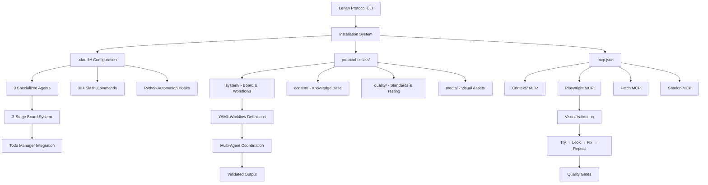

# Lerian Protocol Architecture Guide

## System Architecture Diagram



## Lerian Protocol Process Flow

### Installation Phase

1. **CLI Execution**: `lerian-protocol install` command initiated
2. **Directory Discovery**: Dynamic scanning of source structure for complete setup
3. **Asset Installation**: Copy .claude/, protocol-assets/, .mcp.json to target directory
4. **Configuration**: Set up MCP servers (Context7, Playwright, Fetch, Shadcn)
5. **Hook Activation**: Make Python hooks executable for automation
6. **Validation**: Verify installation completeness and health

### Development Workflow

1. **Agent Activation**: Specialized agents (UI/UX, UI validator, todo manager, frontend developer) available
2. **Board Management**: 3-stage kanban system (backlog → ready → done) with workflow automation
3. **UI-First Development**: Visual validation with Playwright MCP screenshots
4. **Quality Gates**: Multi-dimensional validation (visual 95%, accessibility 100%, performance 90%)
5. **Iterative Refinement**: "Try → Look → Fix → Repeat" cycle until quality gates met
6. **Multi-Agent Coordination**: Context-preserving handoffs between specialized agents
7. **Template Application**: Reusable templates ensure consistent outputs
8. **Workflow Orchestration**: YAML-defined processes for complex automation
9. **Board Integration**: Output automatically routed to appropriate board stage
10. **Quality Validation**: Comprehensive testing and standards enforcement
11. **Completion**: Production-ready deliverables with full documentation

## Key Architecture Components

### Core Installation System

- **🔧 CLI Tool**: Complete installer with progress tracking, error handling, retry logic
- **📁 Dynamic Discovery**: Automatic detection and installation of all protocol assets
- **⚙️ Configuration Management**: Automated setup of Claude Code and MCP server integrations
- **🛡️ Safety Systems**: Git validation, environment sanitization, file operation safety

### Claude Code Integration Layer

- **🤖 9 Specialized Agents**: UI/UX specialist, UI validator, todo manager, tech writer, frontend developer, etc.
- **⚡ 30+ Slash Commands**: Organized by function (code-quality, documentation, development, planning, utils)
- **🐍 Python Hook System**: Automated testing, security validation, formatting, backup automation
- **📋 Native Configuration**: Complete .claude/ directory with CLAUDE.md collaboration guidelines

### UI-First Development System

- **🎨 Visual Validation**: Playwright MCP screenshots with pixel-perfect comparison
- **🔄 Iterative Refinement**: "Try → Look → Fix → Repeat" development cycle
- **📊 Quality Gates**: Multi-dimensional thresholds (visual 95%, accessibility 100%, performance 90%)
- **📱 Multi-Viewport Testing**: Desktop and responsive validation capabilities

### 4-Layer Protocol Asset Architecture

- **🏗️ system/**: Board management (3-stage kanban), workflow orchestration (YAML definitions)
- **📚 content/**: Knowledge base (Anthropic/console patterns), design system, documentation templates
- **⚡ quality/**: Standards enforcement, testing protocols, validation outputs, compatibility guidelines
- **🎨 media/**: Screenshots, visual assets, UI references, design mockups

### Advanced Component System

- **⚛️ Enhanced React Components**: TypeScript-first components with full design system
- **🎨 Design System**: Comprehensive theming (colors, typography, spacing, animations)
- **🔧 File Management**: Enhanced selectors, sync systems, change detection
- **📈 Progress Tracking**: Smart indicators, step wizards, loading states

### MCP Server Ecosystem

- **📖 Context7 MCP**: Up-to-date library documentation and code examples
- **🎭 Playwright MCP**: Browser automation with screenshot validation
- **🌐 Fetch MCP**: Web content retrieval capabilities
- **🎨 Shadcn MCP**: UI component generation from design systems

### Workflow Orchestration Engine

- **📄 YAML Workflow Definitions**: Declarative process automation (ui-first-development.yaml)
- **🔗 Multi-Agent Coordination**: Context-preserving handoffs between specialized agents
- **📋 Board Integration**: Intelligent todo management with kanban workflow
- **✅ Quality Validation**: Comprehensive testing and standards enforcement
- **📊 Template System**: Reusable templates for consistent, standardized outputs

## Agents vs Commands vs Workflows: Understanding the Architecture

**Agents** are specialized AI assistants, **Commands** are slash commands for specific tasks, and **Workflows** orchestrate complex multi-step processes.

### Architecture Layers

| Component     | Purpose                                        | Example                                               |
| ------------- | ---------------------------------------------- | ----------------------------------------------------- |
| **Agents**    | Specialized AI assistants for domain expertise | `ui-ux-specialist` for design work                    |
| **Commands**  | Slash commands for immediate, focused tasks    | `/analyze-codebase` for code analysis                 |
| **Workflows** | Multi-agent, multi-step process orchestration  | Task classification and routing to specialized agents |

### Integration Patterns

Agents use commands within workflows:

```yaml
- id: visual-validation
  title: Validate UI with screenshots
  agent: visual-validator
  requires:
    - reference_design
    - ai_screenshots
  creates:
    - visual-diff-report.md
    - similarity-metrics.json
```

### Board System Integration

The 3-stage board system coordinates all three:

1. **01.backlog** - Requirements and user stories
2. **02.ready** - Implementation tasks with complete specifications (via workflow automation)
3. **03.done** - Completed development ready for delivery

## Installed Directory Structure

```
├── .claude/                    # Claude Code Native Integration
│   ├── agents/                 # 9 Specialized AI Agents
│   │   ├── ui-ux-specialist.md        # UI/UX design and specifications
│   │   ├── ui-validator.md            # UI validation and testing
│   │   ├── todo-manager.md            # Intelligent task management
│   │   ├── tech-writer.md             # Technical documentation
│   │   ├── task-breakdown-specialist.md # Complex task decomposition
│   │   ├── user-story-generator.md    # Agile story creation
│   │   ├── react-state-management.md  # React state patterns
│   │   ├── react-performance-optimization.md # Performance optimization
│   │   └── frontend-developer.md     # Frontend development specialist
│   ├── commands/               # 30+ Development Commands
│   │   ├── code-quality/       # Code review, security scans, refactoring
│   │   ├── documentation/      # Codebase analysis, diagrams, explanations
│   │   ├── development/        # Scaffolding, debugging, prototyping
│   │   ├── planning/           # Estimation, issue prediction, options analysis
│   │   └── utils/              # Setup, cleaning, command management
│   ├── hooks/                  # Python Automation Hooks
│   │   ├── auto-test.py        # Automated testing hooks
│   │   ├── dependency-monitor.py # Dependency monitoring
│   │   ├── security.py         # Security validation
│   │   ├── prettier.py         # Code formatting
│   │   └── backup.py           # Backup automation
│   └── CLAUDE.md               # Main configuration with collaboration guidelines
├── protocol-assets/            # 4-Layer Protocol Asset Architecture
│   ├── system/                 # Core Workflow & Project Management
│   │   ├── board/              # 3-stage kanban system (backlog → ready → done)
│   │   ├── workflows/          # YAML workflow definitions with task classification
│   │   └── templates/          # Design approval, implementation handoff
│   ├── content/                # Knowledge Base & Documentation
│   │   ├── docs/               # Anthropic patterns, console conventions
│   │   ├── design-system/      # UI standards, validation rules
│   │   └── templates/          # Reusable document templates
│   ├── quality/                # Standards & Testing Protocols
│   │   ├── standards/          # Code quality standards
│   │   ├── testing/            # Test scenarios and validation
│   │   ├── compatibility/      # Cross-platform guidelines
│   │   └── validation-outputs/ # Playwright screenshot outputs
│   └── media/                  # Visual Assets & Screenshots
│       └── ui-references/      # Reference designs and mockups
└── .mcp.json                   # MCP Server Configuration
    ├── context7                # Library documentation and code examples
    ├── playwright              # Browser automation with screenshot validation
    ├── fetch                   # Web content retrieval capabilities
    └── shadcn                  # UI component generation
```

## Task Classification System

The Lerian Protocol includes an intelligent **task classification system** that automatically routes backlog items to appropriate specialized workflows:

```yaml
task_classifier:
  classification_rules:
    ui_pure: # Frontend-only tasks
      target_workflow: ui-ready
      triggers:
        - labels: [frontend, ui, component, styling]
        - keywords: [component styling, responsive design, CSS changes]

    logic_pure: # Backend-only tasks
      target_workflow: logic-ready
      triggers:
        - labels: [backend, api, database, business-logic]
        - keywords: [API endpoint, business rule, integration]

    integrated: # Full-stack features
      target_workflow: integrated-ready
      triggers:
        - labels: [feature, full-stack, end-to-end]
        - keywords: [new feature, complete implementation]
```

**Classification Algorithm:**

1. **Content Analysis** (40%) - Analyze task title, description, labels
2. **Keyword Matching** (30%) - Match against predefined patterns
3. **Context Analysis** (20%) - Analyze dependencies and requirements
4. **Exclusion Filtering** (10%) - Apply rules to prevent misclassification

**Confidence Thresholds:**

- **High (85%+)**: Auto-route without confirmation
- **Medium (70%+)**: Auto-route with logging
- **Low (<70%)**: Prompt for manual classification

## Current Workflow Types

### 1. UI-First Development Workflow (`ui-first-development.yaml`)

- **Input**: Reference design (Figma/screenshot), component specification
- **Process**: Visual analysis → UI generation → screenshot validation → iterative refinement
- **Agents**: ui-analyzer, ui-generator, visual-validator, standards-validator, ui-refiner
- **Output**: Pixel-perfect UI implementation with comprehensive validation report
- **Quality Gates**: Visual similarity 95%, accessibility 100%, performance 90%

### 2. Board Management Workflow

- **Input**: User stories, feature requirements
- **Process**: Backlog → UI Design → Ready → In Progress → Testing → Completed
- **Agents**: todo-manager, ui-ux-specialist, visual-validator, tech-writer
- **Output**: Structured feature development with intelligent task management

### 3. Documentation Workflow

- **Input**: Codebase analysis, API specifications
- **Process**: Code analysis → content generation → template application → validation
- **Agents**: tech-writer, task-breakdown-specialist
- **Output**: Comprehensive technical documentation with consistent formatting

## Workflow Extension Pattern

To add new workflows to Lerian Protocol:

1. **Define YAML Workflow**: Create workflow definition in `protocol-assets/system/workflows/`
2. **Configure Agents**: Set up specialized agents in `.claude/agents/`
3. **Create Templates**: Develop reusable templates in `protocol-assets/content/templates/`
4. **Add Knowledge**: Include domain-specific docs in `protocol-assets/content/docs/`
5. **Set Quality Gates**: Define validation criteria in `protocol-assets/quality/standards/`
6. **Test Integration**: Validate workflow with board system and MCP servers

## Advanced Features

### Multi-Agent Coordination

Workflows support complex agent handoffs with context preservation:

```yaml
handoff_prompts:
  visual-validator-to-standards-validator: >
    Visual validation completed. Screenshots captured at 1920×1080 resolution
    with comprehensive visual diff analysis against reference design.
    Please perform comprehensive standards validation...
```

### Quality Gate System

Configurable thresholds ensure consistent output quality:

```yaml
quality_gates:
  visual_similarity:
    threshold: 95%
    weight: 40%
  accessibility_score:
    threshold: 100%
    weight: 20%
```

### Iterative Processing

Workflows support iterative refinement with early termination:

```yaml
iteration_config:
  max_iterations: 10
  convergence_threshold: 95%
  early_termination:
    perfect_score: 98%
    no_improvement_cycles: 3
```

### MCP Server Integration

Workflows leverage MCP servers for enhanced capabilities:

- **Context7**: Fetch up-to-date library documentation during development
- **Playwright**: Capture screenshots for visual validation in UI workflows
- **Fetch**: Retrieve external content for documentation workflows
- **Shadcn**: Generate UI components based on design system standards

## Summary

Lerian Protocol represents a **next-generation development workflow system** that combines:

- **Agent-based AI assistance** with domain specialization
- **Visual validation** with iterative refinement cycles
- **Structured protocol assets** in a clean 4-layer architecture
- **Board system integration** with intelligent task management
- **MCP server ecosystem** for external tool access
- **Quality gate enforcement** across multiple dimensions

This creates a comprehensive development environment optimized for **Claude Code**, enabling sophisticated AI-powered workflows while maintaining code quality, visual fidelity, and development standards.
