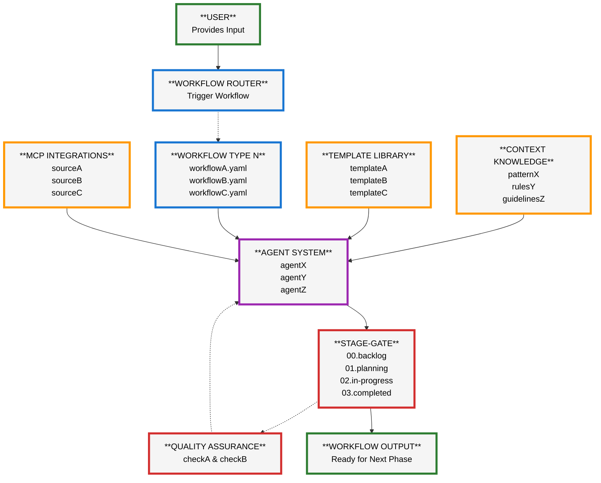

# Lerian Protocol: Extensible Workflow Orchestration Framework

## Overview

The **Lerian Protocol** is a generalized workflow orchestration framework for Claude Code that enables automated, template-driven development processes. The system is designed to support multiple workflow types through modular templates, context knowledge, and specialized agents.

## Workflow Diagram



## Framework Process Flow

1. **User Input**: User provides input for any supported workflow type
2. **Workflow Routing**: System selects appropriate workflow based on input type and context
3. **Workflow Selection**: Specific YAML workflow definition loaded (e.g., `apidog-documentation.yaml`)
4. **External Integration**: MCP integrations fetch required external data sources
5. **Context Assembly**: Domain-specific knowledge base provides contextual guidelines
6. **Template Selection**: Appropriate templates chosen based on workflow requirements
7. **Agent Orchestration**: Specialized agents assigned based on workflow needs
8. **Processing Engine**: Universal processing with template application and context integration
9. **Stage-Gate Integration**: Output routed to appropriate stage-gate directory
10. **Quality Assurance**: Optional validation and compliance checking
11. **Workflow Completion**: Standardized output ready for next development phase

## Key Framework Components

- **🎯 Workflow Router**: Intelligent workflow selection based on input type and context
- **📋 Extensible Workflow Library**: YAML-defined workflows for different automation needs
  - `apidog-documentation.yaml`, `feature-planning.yaml`, `code-generation.yaml`
- **📄 Template System**: Modular, reusable templates for different output formats
  - Documentation templates, code templates, planning templates
- **🤖 Agent Ecosystem**: Specialized Claude agents for different domains
  - Tech-writer, planning, code generation, custom domain agents
- **📂 Universal Stage-Gate System**: Consistent project lifecycle management across all workflows
  - `00.backlog/`, `01.planning/`, `02.in-progress/`, `03.completed/`
- **🔧 MCP Integration Layer**: Pluggable external system integrations
  - APIdog, GitHub, design systems, custom APIs
- **📚 Context Knowledge Base**: Domain-specific knowledge for accurate processing
  - API patterns, design guidelines, architecture rules
- **⚙️ Universal Processing Engine**: Template application, context integration, validation

## Framework Benefits

- **Extensible Architecture**: Easily add new workflow types without modifying core framework
- **Template-Driven Consistency**: Standardized outputs across all workflow types ensure quality and uniformity
- **Domain-Specific Intelligence**: Context knowledge bases provide accurate, relevant processing for any domain
- **Automated Orchestration**: Single-command execution from input to finished deliverable
- **Universal Stage-Gate Integration**: Consistent project lifecycle management across all workflow types
- **Modular External Integrations**: Pluggable MCP integrations for any external system or API
- **Agent Specialization**: Dedicated Claude agents optimize for specific workflow domains
- **Quality Assurance**: Built-in validation and review processes ensure output standards
- **Future-Proof Design**: Framework architecture accommodates new workflows, templates, and integrations
- **Context-Aware Processing**: Incorporates project-specific patterns, guidelines, and architectural rules

## System Architecture

### Directory Structure

```
├── context/                    # Domain knowledge base
│   ├── knowledge.md
├── templates/                  # Documentation templates
│   └── documentation.md
├── workflows/                  # Process definitions
│   └── workflow.yaml
├── development/                # Development resources
└── planning/                   # Planning resources
```

### Framework Specifications

- **Workflow Definition**: YAML-based workflow orchestration files
- **Template System**: Modular, reusable markdown and code templates
- **Agent Architecture**: Pluggable Claude agents for different domains
- **Stage-Gate Integration**: Universal project lifecycle management
- **External Integrations**: MCP-based pluggable external system connections
- **Context System**: Domain-specific knowledge bases for accurate processing

### Potential Workflow Types

1. **Feature Planning Workflow**
  - Input: User stories, requirements
  - Output: Structured PRDs, technical specifications
  - Agent: planning-agent
  - Template: PRD templates, architecture templates

2. **Code Generation Workflow**
  - Input: API specifications, design patterns
  - Output: Boilerplate code, component scaffolds
  - Agent: code-gen-agent
  - Template: Code templates, component templates

3. **Design System Integration**
  - Input: Figma designs, component libraries
  - Output: Component documentation, implementation guides
  - Agent: design-system-agent
  - Template: Design documentation templates

4. **Testing Workflow**
  - Input: Feature specifications, API definitions
  - Output: Test plans, automated test code
  - Agent: qa-agent
  - Template: Test templates, coverage templates

5. **Architecture Review Workflow**
  - Input: Technical designs, architectural decisions
  - Output: Review documentation, compliance reports
  - Agent: architect-agent
  - Template: Review templates, compliance templates

### Extensibility Pattern

Each new workflow follows the same pattern:

1. Create YAML workflow definition
2. Develop domain-specific templates
3. Configure or create specialized agent
4. Add context knowledge for domain
5. Define validation and quality rules
