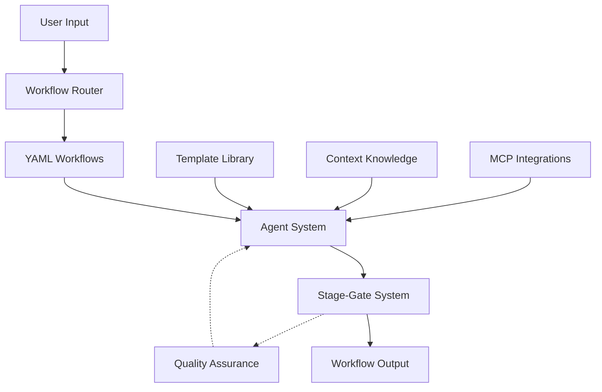

## Workflow Diagram



## Framework Process Flow

1. **User Input**: Input provided for any supported workflow
2. **Workflow Routing**: System selects workflow based on input type and context
3. **Workflow Loading**: YAML workflow definition loaded (e.g., `apidog-documentation.yaml`)
4. **External Integration**: MCP integrations fetch required data sources
5. **Context Assembly**: Knowledge base provides domain-specific guidelines
6. **Template Selection**: Templates chosen based on workflow requirements
7. **Agent Orchestration**: Specialized agents assigned based on workflow needs
8. **Processing**: Template application with context integration
9. **Stage-Gate Integration**: Output routed to appropriate stage-gate directory
10. **Quality Assurance**: Optional validation and compliance checking
11. **Completion**: Standardized output ready for next phase

## Key Framework Components

- **🎯 Workflow Router**: Intelligent workflow selection based on input type and context
- **📋 Extensible Workflow Library**: YAML-defined workflows that enable easy addition of new automation types without modifying core framework
  - `apidog-documentation.yaml`, `feature-planning.yaml`, `code-generation.yaml`
- **📄 Template System**: Modular, reusable templates ensuring standardized, consistent outputs across all workflow types
  - Documentation templates, code templates, planning templates
- **🤖 Agent Ecosystem**: Specialized Claude agents optimized for specific workflow domains
  - Tech-writer, planning, code generation, custom domain agents
- **📂 Universal Stage-Gate System**: Consistent project lifecycle management across all workflows
  - `00.backlog/`, `01.planning/`, `02.in-progress/`, `03.completed/`
- **🔧 MCP Integration Layer**: Pluggable external system integrations supporting any API or service
  - APIdog, GitHub, design systems, custom APIs
- **📚 Context Knowledge Base**: Domain-specific knowledge providing accurate, context-aware processing
  - API patterns, design guidelines, architecture rules
- **⚙️ Universal Processing Engine**: Automated orchestration with single-command execution from input to deliverable
  - Template application, context integration, validation, quality assurance

## Workflow vs Tasks: Understanding the Architecture

**Workflows** (YAML files) orchestrate multi-agent processes across entire projects, while **Tasks** (markdown files) provide step-by-step instructions for individual agents.

### Key Differences

| Aspect      | Workflows                                                  | Tasks                                                 |
| ----------- | ---------------------------------------------------------- | ----------------------------------------------------- |
| **Scope**   | Multi-agent, project-wide                                  | Single-agent, focused                                 |
| **Purpose** | Coordinate "who does what when"                            | Define "exactly how to do it"                         |
| **Example** | `building-app.yaml` coordinates architect → PM → developer | `create-story.md` tells PM how to create user stories |

### How They Work Together

Workflows reference tasks to coordinate execution:

```yaml
- id: create_stories
  title: Create user stories
  agent: sm
  uses: tasks/create-next-story.md # ← Workflow calls task
```

## System Architecture

### Directory Structure

```
├── context/                    # Domain knowledge base
│   ├── knowledge.md
├── templates/                  # Documentation templates
│   └── documentation.md
├── workflows/                  # Process definitions
│   └── workflow.yaml
├── development/                # Development resources
└── planning/                   # Planning resources
```

### Potential Workflow Types

1. **Feature Planning Workflow**
   - Input: User stories, requirements
   - Output: Structured PRDs, technical specifications
   - Agent: planning-agent | Template: PRD, architecture templates

2. **Code Generation Workflow**
   - Input: API specifications, design patterns
   - Output: Boilerplate code, component scaffolds
   - Agent: code-gen-agent | Template: Code, component templates

3. **Testing Workflow**
   - Input: Feature specifications, API definitions
   - Output: Test plans, automated test code
   - Agent: qa-agent | Template: Test, coverage templates

### Extensibility Pattern

Each new workflow follows the same pattern:

1. Create YAML workflow definition
2. Develop domain-specific templates
3. Configure or create specialized agent
4. Add context knowledge for domain
5. Define validation and quality rules
