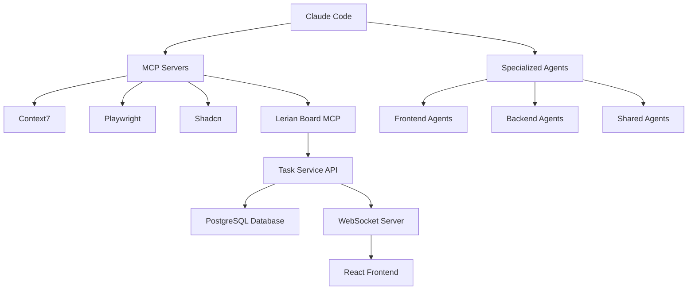

# Lerian Protocol


> **Lerian Protocol** is an advanced CLI tool that creates a comprehensive **AI-powered development environment** for **Claude Code**. It implements a sophisticated agent-based workflow system with visual validation, board management, and protocol asset organization.

### Adjustments and improvements

The project is still under development and future updates will be aimed at the following tasks:

- [x] **Agent-Based Workflows** - 9 specialized agents with domain expertise
- [x] **UI-First Development** - Visual validation with Playwright MCP screenshots
- [x] **Database-Backed Task Management** - PostgreSQL-based @task-manager system
- [x] **Real-time Collaboration** - WebSocket-powered kanban board
- [x] **External Tool Integration** - Context7, Playwright, Fetch, Shadcn integrations
- [x] **Domain-Driven Architecture** - Profile-based installation (frontend/backend/full)
- [ ] **Enhanced Filtering** - Advanced search and project organization
- [ ] **Team Collaboration** - User authentication and task assignment

## 💻 Prerequisites

Before you begin, make sure you have met the following requirements:

- You have installed the latest version of **Node.js >= 16.0.0**
- You have a **Linux / macOS / Windows (WSL)** machine. Compatible with all major operating systems.
- You have read the **Claude Code documentation** and have Claude Code installed.

## ✨ What Gets Installed

The installer creates a complete AI-powered development environment:

### Claude Code Integration

- **Domain-Organized Agents** - Specialized agents organized by frontend, backend, and shared domains
- **30+ Slash Commands** - Domain-specific commands for development, quality, documentation workflows
- **Python Hook System** - Domain-organized hooks for automated testing, security, formatting
- **Native Configuration** - Complete `.claude/` directory with domain separation and CLAUDE.md

### Modern Architecture System

- **Domain Separation** - Frontend, backend, and shared component organization
- **Service Layer** - Error handling, protocol asset management, and utility services
- **Documentation System** - UI workflows, diagrams, and architecture documentation
- **CLI Tooling** - Interactive terminal components with modern styling

### Advanced Development Tools

- **External Tool Configurations** - Context7, Playwright, Fetch, Shadcn integrations
- **Interactive CLI Components** - Modern terminal UI components with advanced styling
- **Database-Backed Task Management** - PostgreSQL-based @task-manager system replacing fragile file operations
- **Workflow Definitions** - YAML-based process automation with database integration
- **Quality Validation** - Comprehensive standards and testing protocols

### 📁 Directory Structure

```
.claude/                    # Claude Code Native Integration
├── agents/                # Specialized AI Agents (organized by domain)
│   ├── frontend/          # Frontend-specific agents (React, UI/UX, Playwright)
│   ├── backend/           # Backend-specific agents (empty - structure only)
│   └── shared/            # Cross-domain agents (Tech Writer, Task Manager, User Stories)
├── commands/              # 30+ Development Commands
│   ├── frontend/          # Frontend development commands
│   ├── backend/           # Backend development commands (empty - structure only)
│   └── shared/            # Shared utility commands
├── hooks/                 # Python Automation Hooks
│   ├── frontend/          # Frontend-specific hooks
│   └── shared/            # Shared automation hooks
├── tools/                 # MCP Tool Configurations
│   └── task-manager.md    # @task-manager tool documentation
├── frontend/              # Frontend-specific configurations
├── backend/               # Backend-specific configurations
├── shared/                # Shared configurations and utilities
├── CLAUDE.md              # Main configuration with collaboration guidelines
└── settings.json          # Claude Code settings

protocol-assets/           # Protocol Asset Organization (MAIN IMPLEMENTATION)
├── lib/                   # Core Implementation Library
│   ├── board-service/     # 🔥 Full-Stack Task Management Service
│   │   ├── src/client/    # React TypeScript frontend (Vite + TailwindCSS)
│   │   ├── src/server.js  # Express.js REST API + WebSocket server
│   │   ├── migrations/    # PostgreSQL database schema migrations
│   │   └── public/        # Static assets and production build
│   ├── board-executor/    # 🔥 Claude Code Execution Service
│   │   ├── src/           # Node.js execution service
│   │   └── tests/         # Integration tests
│   ├── installer/         # Installation system components
│   ├── services/          # Service layer (error handling, protocol assets)
│   ├── components/        # Interactive CLI components
│   ├── sync/              # File synchronization system
│   └── utils/             # Shared utilities and helpers
├── data/                  # 🔥 Runtime Data (CRITICAL - UNDOCUMENTED)
│   ├── databases/         # PostgreSQL task management database
│   ├── logs/              # Service and MCP server logs
│   ├── pids/              # Process ID files
│   └── backups/           # Database backups
├── scripts/               # 🔥 Service Orchestration (CRITICAL)
│   ├── start-mcp-stack.sh # Comprehensive service orchestrator
│   ├── stop-mcp-stack.sh  # Service shutdown management
│   └── mcp-stack-status.sh # Health monitoring and status
├── frontend/              # Frontend-specific assets and workflows
├── backend/               # Backend-specific assets and workflows
└── shared/                # Cross-domain assets and standards

docs/                      # Project Documentation (SPARSE)
└── next-steps-roadmap.md  # Development roadmap

bin/                       # CLI Executables
├── lerian-protocol.js     # Main CLI entry point
└── lerian-cli-wrapper.js  # CLI wrapper script

.mcp.json                  # External MCP Tools Configuration
├── context7               # Library documentation and code examples
├── playwright             # Browser automation with screenshot validation
├── fetch                  # Web content retrieval capabilities
└── shadcn                 # UI component generation
```

## 🚀 Installing Lerian Protocol

To install Lerian Protocol, follow these steps:

Linux and macOS:

```bash
# -
git clone https://github.com/LerianStudio/ai-prompts.git -b lerian-protocol

# -
cd ai-prompts

# -
npm install

# -
npm link

# -
lerian-protocol install ./my-project
```

## ☕ Using Lerian Protocol

To use Lerian Protocol, follow these steps:

```bash
# Install in current directory
lerian-protocol install

# Install in specific directory
lerian-protocol install ./my-project

# Check installation status
lerian-protocol status

# Start MCP stack for development
npm run mcp:start

# Start task management service
npm run mcp:start:dev
```

Add execution commands and examples that you think users will find useful. Provide an options reference for bonus points!

### Key Capabilities

#### Full-Stack Task Management System

- **React Frontend Application** - Complete kanban board with drag-and-drop, built with TypeScript + Vite
- **Express.js REST API** - Full CRUD operations with WebSocket real-time synchronization
- **PostgreSQL Database** - Reliable task state with migrations, foreign keys, and transaction safety
- **@task-manager MCP Tool** - Revolutionary MCP server implementation for agent integration
- **Service Orchestration** - Shell script-based service management and health monitoring

#### UI-First Development

- **Visual Validation** - Playwright MCP screenshots with pixel-perfect comparison
- **Iterative Refinement** - "Try → Look → Fix → Repeat" development cycle
- **Quality Gates** - Visual similarity (95%), accessibility (100%), performance (90%)
- **Multi-Viewport Testing** - Desktop and responsive validation

#### Domain-Driven Architecture

- **Profile-Based Installation** - Frontend-only, backend-only, or full installation based on project needs
- **Agent Specialization** - Domain-specific agents prevent overlap and ensure targeted expertise
- **Asset Organization** - Protocol assets organized by domain (frontend/, backend/, shared/)
- **Workflow Automation** - YAML workflows with database integration for complex multi-step processes

#### External Tool Ecosystem

- **Context7** - Up-to-date library documentation and code examples
- **Playwright** - Browser automation with screenshot validation
- **Fetch** - Web content retrieval capabilities
- **Shadcn** - UI component generation

## 📚 Key Components

| Directory                                | Purpose                     | Contents                                                                   |
| ---------------------------------------- | --------------------------- | -------------------------------------------------------------------------- |
| **`.claude/`**                           | **Claude Code Integration** | Complete agent ecosystem with 30+ commands and hooks                       |
| `.claude/agents/`                        | Specialized AI agents       | Frontend (React, UI/UX, Playwright) + Shared (Tech Writer, Task Breakdown) |
| `.claude/commands/`                      | Development commands        | 30+ commands organized by domain (frontend/shared/backend)                 |
| `.claude/hooks/`                         | Automation hooks            | Python hooks for testing, security, formatting                             |
| **`protocol-assets/lib/board-service/`** | **🔥 Full-Stack App**       | **Complete React+Express task management system**                          |
| `└─ src/client/`                         | React frontend              | TypeScript + Vite + TailwindCSS + Drag-and-Drop Kanban                     |
| `└─ src/server.js`                       | Express.js API              | REST endpoints + WebSocket + PostgreSQL integration                        |
| `└─ migrations/`                         | Database schema             | PostgreSQL migrations with foreign keys and constraints                    |
| **`services/board-executor/`**           | **🔥 Executor Service**     | **Claude Code execution integration**                                      |
| `└─ src/`                                | Node.js execution service   | Claude Code integration and task execution                                 |
| `└─ tests/`                              | Integration tests           | Execution workflow testing                                                 |
| **`protocol-assets/data/`**              | **🔥 Runtime Data**         | **Production database, logs, process management**                          |
| `└─ databases/`                          | PostgreSQL database         | Task management database with backups                                      |
| `└─ logs/`                               | Service logs                | Real-time logs from all services                                           |
| `└─ pids/`                               | Process tracking            | Process ID files for service management                                    |
| **`protocol-assets/scripts/`**           | **🔥 Orchestration**        | **Service management and monitoring**                                      |
| `└─ start-mcp-stack.sh`                  | Service starter             | Comprehensive service orchestration                                        |
| `└─ mcp-stack-status.sh`                 | Health monitoring           | Real-time status and health checks                                         |
| `.mcp.json`                              | MCP configuration           | 5 integrated servers (Context7, Playwright, etc.)                          |

## Repository Structure

```
├── .claude/                     # Claude Code Native Integration
│   ├── agents/                  # Domain-organized specialized AI agents
│   │   ├── frontend/            # Frontend-specific agents (React, UI/UX, Playwright)
│   │   └── shared/              # Cross-domain agents (Tech Writer, Task Breakdown)
│   ├── commands/                # 30+ development commands by domain
│   │   ├── frontend/            # Frontend development commands
│   │   └── shared/              # Shared utility commands
│   ├── hooks/                   # Python automation hooks by domain
│   │   ├── frontend/            # Frontend-specific hooks
│   │   └── shared/              # Shared automation hooks
│   ├── tools/                   # MCP tool configurations
│   │   └── task-manager.md      # @task-manager tool documentation
│   ├── frontend/                # Frontend-specific configurations
│   ├── backend/                 # Backend-specific configurations (structure created)
│   ├── shared/                  # Shared configurations and utilities
│   ├── CLAUDE.md                # Main configuration with collaboration guidelines
│   └── settings.json            # Claude Code settings
├── docs/                        # Project Documentation (SPARSE)
│   └── next-steps-roadmap.md    # Development roadmap
├── protocol-assets/             # 🔥 MAIN IMPLEMENTATION DIRECTORY
│   ├── lib/                     # Core Implementation Library
│   │   ├── board-service/       # 🔥 Full-Stack Task Management Service
│   │   │   ├── src/client/      # React TypeScript frontend (Vite + TailwindCSS)
│   │   │   ├── src/server.js    # Express.js REST API + WebSocket server
│   │   │   ├── migrations/      # PostgreSQL database schema migrations
│   │   │   └── public/          # Static assets and production build
│   │   ├── board-executor/      # 🔥 Claude Code Execution Service
│   │   │   ├── src/             # Node.js execution service
│   │   │   └── tests/           # Integration tests
│   │   ├── installer/           # Installation system components
│   │   ├── services/            # Service layer (error handling, protocol assets)
│   │   ├── components/          # Interactive CLI components
│   │   ├── sync/                # File synchronization system
│   │   └── utils/               # Shared utilities and helpers
│   ├── data/                    # 🔥 Runtime Data (CRITICAL)
│   │   ├── databases/           # PostgreSQL task management database
│   │   ├── logs/                # Service and MCP server logs
│   │   ├── pids/                # Process ID files
│   │   └── backups/             # Database backups
│   ├── scripts/                 # 🔥 Service Orchestration
│   │   ├── start-mcp-stack.sh   # Comprehensive service orchestrator
│   │   ├── stop-mcp-stack.sh    # Service shutdown management
│   │   └── mcp-stack-status.sh  # Health monitoring and status
│   ├── frontend/                # Frontend-specific assets and workflows
│   ├── backend/                 # Backend-specific assets and workflows
│   └── shared/                  # Cross-domain assets and standards
├── bin/                         # CLI entry points and executables
│   ├── lerian-protocol.js       # Main CLI entry point
│   └── lerian-cli-wrapper.js    # CLI wrapper script
├── .backups/                    # System backups (UNDOCUMENTED)
├── boards/                      # Development workspace (UNDOCUMENTED)
└── .mcp.json                    # MCP server configuration (5 integrated servers)
```

## 🏗️ Architecture Overview

Lerian Protocol implements a **sophisticated dual-service architecture** with real-time collaboration:



### Real System Architecture

```
Board UI ←→ REST API (board-api) ←→ Executor Service ←→ Claude Code ←→ PostgreSQL Database
                ↓                           ↓                             ↓
           React Frontend              HTTP/WebSocket              Command Execution
                                                    ↓
                                            WebSocket Real-time Updates
```

This creates a complete task management ecosystem with:

- **Database persistence** for reliable task state
- **Real-time collaboration** via WebSocket broadcasting
- **Agent integration** through MCP protocol
- **Modern UI** with drag-and-drop kanban board
- **Service orchestration** with health monitoring

## 📫 Contributing to Lerian Protocol

To contribute to Lerian Protocol, follow these steps:

1. Fork this repository.
2. Create a branch: `git checkout -b lerian-protocol/<feature_name>`.
3. Make your changes and commit them: `git commit -m 'feat: add amazing feature'`
4. Push to the original branch: `git push origin lerian-protocol/<feature_name>`
5. Create the pull request.

Alternatively, see the GitHub documentation on [how to create a pull request](https://help.github.com/en/github/collaborating-with-issues-and-pull-requests/creating-a-pull-request).

## 🐙 Advanced Formatting

### Alerts

Use alerts to emphasize critical information with colors and distinct icons:

> [!NOTE]
> Useful information that users should know, even when skimming content.

> [!TIP]
> Helpful advice for doing things better or more easily.

> [!IMPORTANT]
> Key information users need to know to achieve their goal.

> [!WARNING]
> Urgent info that needs immediate user attention to avoid problems.

> [!CAUTION]
> Advises about risks or negative outcomes of certain actions.

### Collapsed Sections

Create expandable sections to organize detailed information:

<details>

<summary>Advanced Configuration</summary>

### Additional Settings

You can include detailed configuration options here.

```bash
npm run configure --advanced
```

Add any technical details that might not be relevant for all readers.

</details>

## 📝 License

This project is under license. See the [LICENSE](LICENSE.md) file for more details.

<div align="center">
   <p>Made with ❤️ by <a href="https://github.com/LerianStudio">Lerian Studio</a></p>
</div>
