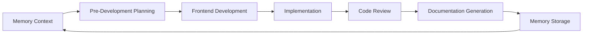

# AI Prompts for LerianStudio Ecosystem

A comprehensive collection of AI prompts designed for complete software development lifecycle management within the LerianStudio ecosystem.

## 🎯 Overview

This repository provides integrated systems that work together to support the entire software development lifecycle:

| System | Purpose | Workflow Type | Quick Start |
|--------|---------|---------------|-------------|
| **Memory System** | Cross-session learning & pattern recognition | Sequential (5 phases) | `claude 0-memory-system/m0-memory-orchestrator.mdc` |
| **Product Development** | Comprehensive planning from idea to implementation | **Dynamic (4 phases, 2 checkpoints)** | `claude 1-pre-dev-product/0-pre-dev-orchestrator.mdc` |
| **Feature Development** | Adaptive feature addition with complexity-based flow | **Adaptive (4 phases, complexity-based)** | `claude 2-pre-dev-feature/0-feature-orchestrator.mdc` |
| **Frontend Development** | Complete frontend development with flexible design inputs | Flexible (5 phases) | `claude 3-frontend/0-frontend-orchestrator.mdc` |
| **Code Review** | Streamlined 5-phase analysis with validation gates | Systematic (5 phases, 5 gates) | `claude 4-code-review/0-review-orchestrator.mdc` |
| **Documentation Generation** | Comprehensive documentation generation and distribution | Comprehensive (5 phases) | `claude 5-generate-docs/0-docs-orchestrator.mdc` |

## 📚 Documentation

- **[CLAUDE.md](CLAUDE.md)** - Complete orchestrator architecture and execution patterns for AI assistants
- **[Memory Management README](0-memory-system/README.md)** - Detailed memory system documentation
- **[Pre-Development README](1-pre-dev-product/README.md)** - Interactive planning workflow guide
- **[Frontend Development README](3-frontend/README.md)** - Complete frontend development workflow
- **[Code Review README](4-code-review/README.md)** - Systematic analysis documentation
- **[Documentation Generation README](5-generate-docs/README.md)** - Comprehensive documentation workflow guide

## 🆕 Dynamic Workflow Innovation

### Confidence-Based Interactions
The Pre-Development Product workflow now uses AI confidence scoring to minimize user interaction:

```yaml
High Confidence (80-100%):
  - AI proceeds autonomously
  - Notifies user of decisions
  - User can intervene if needed

Medium Confidence (50-79%):
  - AI presents 2-3 options
  - User selects preferred approach
  - AI refines based on selection

Low Confidence (<50%):
  - AI requests specific guidance
  - Presents gaps in understanding
  - User provides targeted input
```

### Tool Integration (Enhanced)
- **Memory MCP**: Pattern recognition, knowledge persistence, cross-project learning
- **Sequential Thinking MCP**: Complex problem decomposition with iterative refinement
- **Zen MCP Suite**: Comprehensive analysis tools:
  - `codereview`: Deep code quality analysis with severity prioritization
  - `analyze`: Architecture and pattern analysis across directories
  - `thinkdeep`: Complex problem exploration and solution validation
  - `debug`: Root cause analysis with 1M token capacity
  - `chat`: Collaborative thinking and validation
- **Task Tool**: Parallel search operations for maximum efficiency in pattern discovery

## 🚀 Quick Start Workflows

### 1. New Feature Development
```bash
# Initialize memory context
claude 0-memory-system/m0-memory-orchestrator.mdc

# Plan the feature interactively
claude 1-pre-dev-product/0-pre-dev-orchestrator.mdc

# Analyze integration points with foundation analysis
claude 4-code-review/1-foundation-analysis.mdc
```

### 2. Frontend Development
```bash
# Design input analysis (any format: sketches, Figma, specs)
claude 3-frontend/1-design-input-analysis.mdc

# Complete frontend implementation
claude 3-frontend/0-frontend-orchestrator.mdc

# Validate with streamlined code review
claude 4-code-review/0-review-orchestrator.mdc
```

### 3. Existing Code Analysis
```bash
# Full streamlined code review
claude 4-code-review/0-review-orchestrator.mdc

# Store findings
claude 0-memory-system/m4-memory-workflow.md
```

### 4. Documentation Generation
```bash
# Comprehensive documentation suite
claude 5-generate-docs/0-docs-orchestrator.mdc

# Store documentation patterns
claude 0-memory-system/m4-memory-workflow.md
```

### 5. Quick Security Check
```bash
# Security-focused analysis (phases 1, 2, and 5 only)
claude 4-code-review/1-foundation-analysis.mdc
claude 4-code-review/2-security-compliance.mdc
claude 4-code-review/5-production-readiness.mdc
```

## 🔄 Development Lifecycle Integration

### Complete Development Cycle


1. **Initialize**: Start with memory context to leverage existing patterns
2. **Plan**: Use pre-development for interactive requirements and design
3. **Frontend**: Design and implement frontend with systematic precision
4. **Implement**: Follow generated tasks and sub-tasks
5. **Review**: Comprehensive code analysis and validation
6. **Document**: Generate comprehensive documentation for all audiences
7. **Learn**: Store insights back to memory for future projects

## 🎯 Key Features

### 🔗 Orchestrator Architecture
- **Dynamic Phase Execution**: Pre-Development now uses confidence-based execution with only 2 mandatory checkpoints
- **Memory MCP Integration**: Context retrieval, decision storage, pattern analysis across sessions
- **Multi-Tool Integration**: Sequential Thinking, Zen MCP, and Task tool for enhanced capabilities
- **Cross-System Dependencies**: Workflows feed into each other with validation gates

### 📋 User Interaction Patterns
- **Adaptive Complexity Assessment**: Feature Development now includes Phase 0 complexity analysis
- **Confidence-Based Interactions**: AI decides when user input is needed based on confidence scores
- **Structured Feedback Loops**: Draft → User feedback → AI incorporation → Approval
- **Minimal Interruption**: From 6+ checkpoints down to just 2 in Pre-Development workflow
- **Flexible Design Inputs**: iPad sketches, Figma designs, written specs, reference apps
- **Risk-Based Planning**: Complex features get automatic risk assessment and mitigation strategies

### 🚀 Workflow Features
- **Deliverable-Focused Planning**: Shifted from atomic tasks to complete deliverables (2-pre-dev-feature)
- **Autonomous Refinement**: AI works independently when confidence is high
- **Parallel Processing**: Multiple operations execute simultaneously for efficiency
- **Adaptive Task Sizing**: 2-8 hours based on complexity assessment
- **Smart Validation**: Consistency checks with auto-correction capabilities
- **Priority-Based Todos**: 🔴 CRITICAL → 🟡 HIGH → 🟢 MEDIUM → 🔵 LOW organization
- **Pattern Reuse**: Automatic detection and application of similar solutions

## 📦 Output Organization

### Pre-Development Outputs
```
docs/pre-development/
├── prd-[feature].md              # Product requirements
├── trd-[feature].md              # Technical specifications
├── validation-report-[feature].md # Consistency validation
└── tasks/
    ├── tasks-[feature].md        # Atomic phases
    └── MT-[XX]-[name]/           # Sub-task details
```

### Code Review Outputs
```
docs/code-review/
├── review-summary.md             # Executive summary
├── 1-foundation-analysis.md      # Technical foundation
├── 2-security-compliance.md      # Security findings
├── 3-quality-operations.md       # Quality assessment
├── 4-business-documentation.md   # Business alignment
├── 5-production-readiness.md     # Final validation
└── code-review-todos.md          # Consolidated action items
```

### Documentation Generation Outputs
```
docs/documentation/
├── documentation-audit.md        # Discovery phase audit
├── documentation-plan.md         # Strategic planning
├── validation-report.md          # Quality validation
├── distribution-strategy.md      # Multi-channel distribution
└── content/
    ├── business/                 # Product team docs
    ├── technical/                # Developer docs
    ├── integration/              # API consumer docs
    └── operations/               # DevOps docs
```

## 🏆 Orchestrator Best Practices

### Execution Order Guidelines
1. **Memory First**: Always start with `memory_search` and `memory_get_context` before any workflow
2. **Follow Phase Dependencies**: 
   - Pre-Development: Discovery (conditional) → Strategic Decision✓ → Autonomous Refinement → Final Validation✓
   - **Feature Development**: Phase 0 Complexity Assessment → Adaptive Brief (1-7 questions) → Technical Approach✓ → Deliverable Planning → Test Strategy
   - **Code Review**: Foundation → Gate 1✓ → Security → Gate 2✓ → Quality → Gate 3✓ → Business → Gate 4✓ → Production → Gate 5✓
   - Frontend: Design✓ → Tech✓ → Architecture → Tasks → Validation
   - Documentation: Discovery✓ → Planning✓ → Generation✓ → Validation✓ → Distribution
3. **Leverage AI Autonomy**: Let confidence scores guide interaction needs
4. **Use Tools Liberally**: 
   - **Zen MCP**: Use specific tools (`codereview`, `analyze`, `thinkdeep`, `debug`, `chat`) based on context
   - **Task Tool**: Always prefer for parallel searches and pattern discovery
5. **Store All Decisions**: Use `memory_store_decision` for architectural choices and `memory_store_chunk` for insights

### Integration Patterns
- **New Product**: Memory → Pre-Development Product → Frontend → Code Review → Documentation → Memory
- **Feature Enhancement**: Memory → Pre-Development Feature → Implementation → Code Review → Documentation → Memory  
- **Existing Analysis**: Memory → Code Review → Memory
- **Documentation Focus**: Memory → Documentation Generation → Distribution → Memory
- **Security Focus**: Memory → Code Review (phases 1,2,5) → Memory

## 🏗️ Integration with LerianStudio

This repository supports the broader LerianStudio ecosystem:
- **Midaz Financial Ledger**: Architecture and security analysis
- **Plugin Ecosystem**: Component analysis and integration patterns
- **SDK Development**: API design and documentation workflows
- **Infrastructure**: Observability and deployment analysis

### Repository Context
```bash
# Use appropriate repository context
repository="github.com/lerianstudio/midaz"
repository="github.com/lerianstudio/midaz-private"
repository="github.com/lerianstudio/monorepo"
```

## 📈 Key Benefits

- **Consistency**: Standardized workflows across all projects
- **Quality**: Comprehensive analysis at every stage with Zen MCP integration
- **Learning**: Continuous improvement through memory and pattern recognition
- **Efficiency**: Reuse patterns and decisions, deliverable-focused planning
- **Collaboration**: Clear user interaction points with adaptive complexity
- **Tool Synergy**: Zen MCP + Task Tool + Memory MCP work together for comprehensive analysis

### 🚀 Efficiency Improvements
- **70% Reduction in Interactions**: Pre-Development workflow reduced from 6+ to 2 mandatory checkpoints
- **Adaptive Complexity**: Feature Development adjusts depth based on feature complexity (1-7 questions)
- **Parallel Processing**: Multiple analyses run simultaneously with Task Tool
- **Pattern Reuse**: Memory MCP enables >60% pattern reuse from similar projects
- **Autonomous Refinement**: AI works independently when confidence is high (>80%)
- **Smart Validation**: Auto-correction of minor issues without user intervention
- **Tool-Powered Analysis**: Zen MCP tools accelerate deep analysis by 5-10x

## 🔧 Getting Started

### For AI Assistants
1. **Read CLAUDE.md First**: Complete orchestrator architecture and execution patterns
2. **Choose Your Workflow**:
   - New project? Start with Pre-Development Product (4-phase dynamic, only 2 checkpoints!)
   - Existing code? Begin with Code Review (5-phase streamlined with validation gates)
   - Frontend focus? Use Frontend Development (5-phase flexible)
   - Feature addition? Use Pre-Development Feature (4-phase adaptive with complexity assessment)
3. **Leverage Tools Strategically**:
   - **Zen MCP**: Choose the right tool for the task:
     - `codereview` for quality assessment
     - `analyze` for architecture review
     - `thinkdeep` for complex reasoning
     - `debug` for troubleshooting (1M token capacity)
     - `chat` for collaborative validation
   - **Task Tool**: Always use for parallel searches and pattern discovery
   - **Memory MCP**: Start and end every workflow with memory operations
   - Let confidence scores and complexity assessments guide your interactions

### For Developers
1. **Start with Orchestrators**: Each system has a `0-*-orchestrator.mdc` entry point
2. **Follow Phase Dependencies**: Respect mandatory checkpoints and user feedback loops
3. **Leverage Memory**: Check context before starting, store learnings after completion
4. **Use Integration Patterns**: Connect workflows for complete development lifecycle

### Command Examples
```bash
# Complete new feature workflow with adaptive complexity
claude 0-memory-system/m0-memory-orchestrator.mdc
claude 2-pre-dev-feature/0-feature-orchestrator.mdc  # Now with Phase 0 complexity assessment
claude 3-frontend/0-frontend-orchestrator.mdc
claude 4-code-review/0-review-orchestrator.mdc  # Streamlined 5-phase with validation gates
claude 5-generate-docs/0-docs-orchestrator.mdc

# Quick feature addition with risk assessment
claude 2-pre-dev-feature/0-feature-orchestrator.mdc  # Adapts to feature complexity
# Phase 0: Automatic complexity assessment
# Phases 1-4: Adjusted based on complexity (Simple/Medium/Complex)
```

## 📄 License

This project is part of the LerianStudio ecosystem. See the main repository for licensing information.

---

*Part of the [LerianStudio](https://github.com/lerianstudio) ecosystem - Building the future of financial technology with AI-assisted development.*