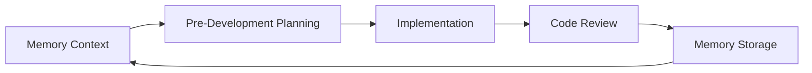

# AI Prompts for LerianStudio Ecosystem

A comprehensive collection of AI prompts designed for complete software development lifecycle management within the LerianStudio ecosystem.

## 🎯 Overview

This repository provides three integrated systems that work together to support the entire software development lifecycle:

| System | Purpose | Directory | Quick Start |
|--------|---------|-----------|-------------|
| **Memory Management** | Cross-session learning & pattern recognition | [`0-memory-related/`](0-memory-related/) | `claude 0-memory-related/m0-memory-orchestrator.md` |
| **Pre-Development** | Interactive planning from idea to implementation | [`1-pre-development/`](1-pre-development/) | `claude 1-pre-development/0-pre-dev-orchestrator.mdc` |
| **Code Review** | 18-point systematic code analysis | [`2-code-review/`](2-code-review/) | `claude 2-code-review/00-code-review-orchestrator.mdc` |

## 📚 Documentation

- **[ORCHESTRATORS.md](ORCHESTRATORS.md)** - Comprehensive guide to all orchestrators and workflow integration
- **[Memory Management README](0-memory-related/README.md)** - Detailed memory system documentation
- **[Pre-Development README](1-pre-development/README.md)** - Interactive planning workflow guide
- **[Code Review README](2-code-review/README.md)** - Systematic analysis documentation

## 🚀 Quick Start Workflows

### 1. New Feature Development
```bash
# Initialize memory context
claude 0-memory-related/m0-memory-orchestrator.md

# Plan the feature interactively
claude 1-pre-development/0-pre-dev-orchestrator.mdc

# Analyze integration points
claude 2-code-review/01-codebase-overview.md
```

### 2. Existing Code Analysis
```bash
# Full code review
claude 2-code-review/00-code-review-orchestrator.mdc

# Store findings
claude 0-memory-related/m4-memory-workflow.md
```

### 3. Quick Security Check
```bash
# Security-focused analysis
claude 2-code-review/01-codebase-overview.md
claude 2-code-review/07-security-vulnerability-analysis.md
claude 2-code-review/08-dependency-security-analysis.md
```

## 🔄 Development Lifecycle Integration

### Complete Development Cycle


1. **Initialize**: Start with memory context to leverage existing patterns
2. **Plan**: Use pre-development for interactive requirements and design
3. **Implement**: Follow generated tasks and sub-tasks
4. **Review**: Comprehensive code analysis and validation
5. **Learn**: Store insights back to memory for future projects

## 🎯 Key Features

### 🔗 Integrated Systems
- **Memory First**: Every workflow starts with context retrieval and ends with knowledge storage
- **Interactive Planning**: User feedback loops ensure alignment at every stage
- **Systematic Analysis**: 18-point code review covers all engineering disciplines
- **Continuous Learning**: Patterns and decisions persist across projects

### 📋 Todo Generation
- Consolidated todo lists from all code review analyses
- Priority-based organization (CRITICAL → HIGH → MEDIUM → LOW)
- Developer comment extraction (`///AUTHOR` tags)
- Actionable tasks with effort estimates

### 🚀 Workflow Features
- **Atomic Tasks**: Each task delivers complete, working software
- **Validation Gates**: Consistency checks prevent flawed implementations
- **Architecture Patterns**: Built-in best practices and standards
- **Language Agnostic**: Supports all major programming languages

## 📦 Output Organization

### Pre-Development Outputs
```
docs/pre-development/
├── prd-[feature].md              # Product requirements
├── trd-[feature].md              # Technical specifications
├── validation-report-[feature].md # Consistency validation
└── tasks/
    ├── tasks-[feature].md        # Atomic phases
    └── MT-[XX]-[name]/           # Sub-task details
```

### Code Review Outputs
```
docs/code-review/
├── code-review-todo-list.md     # Consolidated todos
├── 1-CODEBASE_OVERVIEW.md       # Foundation analysis
├── 2-ARCHITECTURE_ANALYSIS.md   # Architecture patterns
├── ...
└── 18-COMPREHENSIVE_TODO_LIST.md # Final synthesis
```

## 🏆 Best Practices

1. **Start with Memory**: Always check for existing patterns before beginning new work
2. **Interactive Planning**: Engage with feedback loops during pre-development
3. **Systematic Review**: Follow the phased approach for comprehensive analysis
4. **Store Learnings**: Capture decisions and patterns back to memory
5. **Use Orchestrators**: Let the orchestrators guide you through complex workflows

## 🏗️ Integration with LerianStudio

This repository supports the broader LerianStudio ecosystem:
- **Midaz Financial Ledger**: Architecture and security analysis
- **Plugin Ecosystem**: Component analysis and integration patterns
- **SDK Development**: API design and documentation workflows
- **Infrastructure**: Observability and deployment analysis

### Repository Context
```bash
# Use appropriate repository context
repository="github.com/lerianstudio/midaz"
repository="github.com/lerianstudio/midaz-private"
repository="github.com/lerianstudio/monorepo"
```

## 📈 Key Benefits

- **Consistency**: Standardized workflows across all projects
- **Quality**: Comprehensive analysis at every stage
- **Learning**: Continuous improvement through memory
- **Efficiency**: Reuse patterns and decisions
- **Collaboration**: Clear user interaction points

## 🔧 Getting Started

1. **Choose Your Workflow**:
   - New project? Start with Pre-Development
   - Existing code? Begin with Code Review
   - Need context? Check Memory first

2. **Use the Orchestrators**:
   - Each system has an orchestrator file
   - Follow the guided workflows
   - Provide feedback when requested

3. **Store Your Learning**:
   - Capture decisions in memory
   - Build on previous patterns
   - Share knowledge across projects

## 📄 License

This project is part of the LerianStudio ecosystem. See the main repository for licensing information.

---

*Part of the [LerianStudio](https://github.com/lerianstudio) ecosystem - Building the future of financial technology with AI-assisted development.*