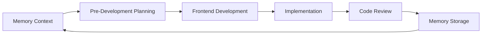

# AI Prompts for LerianStudio Ecosystem

A comprehensive collection of AI prompts designed for complete software development lifecycle management within the LerianStudio ecosystem.

## 🎯 Overview

This repository provides integrated systems that work together to support the entire software development lifecycle:

| System | Purpose | Directory | Quick Start |
|--------|---------|-----------|-------------|
| **Memory System** | Cross-session learning & pattern recognition | [`0-memory-system/`](0-memory-system/) | `claude 0-memory-system/m0-memory-orchestrator.mdc` |
| **Product Development** | Comprehensive planning from idea to implementation | [`1-pre-dev-product/`](1-pre-dev-product/) | `claude 1-pre-dev-product/0-pre-dev-orchestrator.mdc` |
| **Feature Development** | Streamlined feature addition to existing products | [`2-pre-dev-feature/`](2-pre-dev-feature/) | `claude 2-pre-dev-feature/0-feature-orchestrator.mdc` |
| **Frontend Development** | Complete frontend development with flexible design inputs | [`3-frontend/`](3-frontend/) | `claude 3-frontend/0-frontend-orchestrator.mdc` |
| **Code Review** | 18-point systematic code analysis | [`4-code-review/`](4-code-review/) | `claude 4-code-review/00-code-review-orchestrator.mdc` |

## 📚 Documentation

- **[CLAUDE.md](CLAUDE.md)** - Complete orchestrator architecture and execution patterns for AI assistants
- **[Memory Management README](0-memory-system/README.md)** - Detailed memory system documentation
- **[Pre-Development README](1-pre-dev-product/README.md)** - Interactive planning workflow guide
- **[Frontend Development README](3-frontend/README.md)** - Complete frontend development workflow
- **[Code Review README](4-code-review/README.md)** - Systematic analysis documentation

## 🚀 Quick Start Workflows

### 1. New Feature Development
```bash
# Initialize memory context
claude 0-memory-system/m0-memory-orchestrator.mdc

# Plan the feature interactively
claude 1-pre-dev-product/0-pre-dev-orchestrator.mdc

# Analyze integration points
claude 4-code-review/01-codebase-overview.md
```

### 2. Frontend Development
```bash
# Design input analysis (any format: sketches, Figma, specs)
claude 3-frontend/1-design-input-analysis.mdc

# Complete frontend implementation
claude 3-frontend/0-frontend-orchestrator.mdc

# Validate with code review
claude 4-code-review/00-code-review-orchestrator.mdc
```

### 3. Existing Code Analysis
```bash
# Full code review
claude 4-code-review/00-code-review-orchestrator.mdc

# Store findings
claude 0-memory-system/m4-memory-workflow.md
```

### 4. Quick Security Check
```bash
# Security-focused analysis
claude 4-code-review/01-codebase-overview.md
claude 4-code-review/07-security-vulnerability-analysis.md
claude 4-code-review/08-dependency-security-analysis.md
```

## 🔄 Development Lifecycle Integration

### Complete Development Cycle


1. **Initialize**: Start with memory context to leverage existing patterns
2. **Plan**: Use pre-development for interactive requirements and design
3. **Frontend**: Design and implement frontend with systematic precision
4. **Implement**: Follow generated tasks and sub-tasks
5. **Review**: Comprehensive code analysis and validation
6. **Learn**: Store insights back to memory for future projects

## 🎯 Key Features

### 🔗 Orchestrator Architecture
- **Phase-Based Execution**: 5 systematic workflows with mandatory checkpoints (✓ = user approval required)
- **Memory MCP Integration**: Context retrieval, decision storage, pattern analysis across sessions
- **Sequential Thinking**: Complex analysis through structured reasoning and hypothesis validation
- **Cross-System Dependencies**: Workflows feed into each other with validation gates

### 📋 User Interaction Patterns
- **Structured Feedback Loops**: Draft → User feedback → AI incorporation → Approval
- **Context Acknowledgment**: AI confirms understanding before proceeding to next phase
- **Iterative Refinement**: Multiple feedback rounds until user satisfaction
- **Flexible Design Inputs**: iPad sketches, Figma designs, written specs, reference apps

### 🚀 Workflow Features
- **Atomic Tasks**: Each task delivers complete, working software with git workflow
- **Validation Gates**: Consistency checks prevent flawed implementations
- **File Size Optimization**: <300 lines target, 500 max for LLM processing efficiency
- **Priority-Based Todos**: 🔴 CRITICAL → 🟡 HIGH → 🟢 MEDIUM → 🔵 LOW organization

## 📦 Output Organization

### Pre-Development Outputs
```
docs/pre-development/
├── prd-[feature].md              # Product requirements
├── trd-[feature].md              # Technical specifications
├── validation-report-[feature].md # Consistency validation
└── tasks/
    ├── tasks-[feature].md        # Atomic phases
    └── MT-[XX]-[name]/           # Sub-task details
```

### Code Review Outputs
```
docs/code-review/
├── code-review-todo-list.md     # Consolidated todos
├── 1-CODEBASE_OVERVIEW.md       # Foundation analysis
├── 2-ARCHITECTURE_ANALYSIS.md   # Architecture patterns
├── ...
└── 18-COMPREHENSIVE_TODO_LIST.md # Final synthesis
```

## 🏆 Orchestrator Best Practices

### Execution Order Guidelines
1. **Memory First**: Always start with `memory_search` and `memory_get_context` before any workflow
2. **Follow Phase Dependencies**: 
   - Pre-Development: PRD✓ → TRD✓ → Tasks✓ → Validation✓ → Sub-tasks
   - Code Review: Foundation → Security → Quality → Documentation → Production → Synthesis
   - Frontend: Design✓ → Tech✓ → Architecture → Tasks → Validation
3. **Respect Checkpoints**: Mandatory user approval (✓) required before proceeding to next phase
4. **Store All Decisions**: Use `memory_store_decision` for architectural choices and `memory_store_chunk` for insights

### Integration Patterns
- **New Product**: Memory → Pre-Development Product → Frontend → Code Review → Memory
- **Feature Enhancement**: Memory → Pre-Development Feature → Implementation → Code Review → Memory  
- **Existing Analysis**: Memory → Code Review → Memory
- **Security Focus**: Memory → Code Review (phases 1,7,8,9) → Memory

## 🏗️ Integration with LerianStudio

This repository supports the broader LerianStudio ecosystem:
- **Midaz Financial Ledger**: Architecture and security analysis
- **Plugin Ecosystem**: Component analysis and integration patterns
- **SDK Development**: API design and documentation workflows
- **Infrastructure**: Observability and deployment analysis

### Repository Context
```bash
# Use appropriate repository context
repository="github.com/lerianstudio/midaz"
repository="github.com/lerianstudio/midaz-private"
repository="github.com/lerianstudio/monorepo"
```

## 📈 Key Benefits

- **Consistency**: Standardized workflows across all projects
- **Quality**: Comprehensive analysis at every stage
- **Learning**: Continuous improvement through memory
- **Efficiency**: Reuse patterns and decisions
- **Collaboration**: Clear user interaction points

## 🔧 Getting Started

### For AI Assistants
1. **Read CLAUDE.md First**: Complete orchestrator architecture and execution patterns
2. **Choose Your Workflow**:
   - New project? Start with Pre-Development Product (5-phase linear)
   - Existing code? Begin with Code Review (6-phase systematic)
   - Frontend focus? Use Frontend Development (5-phase flexible)
   - Quick feature? Use Pre-Development Feature (3-phase streamlined)

### For Developers
1. **Start with Orchestrators**: Each system has a `0-*-orchestrator.mdc` entry point
2. **Follow Phase Dependencies**: Respect mandatory checkpoints and user feedback loops
3. **Leverage Memory**: Check context before starting, store learnings after completion
4. **Use Integration Patterns**: Connect workflows for complete development lifecycle

### Command Examples
```bash
# Complete new feature workflow
claude 0-memory-system/m0-memory-orchestrator.mdc
claude 1-pre-dev-product/0-pre-dev-orchestrator.mdc  
claude 3-frontend/0-frontend-orchestrator.mdc
claude 4-code-review/00-code-review-orchestrator.mdc
```

## 📄 License

This project is part of the LerianStudio ecosystem. See the main repository for licensing information.

---

*Part of the [LerianStudio](https://github.com/lerianstudio) ecosystem - Building the future of financial technology with AI-assisted development.*