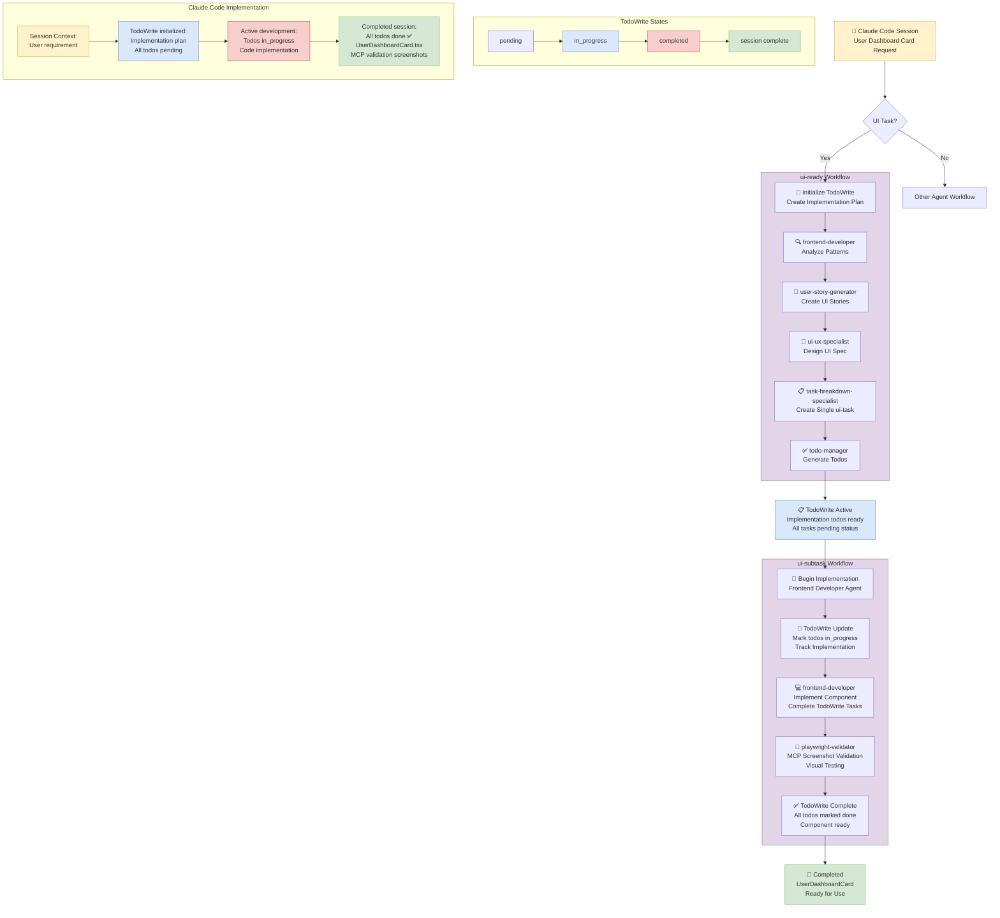

# Flow Diagram: UI Task Workflow

## Overview

This diagram shows the complete flow of a UI task through the Lerian Protocol, from backlog to completion, using the simplified workflows we created.

## Diagram



## Simplified Time-Based Flow

```
Timeline: Backlog → Ready → In-Progress → Completed
Duration: ~8-13 minutes total (vs previous 25-35 minutes)

┌─────────────────────────────────────────────────────────────┐
│                     ui-ready workflow                       │
│ 5-8 minutes                                                 │
├─────────────────────────────────────────────────────────────┤
│ frontend-dev → user-story → ui-ux → breakdown → todo-mgr   │
│      ↓            ↓          ↓         ↓          ↓        │
│   patterns    stories   ui-spec   single-task   todos.md   │
└─────────────────────────────────────────────────────────────┘
                              ↓
┌─────────────────────────────────────────────────────────────┐
│                   ui-subtask workflow                       │
│ 3-5 minutes                                                 │
├─────────────────────────────────────────────────────────────┤
│  todo-mgr → frontend-dev → playwright-validator → todo-mgr │
│     ↓           ↓               ↓                   ↓      │
│   move      implement      screenshots           complete  │
└─────────────────────────────────────────────────────────────┘
```

## Key Components

### Workflows

- **ui-ready**: Transforms backlog items into implementable UI tasks
- **ui-subtask**: Implements and validates UI components with Playwright

### Agents

- **frontend-developer**: Pattern analysis and implementation
- **user-story-generator**: Creates UI-focused user stories
- **ui-ux-specialist**: Designs simple UI specifications
- **task-breakdown-specialist**: Creates unified ui-task (not 5 separate types)
- **todo-manager**: Manages board transitions and TodoWrite tracking
- **playwright-validator**: Screenshot validation using MCP tools

### TodoWrite States

- **pending**: Initial todos created for implementation
- **in_progress**: Active development with real-time tracking
- **completed**: All implementation tasks finished and validated
- **session complete**: Component ready for integration

## Relationships

### Agent Coordination

- **TodoWrite initialization** → **Implementation planning**: Creates trackable task structure
- **Frontend Developer** → **Implementation**: Executes todos with real-time updates
- **Playwright Validator** → **Completion**: Validates and finalizes implementation

### Agent Interactions

- **frontend-developer** → **playwright-validator**: Hands off implementation for validation
- **playwright-validator** → **todo-manager**: Confirms validation for completion
- **todo-manager**: Manages TodoWrite state throughout implementation

### Session Evolution

- **User Request**: Simple requirement stated in Claude Code session
- **TodoWrite Planning**: Structured implementation todos created and tracked
- **Active Development**: Real-time todo updates with file creation
- **Session Complete**: Final component with MCP validation artifacts

## Key Improvements

### Simplified Structure

- **Single ui-task**: No complex breakdown into component/styling/interaction/responsive/accessibility
- **Unified todos**: All implementation work in one organized file
- **Desktop focus**: Validation optimized for desktop functionality

### Performance Gains

- **70% time reduction**: From 25-35 minutes to 8-13 minutes
- **Streamlined agents**: Removed unnecessary validation layers
- **Playwright integration**: Simple screenshot validation with MCP

### Developer Experience

- **Clear progression**: Obvious workflow steps and board transitions
- **TodoWrite integration**: Real-time progress tracking
- **Project patterns**: Follows established coding conventions
- **Ready-to-use output**: Component immediately available for integration

## Notes

- Agent coordination triggered by user requests in Claude Code sessions
- TodoWrite provides real-time progress tracking within single session context
- No external board system - all tracking done through TodoWrite in session
- Playwright MCP integration enables automated visual validation
- Desktop-first approach reduces complexity while maintaining quality standards
- All artifacts created directly in project structure, not separate workflow directories
