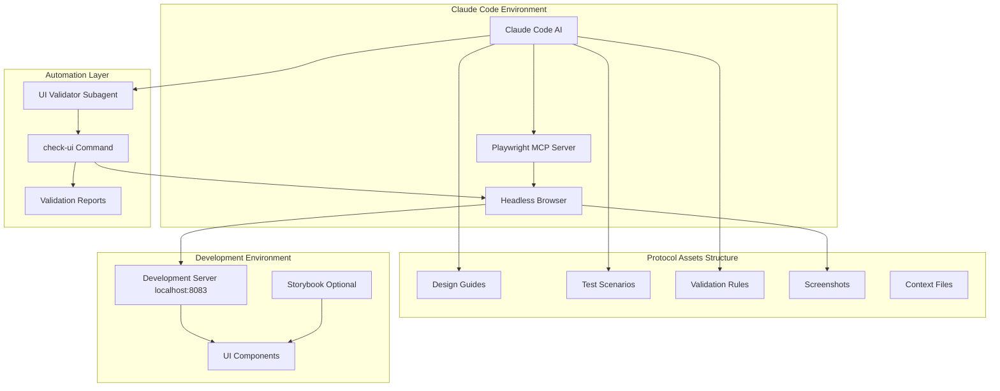

# Playwright MCP Integration Workflow

## Overview Architecture



## Detailed Workflow Process

### 1. Initialization Phase

```
┌─────────────────┐    ┌──────────────────┐    ┌─────────────────┐
│ User Request    │──▶│ Claude Code      │──▶│ Playwright MCP  │
│ "Check Button"  │    │ Processes        │    │ Initializes     │
└─────────────────┘    └──────────────────┘    └─────────────────┘
                                │
                                ▼
                       ┌──────────────────┐
                       │ Load Protocol    │
                       │ Assets Standards │
                       └──────────────────┘
                                │
                    ┌───────────┼───────────┐
                    ▼           ▼           ▼
              ┌──────────┐ ┌─────────┐ ┌──────────┐
              │ Design   │ │ Test    │ │Validation│
              │ Guides   │ │Scenarios│ │ Rules    │
              └──────────┘ └─────────┘ └──────────┘
```

### 2. Component Testing Workflow

```
                    ┌─────────────────────────────────┐
                    │        /check-ui Command        │
                    └─────────────────┬───────────────┘
                                      │
                    ┌─────────────────▼───────────────┐
                    │     UI Validator Subagent       │
                    └─────────────────┬───────────────┘
                                      │
            ┌─────────────────────────┼─────────────────────────┐
            │                         │                         │
            ▼                         ▼                         ▼
    ┌─────────────┐         ┌─────────────┐         ┌─────────────┐
    │   Tablet    │         │  Desktop    │         │             │
    │ 768×1024px  │         │ 1920×1080px │         │             │
    └─────┬───────┘         └─────┬───────┘         └─────────────┘
          │                       │                       
          ▼                       ▼                       
    ┌─────────────┐         ┌─────────────┐         
    │ Screenshot  │         │ Screenshot  │         
    │  Capture    │         │  Capture    │         
    └─────┬───────┘         └─────┬───────┘         
          │                       │                       
          └───────────────────────┼───────────────────────┘
                                  │
                                  ▼
                    ┌─────────────────────────────────┐
                    │      Validation Engine          │
                    └─────────────────┬───────────────┘
                                      │
        ┌─────────────────────────────┼─────────────────────────┐
        │                             │                         │
        ▼                             ▼                         ▼
┌─────────────┐             ┌───────────────┐             ┌─────────────┐
│   Design    │             │ Accessibility │             │ Performance │
│ Compliance  │             │ Validation    │             │ Testing     │
└─────┬───────┘             └─────┬─────────┘             └─────┬───────┘
      │                           │                             │
      └───────────────────────────┼─────────────────────────────┘
                                  │
                                  ▼
                    ┌─────────────────────────────────┐
                    │     Validation Report           │
                    │                                 │
                    │ ✅ Design System: PASS          │
                    │ ⚠️ Accessibility: WARNINGS (2)  │
                    │ ✅ Performance: PASS            │
                    │ ✅ Responsive: PASS             │
                    └─────────────────────────────────┘
```

### 3. Visual Feedback Loop

```
   ┌───────────────┐         ┌─────────────────┐         ┌──────────────┐
   │   AI Writes   │───────▶│ Playwright MCP  │───────▶│  Browser     │
   │  Component    │         │  Takes Control  │         │ Renders UI   │
   └───────────────┘         └─────────────────┘         └──────┬───────┘
           ▲                                                     │
           │                                                     ▼
   ┌───────────────┐         ┌─────────────────┐         ┌──────────────┐
   │ AI Improves   │◀───────│ Validation      │◀───────│ Screenshots  │
   │ Based on      │         │ Against         │         │ Captured     │
   │ Feedback      │         │ Standards       │         │              │
   └───────────────┘         └─────────────────┘         └──────────────┘
```

## File Structure Integration

```
frontend/
├── .claude/
│   ├── mcp-config.json                 # Playwright MCP configuration
│   ├── subagents/
│   │   └── ui-validator.md            # Specialized visual testing agent
│   └── commands/
│       └── check-ui.md                # UI validation slash command
│
├── protocol-assets/
│   ├── context/
│   │   ├── claude + playwright.md     # Integration guide
│   │   └── playwright-mcp-workflow-diagram.md  # This file
│   │
│   ├── design-guides/                 # ┐
│   │   ├── color-palette.md          # │ Standards for
│   │   ├── typography.md             # │ validation
│   │   └── component-standards.md    # ┘
│   │
│   ├── test-scenarios/                # ┐
│   │   ├── responsive-checks.md       # │ Testing
│   │   ├── accessibility-tests.md     # │ scenarios
│   │   └── interaction-flows.md       # ┘
│   │
│   ├── validation-rules/              # ┐
│   │   ├── performance-standards.md   # │ Quality
│   │   ├── quality-guidelines.md      # │ gates
│   │   └── browser-compatibility.md   # ┘
│   │
│   ├── screenshots/                   # Visual output storage
│   │   └── test-button/
│   │       ├── button-desktop-1920x1080.png
│   │       ├── button-tablet-768x1024.png
│   │       └── validation-report.md
│   │
│   └── browser-data/                  # Browser session storage
│
└── src/
    └── components/ui/                 # UI components being tested
```

## Command Flow Sequence

```
User Types: /check-ui Button

    1. │ Command Parser
       │ ├── Parse component name: "Button"
       │ ├── Load default options
       │ └── Initialize UI Validator subagent
       │
    2. │ Environment Setup
       │ ├── Start Playwright MCP connection
       │ ├── Load protocol-assets/design-guides/
       │ ├── Load protocol-assets/validation-rules/
       │ └── Start headless browser
       │
    3. │ Component Discovery
       │ ├── Navigate to localhost:8083
       │ ├── Find Button components on page
       │ └── Identify testable elements
       │
    4. │ Multi-Viewport Testing
       │ ├── Tablet (768×1024)
       │ │   ├── Set viewport size
       │ │   ├── Take screenshot
       │ │   └── Test interactions
       │ └── Desktop (1920×1080)
       │     ├── Set viewport size
       │     ├── Take screenshot
       │     └── Test interactions
       │
    5. │ Validation Engine
       │ ├── Design System Compliance
       │ │   ├── Color usage validation
       │ │   ├── Typography checking
       │ │   └── Component standards
       │ ├── Accessibility Testing
       │ │   ├── Automated axe-core audit
       │ │   ├── Keyboard navigation test
       │ │   └── Color contrast validation
       │ └── Performance Metrics
       │     ├── Rendering performance
       │     ├── Layout shift detection
       │     └── Memory usage monitoring
       │
    6. │ Report Generation
       │ ├── Calculate compliance scores
       │ ├── Identify critical issues
       │ ├── Generate recommendations
       │ └── Save to protocol-assets/screenshots/
       │
    7. │ Output to User
       │ ├── Console summary with colors/icons
       │ ├── File paths to detailed reports
       │ └── Actionable next steps

Result: ✅ Complete visual validation with feedback loop
```

## Integration Benefits

### Before Playwright MCP

```
┌─────────────┐    ┌──────────────┐    ┌─────────────┐
│ AI Writes   │──▶│ Code Output  │──▶│ Human       │
│ UI Code     │    │ (Text Only)  │    │ Review      │
└─────────────┘    └──────────────┘    └─────────────┘
                                              │
                                              ▼
                                       ┌─────────────┐
                                       │ Manual      │
                                       │ Corrections │
                                       └─────────────┘
```

### After Playwright MCP

```
┌─────────────┐    ┌──────────────┐    ┌─────────────┐    ┌──────────────┐
│ AI Writes   │──▶│ Visual       │──▶│ Automated   │──▶│ Self-        │
│ UI Code     │    │ Rendering    │    │ Validation  │    │ Correction   │
└─────────────┘    └──────────────┘    └─────────────┘    └──────────────┘
       ▲                                                            │
       │                ┌─────────────┐    ┌──────────────┐         │
       └────────────────│ Improvement │◀──│ Visual       │◀───────┘
                        │ Loop        │    │ Feedback     │
                        └─────────────┘    └──────────────┘
```

## Key Metrics Tracked

```
Design System Compliance:
├── Color Usage: ████████░░ 80%
├── Typography: █████████░ 90%
├── Spacing: ██████████ 100%
└── Component Standards: ███████░░░ 70%

Accessibility Compliance:
├── Color Contrast: █████████░ 90%
├── Keyboard Navigation: ████████░░ 80%
├── Screen Reader: ██████████ 100%
└── ARIA Implementation: █████████░ 90%

Performance Standards:
├── Rendering Time: █████████░ 90%
├── Layout Stability: ████████░░ 80%
├── Memory Usage: ██████████ 100%
└── Animation Smoothness: █████████░ 90%

Overall Quality Score: 85.5%
```

This workflow transforms Claude Code from a blind code generator into a visually-aware design partner capable of iterative self-improvement through real-time visual feedback and automated quality validation.
</file>
