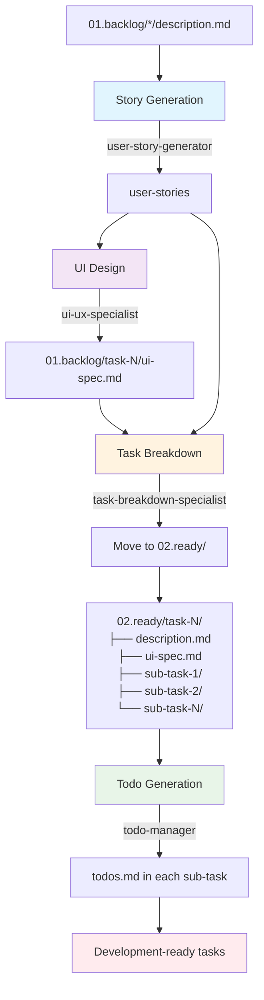
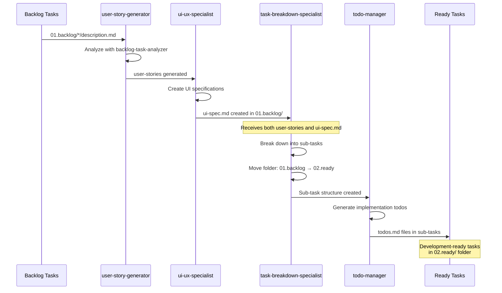
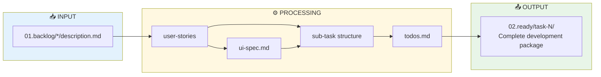

# Backlog to Ready Workflow - Flow Diagram

## Overview
This diagram illustrates the design-first workflow that transforms raw backlog items into development-ready sub-tasks through a series of specialized agents.

## ASCII Flow Diagram

```
INPUT: 01.backlog/*/description.md
         |
         v
┌────────────────────────────────────┐
│    STEP 1: Story Generation        │
│    Agent: user-story-generator     │
│    Uses: backlog-task-analyzer     │
└─────────────┬──────────────────────┘
              │
              v
         user-stories
              │
              v
┌────────────────────────────────────┐
│    STEP 2: UI Design               │
│    Agent: ui-ux-specialist         │
│    Creates: ui-spec.md             │
└─────────────┬──────────────────────┘
              │
              v
    01.backlog/[task-number]/ui-spec.md
              │
              v
┌────────────────────────────────────┐
│    STEP 3: Task Breakdown          │
│    Agent: task-breakdown-specialist│
│    Moves to: 02.ready/             │
└─────────────┬──────────────────────┘
              │
              v
    02.ready/task-N/ structure
    ├── description.md (original)
    ├── ui-spec.md (moved)
    ├── sub-task-1/description.md
    ├── sub-task-2/description.md
    └── sub-task-N/description.md
              │
              v
┌────────────────────────────────────┐
│    STEP 4: Todo Generation         │
│    Agent: todo-manager             │
│    Creates: todos.md in sub-tasks  │
└─────────────┬──────────────────────┘
              │
              v
OUTPUT: Development-ready tasks in 02.ready/
```

## Mermaid Flow Diagram



## Agent Interaction Sequence



## Data Flow



## Folder Structure Transformation

**Before (01.backlog/):**
```
01.backlog/
├── task-392/
│   └── description.md
├── task-393/
│   └── description.md
└── task-394/
    └── description.md
```

**After UI Design:**
```
01.backlog/
├── task-392/
│   ├── description.md
│   └── ui-spec.md ← Created
├── task-393/
│   ├── description.md
│   └── ui-spec.md ← Created
└── task-394/
    ├── description.md
    └── ui-spec.md ← Created
```

**Final Structure (02.ready/):**
```
02.ready/
├── task-392/
│   ├── description.md     ← Moved from 01.backlog
│   ├── ui-spec.md         ← Moved from 01.backlog
│   ├── sub-task-1/
│   │   ├── description.md ← Created
│   │   └── todos.md       ← Created
│   ├── sub-task-2/
│   │   ├── description.md ← Created
│   │   └── todos.md       ← Created
│   └── sub-task-N/
│       ├── description.md ← Created
│       └── todos.md       ← Created
└── [similar structure for other tasks]
```

## Key Features

- **Design-First Approach**: UI specifications created before technical breakdown
- **Agent Specialization**: Four specialized agents handle distinct phases
- **Structured Handoffs**: Clear communication between agents with context
- **Folder Migration**: Tasks move from backlog to ready state
- **Implementation Ready**: Final output includes detailed todos for developers

## Workflow Benefits

1. **User-Centered**: Stories follow INVEST principles
2. **Design-Driven**: UI specs guide technical implementation
3. **Developer-Ready**: Detailed sub-tasks with actionable todos
4. **Organized**: Clear folder structure and file organization
5. **Traceable**: Complete audit trail from backlog to ready state
</file>
