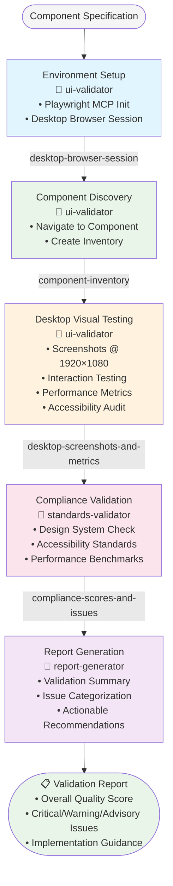

# Playwright Desktop Testing Workflow - Flow Diagram

## Overview
This diagram represents the flow of the Playwright Desktop UI Testing Workflow, showing the sequential steps, agent responsibilities, and data dependencies for comprehensive UI component validation at 1920×1080 resolution.

## ASCII Flow Diagram

```
┌─────────────────────┐
│  Component Spec     │ (Input)
└──────────┬──────────┘
           │
           v
┌─────────────────────┐
│ Environment Setup   │ [ui-validator]
│ - Playwright Init   │
│ - Desktop Browser   │
└──────────┬──────────┘
           │ creates: desktop-browser-session
           v
┌─────────────────────┐
│ Component Discovery │ [ui-validator]
│ - Navigate to UI    │
│ - Inventory Components
└──────────┬──────────┘
           │ creates: component-inventory
           v
┌─────────────────────┐
│ Desktop Visual Test │ [ui-validator]
│ - Screenshots       │
│ - Interactions      │
│ - Performance       │
└──────────┬──────────┘
           │ creates: desktop-screenshots-and-metrics
           v
┌─────────────────────┐
│ Compliance Validation│ [standards-validator]
│ - Design Standards  │
│ - Accessibility     │
│ - Performance       │
└──────────┬──────────┘
           │ creates: compliance-scores-and-issues
           v
┌─────────────────────┐
│ Report Generation   │ [report-generator]
│ - Validation Report │
│ - Recommendations   │
│ - Action Items      │
└──────────┬──────────┘
           │
           v
┌─────────────────────┐
│ Actionable Report   │ (Output)
│ Overall Score: X%   │
└─────────────────────┘
```

## Mermaid Flow Diagram



## Agent Responsibilities

### 🤖 ui-validator
- **Steps**: environment-setup, component-discovery, desktop-visual-testing
- **Focus**: Browser automation, visual testing, interaction validation
- **Outputs**: Screenshots, performance data, accessibility snapshots

### 🤖 standards-validator  
- **Steps**: compliance-validation
- **Focus**: Design system compliance, accessibility standards, performance benchmarks
- **Outputs**: Compliance scores, categorized issues, severity assessments

### 🤖 report-generator
- **Steps**: report-generation
- **Focus**: Comprehensive reporting, actionable recommendations
- **Outputs**: Validation reports, implementation guidance

## Data Flow Dependencies

1. **component-specification** → **desktop-browser-session**
2. **desktop-browser-session** → **component-inventory** 
3. **component-inventory** → **desktop-screenshots-and-metrics**
4. **desktop-screenshots-and-metrics** → **compliance-scores-and-issues**
5. **compliance-scores-and-issues** + **desktop-screenshots-and-metrics** → **actionable-validation-report**

## Handoff Points

The workflow includes three key handoff prompts:

1. **ui-validator → standards-validator**: Desktop testing evidence package transfer
2. **standards-validator → report-generator**: Compliance analysis results transfer  
3. **workflow completion**: Final validation report delivery

## Key Features

- **Resolution**: Fixed at 1920×1080 for consistent desktop testing
- **Evidence Collection**: Screenshots, metrics, logs, interaction behaviors
- **Multi-faceted Validation**: Visual, functional, accessibility, performance
- **Actionable Output**: Specific recommendations with implementation guidance
</file>
