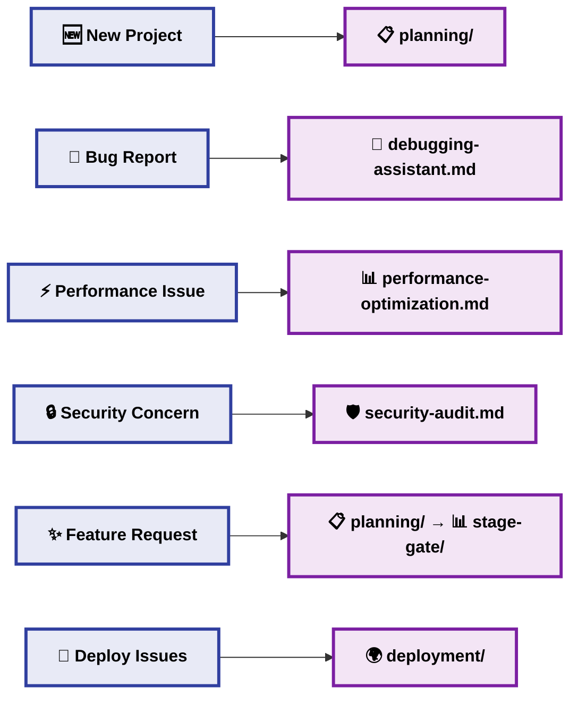

# 🚀 Cursor Starter - Complete Development Workflow

This enhanced visual workflow shows how all the prompt collections in cursor-starter work together to create a complete AI-assisted development process. **All file names are shown in proper kebab-case format** with visual enhancements for better understanding.

```mermaid
flowchart TD
    %% PROJECT INCEPTION
    A[["🚀 PROJECT START<br/><b>New Idea or Requirement</b>"]] --> B{{"❓ Project Type?"}}
    
    B -->|"New Project"| C[["📋 PLANNING PHASE<br/><b>planning/</b><br/>Define & Structure"]]
    B -->|"Existing Project"| D[["💻 DEVELOPMENT PHASE<br/><b>development/</b><br/>Code & Improve"]]
    B -->|"Project Issues"| E[["🔧 MAINTENANCE PHASE<br/><b>maintenance/</b><br/>Fix & Optimize"]]
    
    %% PLANNING PHASE
    C --> C1["📄 <b>prd-from-idea.md</b><br/>Requirements & Vision"]
    C1 --> C2["🏗️ <b>architecture-design.md</b><br/>System Structure"]
    C2 --> C3["⚙️ <b>tech-stack-selection.md</b><br/>Technology Choices"]
    C3 --> C4["👥 <b>user-stories.md</b><br/>Actionable Tasks"]
    C4 --> C5["🔌 <b>api-design.md</b><br/>Interface Planning"]
    
    %% STAGE GATE INTEGRATION
    C5 --> SG1[["📊 STAGE-GATE<br/><b>stage-gate/</b><br/>Project Management"]]
    SG1 --> SG2["📁 <b>1_planning/</b><br/>Create detailed specs"]
    SG2 --> SG3["⚡ <b>2_in_progress/</b><br/>Start implementation"]
    
    %% DEVELOPMENT PHASE
    SG3 --> D
    D --> D1["🆕 <b>code-generation.md</b><br/>Create new code"]
    D1 --> D2["✅ <b>code-review.md</b><br/>Quality assessment"]
    D2 --> D3["🐛 <b>debugging-assistant.md</b><br/>Fix issues"]
    D3 --> D4["♻️ <b>refactoring-assistant.md</b><br/>Improve code quality"]
    D4 --> D5["⚡ <b>performance-optimization.md</b><br/>Enhance efficiency"]
    
    %% ITERATIVE DEVELOPMENT
    D5 --> D6{{"✨ Feature Complete?"}}
    D6 -->|"No"| D1
    D6 -->|"Yes"| F[["🧪 TESTING PHASE<br/><b>testing/</b><br/>Validate Quality"]]
    
    %% TESTING PHASE
    F --> F1["🧩 <b>test-generation.md</b><br/>Unit & Integration tests"]
    F1 --> F2["🎭 <b>e2e-testing.md</b><br/>User workflow validation"]
    F2 --> F3["🔗 <b>integration-testing.md</b><br/>System component testing"]
    F3 --> F4["📈 <b>performance-testing.md</b><br/>Load & stress testing"]
    
    F4 --> F5{{"✔️ Tests Passing?"}}
    F5 -->|"No"| D3
    F5 -->|"Yes"| G[["📚 DOCUMENTATION PHASE<br/><b>documentation/</b><br/>Document & Explain"]]
    
    %% DOCUMENTATION PHASE
    G --> G1["📸 <b>repository-snapshot.md</b><br/>Project overview"]
    G1 --> G2["📖 <b>readme-generator.md</b><br/>User documentation"]
    G2 --> G3{{"📝 Documentation Complete?"}}
    
    G3 -->|"No"| G1
    G3 -->|"Yes"| H[["🚀 DEPLOYMENT PHASE<br/><b>deployment/</b><br/>Ship & Configure"]]
    
    %% DEPLOYMENT PHASE
    H --> H1["🔄 <b>cicd-setup.md</b><br/>Automated pipelines"]
    H1 --> H2["🌍 <b>environment-configuration.md</b><br/>Dev/Staging/Production"]
    H2 --> H3{{"🎯 Deployment Ready?"}}
    
    H3 -->|"No"| H1
    H3 -->|"Yes"| SG4["🎉 <b>3_completed/</b><br/>Move to Completed"]
    
    %% MAINTENANCE PHASE
    SG4 --> I[["🔒 MAINTENANCE PHASE<br/><b>maintenance/</b><br/>Monitor & Maintain"]]
    I --> I1["🛡️ <b>security-audit.md</b><br/>Vulnerability assessment"]
    I1 --> I2{{"⚠️ Issues Found?"}}
    
    I2 -->|"Critical Issues"| E
    I2 -->|"Minor Issues"| J[["🔄 PROJECT ITERATION<br/><b>Continuous Improvement</b>"]]
    I2 -->|"No Issues"| K[["✅ PROJECT SUCCESS<br/><b>Monitoring & Support</b>"]]
    
    %% CONTINUOUS IMPROVEMENT
    E --> E1["📊 <b>performance-optimization.md</b><br/>Optimization needed"]
    E1 --> E2["🔐 <b>security-audit.md</b><br/>Vulnerability fixes"]
    E2 --> E3["🐞 <b>debugging-assistant.md</b><br/>Issue resolution"]
    E3 --> D
    
    %% ITERATION CYCLE
    J --> J1{{"🆕 New Features Needed?"}}
    J1 -->|"Yes"| C
    J1 -->|"No"| K
    
    %% ONGOING MONITORING
    K --> K1["📊 Monitor Performance<br/>Track metrics"]
    K1 --> K2["💬 User Feedback<br/>Collect insights"]
    K2 --> K3{{"🔄 Changes Needed?"}}
    K3 -->|"Yes"| J
    K3 -->|"No"| K1
    
    %% ENHANCED STYLING
    classDef planningStyle fill:#e3f2fd,stroke:#1565c0,stroke-width:4px,color:#000000,font-weight:bold
    classDef developmentStyle fill:#fff8e1,stroke:#ef6c00,stroke-width:4px,color:#000000,font-weight:bold
    classDef testingStyle fill:#fce4ec,stroke:#ad1457,stroke-width:4px,color:#000000,font-weight:bold
    classDef documentationStyle fill:#e8f5e8,stroke:#2e7d32,stroke-width:4px,color:#000000,font-weight:bold
    classDef deploymentStyle fill:#f3e5f5,stroke:#7b1fa2,stroke-width:4px,color:#000000,font-weight:bold
    classDef maintenanceStyle fill:#fff3e0,stroke:#f57c00,stroke-width:4px,color:#000000,font-weight:bold
    classDef stageGateStyle fill:#f1f8e9,stroke:#388e3c,stroke-width:5px,color:#000000,font-weight:bold
    classDef decisionStyle fill:#ffecb3,stroke:#f57c00,stroke-width:4px,color:#000000,font-weight:bold
    classDef successStyle fill:#e0f2f1,stroke:#00695c,stroke-width:4px,color:#000000,font-weight:bold
    classDef startStyle fill:#e8eaf6,stroke:#303f9f,stroke-width:5px,color:#000000,font-weight:bold
    
    class A startStyle
    class C,C1,C2,C3,C4,C5 planningStyle
    class D,D1,D2,D3,D4,D5,E,E1,E2,E3 developmentStyle
    class F,F1,F2,F3,F4 testingStyle
    class G,G1,G2 documentationStyle
    class H,H1,H2 deploymentStyle
    class I,I1 maintenanceStyle
    class SG1,SG2,SG3,SG4 stageGateStyle
    class B,D6,F5,G3,H3,I2,J1,K3 decisionStyle
    class J,K,K1,K2 successStyle
```

## Complete Workflow Overview

## 📋 **PLANNING PHASE** - Project Foundation
**📁 Folder:** `planning/`

| File | Purpose | When to Use |
|------|---------|-------------|
| 📄 **`prd-from-idea.md`** | Define requirements and vision | Starting new projects from scratch |
| 📄 **`prd-questionnaire.md`** | Interactive PRD creation | When you need guidance structuring ideas |
| 📄 **`prd-refactor-existing.md`** | Improve existing requirements | Updating legacy documentation |
| 🏗️ **`architecture-design.md`** | Plan system structure | Major features or new system design |
| ⚙️ **`tech-stack-selection.md`** | Choose technologies | Technology decisions and comparisons |
| 👥 **`user-stories.md`** | Break down into actionable tasks | Converting requirements to dev tasks |
| 🔌 **`api-design.md`** | Plan interfaces and endpoints | Designing REST/GraphQL APIs |

## 📊 **STAGE-GATE** - Project Management
**📁 Folder:** `stage-gate/`

| Subfolder | Purpose | Process |
|-----------|---------|---------|
| 📦 **`0_backlog/`** | Feature queue | Store planned features waiting for work |
| 📋 **`1_planning/`** | Detailed planning | Create specs, design, and requirements |
| ⚡ **`2_in_progress/`** | Active development | Track implementation progress |
| ✅ **`3_completed/`** | Finished features | Archive completed work with summaries |
| 📊 **`5_project/`** | Master coordination | Overall project tracking and plans |

## 💻 **DEVELOPMENT PHASE** - Code Implementation
**📁 Folder:** `development/`

| File | Purpose | Best For |
|------|---------|----------|
| 🆕 **`code-generation.md`** | Create new functionality | Boilerplate, components, new features |
| ✅ **`code-review.md`** | Quality assessment and feedback | Pre-commit code validation |
| 🐛 **`debugging-assistant.md`** | Systematic problem solving | Bug fixes and error resolution |
| ♻️ **`refactoring-assistant.md`** | Improve existing code | Code quality improvements |
| ⚡ **`performance-optimization.md`** | Enhance efficiency | Performance bottlenecks and optimization |

## 🧪 **TESTING PHASE** - Quality Validation
**📁 Folder:** `testing/`

| File | Purpose | Coverage |
|------|---------|----------|
| 🧩 **`test-generation.md`** | Unit and integration tests | Individual functions and components |
| 🎭 **`e2e-testing.md`** | Complete user workflow validation | End-to-end user journeys |
| 🔗 **`integration-testing.md`** | System component testing | API endpoints, database operations |
| 📈 **`performance-testing.md`** | Load and stress validation | Performance under various conditions |

## 📚 **DOCUMENTATION PHASE** - Knowledge Capture
**📁 Folder:** `documentation/`

| File | Purpose | Output |
|------|---------|--------|
| 📸 **`repository-snapshot.md`** | Project overview and analysis | Comprehensive project audit |
| 📖 **`readme-generator.md`** | User-facing documentation | Professional README files |

## 🚀 **DEPLOYMENT PHASE** - Production Ready
**📁 Folder:** `deployment/`

| File | Purpose | Scope |
|------|---------|-------|
| 🔄 **`cicd-setup.md`** | Automated build and deployment | CI/CD pipeline configuration |
| 🌍 **`environment-configuration.md`** | Dev/staging/production setup | Environment management |

## 🔒 **MAINTENANCE PHASE** - Ongoing Support
**📁 Folder:** `maintenance/`

| File | Purpose | Focus |
|------|---------|-------|
| 🛡️ **`security-audit.md`** | Vulnerability assessment | Security analysis and hardening |

## Key Workflow Principles

### **1. AI-Assisted at Every Step**
- Each phase has specialized prompts for maximum AI effectiveness
- Prompts are designed to work with Cursor AI specifically
- Consistent prompt patterns across all phases

### **2. Iterative Development**
- Continuous cycles of development → testing → documentation
- Stage-gate checkpoints ensure quality
- Feedback loops between all phases

### **3. Quality Gates**
- No phase skipping - each builds on the previous
- Testing validates development work
- Documentation captures knowledge
- Deployment ensures production readiness

### **4. Continuous Improvement**
- Maintenance phase feeds back into development
- Performance monitoring drives optimization
- Security audits ensure ongoing protection
- User feedback guides new features

## Workflow Entry Points

## Usage Guidelines

### **Starting Points:**
- **New Project** → Begin with `planning/`
- **Existing Project** → Use `documentation/repository-snapshot` first
- **Bug Fixes** → Start with `development/debugging-assistant`
- **Performance Issues** → Use `development/performance-optimization`
- **Security Concerns** → Start with `maintenance/security-audit`

### **Phase Transitions:**
- Always complete current phase before moving to next
- Use stage-gate checkpoints for major features
- Document decisions and learnings throughout
- Iterate based on testing and feedback

This workflow ensures comprehensive, AI-assisted development from concept to production and ongoing maintenance. 